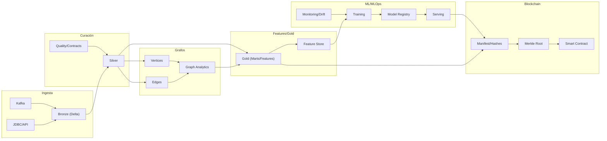
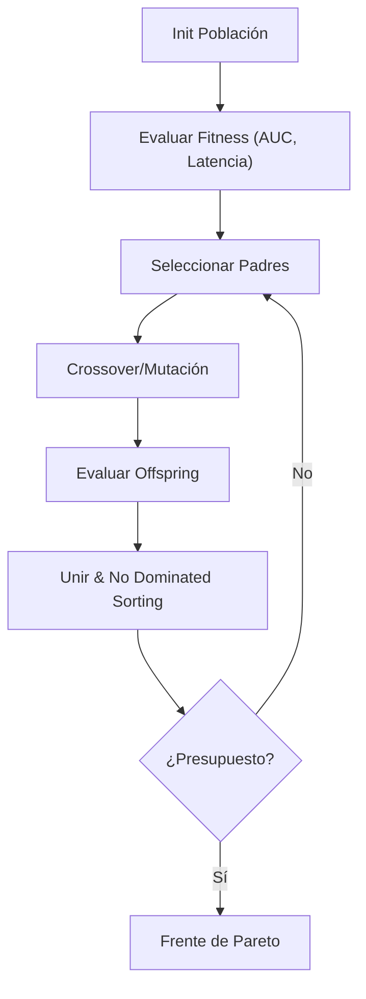

<div align="center">
    <h1>⚙️ Introducción al Big Data </h1>
  <p>Plataforma integral para diseñar, ejecutar y gobernar <b>pipelines de datos a escala</b>, entrenar y desplegar <b>modelos de IA/ML</b>, realizar <b>analítica en grafos</b>, asegurar <b>trazabilidad y pruebas de integridad en blockchain</b> y optimizar con <b>algoritmos evolutivos</b>.</p>

  <!-- Badges -->
  <p>
    <a href="https://www.python.org/"></a>
    <a href="https://spark.apache.org/"></a>
    <a href="https://pytorch.org/"></a>
    <a href="../LICENSE"></a>
    <a href="https://colab.research.google.com/"></a>
    <a href="#"></a>
    <a href="#"></a>
    <a href="#"></a>
  </p>

  <!-- Navigation -->
  <p>
    <a href="./notebooks/"></a>
    <a href="./src/"></a>
    <a href="./dags/"></a>
    <a href="./references/"></a>
  </p>
</div>

---

## 🎯 Visión General

**DataGraphX** unifica pilares modernos de ingeniería y ciencia de datos:

* **Big Data / Lakehouse**: ingesta batch + streaming (Kafka), capa **Bronze/Silver/Gold** en **Parquet/Delta/Iceberg**, calidad y contratos de datos.
* **IA/ML & MLOps**: *feature store*, *training pipelines*, seguimiento de experimentos, *model registry* y despliegue (batch/serving/streaming).
* **Grafos**: algoritmos distribuidos (PageRank, Louvain, Shortest Paths, Node2Vec) en Spark/GraphFrames/GraphX y bases de grafos (Neo4j/PG).
* **Blockchain**: anclaje de *hashes* y metadatos (Merkle) para **inmutabilidad**, no repudio y verificación de artefactos (datasets, modelos).
* **Algoritmos Evolutivos**: optimización de hiperparámetros, selección de rasgos, *neural architecture search*, calendarización y *query planning*.

Incluye APIs limpias en Python, DAGs de orquestación, notebooks demostrativos y utilidades para benchmarking/observabilidad.

---

## 📂 Estructura del Repositorio

```
DataGraphX/
├── README.md
├── notebooks/                   # Tutoriales y experimentos (Colab-ready)
├── src/
│   ├── datalake/                # IO, particionado, Delta/Iceberg/Hudi
│   ├── ingest/                  # Conectores (batch/streaming), esquemas
│   ├── quality/                 # Great Expectations, data contracts
│   ├── pipelines/               # ETL/ELT, medallion (Bronze/Silver/Gold)
│   ├── ml/                      # features, training, evaluation, registry
│   ├── graph/                   # GraphFrames/NetworkX/Neo4j utils
│   ├── evo/                     # Algoritmos evolutivos (CMA-ES, NSGA-II)
│   ├── chain/                   # Anclaje blockchain (Merkle, firmas)
│   ├── serving/                 # REST/gRPC, batch scoring, streaming
│   └── viz/                     # Dashboards y gráficos
├── dags/                        # Airflow/Ray/Dagster
├── infra/                       # Docker/K8s/Terraform (opcional)
├── config/                      # YAMLs centralizados
├── tests/                       # Unit/property/integration tests
├── data/                        # /raw (Bronze), /curated (Silver), /marts (Gold)
├── references/                  # Papers, enlaces y notas
└── pyproject.toml               # Dependencias/estilo/packaging
```

---

## 🎓 Objetivos de Aprendizaje

1. **Diseñar** arquitectura **lakehouse** y pipelines híbridos *batch/streaming* con calidad/lineage.
2. **Entrenar/servir** modelos de ML/Deep Learning con MLOps (versionado, monitoreo, *drift*).
3. **Aplicar** analítica de **grafos** a problemas de fraude, recomendación, logística y KGs.
4. **Garantizar** trazabilidad e integridad con **blockchain** (anclaje de artefactos).
5. **Optimizar** tareas complejas con **algoritmos evolutivos** (HPO, selección de rasgos, NAS).
6. **Escalar** con Spark/Ray/Dask, *vectorization*, GPU (RAPIDS/cuDF/cuGraph) cuando corresponda.

> **Nota**: este repositorio tiene fines educativos/técnicos. No sustituye asesoramiento **financiero/médico/legal**. Para decisiones críticas, consulta con profesionales.

---

## 📊 **Introducción a la materia**  


| 📄 **Recurso** | 📥 **Acceso** |
|--------------|------------|
| **Introducción al BIG DATA** | [](https://github.com/sgevatschnaider/GraphAI-Data-Science-ML/blob/ba97ebadab45f05b0b5b3b4b5ca2fc7156a24691/BIG%20DATA%20INTRODUCCIÓN.pdf) |
| **Cómo TikTok Sabe lo que Quieres Ver** | [](https://sgevatschnaider.github.io/GraphAI-Data-Science-ML/blog/tiktok-algoritmo.html) |
| **Introducción a Big Data en Google Colab** | [](https://colab.research.google.com/github/sgevatschnaider/GraphAI-Data-Science-ML/blob/main/notebooks/Clase_Introduccion_BigData_2025.ipynb) |
| **Sistemas de Recomendación y TikTok** | [](https://colab.research.google.com/drive/1eqcIUhjwrKRj4_4rFv_tg7vRYkxkjuUE) |
| **Evolución y Funcionamiento de los Sistemas de Recomendación** | [](https://github.com/sgevatschnaider/GraphAI-Data-Science-ML/blob/35919d0c04d0f2e447590877c33420003bfcfcc6/Evolución%20y%20Funcionamiento%20de%20los%20Sistemas%20de%20Recomendación.pdf) |
| **Preguntas Big Data** | [](https://github.com/sgevatschnaider/GraphAI-Data-Science-ML/blob/9b93a3f622c3d4a544fe593d8ede12f4f1de2f14/Preguntas_Big_Data.pdf) |
| **Preguntas y Respuestas sobre Sistemas de Recomendación** | [](https://github.com/sgevatschnaider/GraphAI-Data-Science-ML/blob/ed7eb3145a0f91d14dd5e450886e9f876d626ab2/Preguntas%20y%20Respuestas%20sobre%20Sistemas%20de%20Recomendaci%C3%B3n.pdf) |

## 📝 Sharding y Teorema CAP

| 📄 **Recurso** | 📥 **Acceso** |
|---------------|---------------|
| **Big data clase 2025** | [](https://github.com/sgevatschnaider/GraphAI-Data-Science-ML/blob/865757a0e290dd3a8692fbc8db8734a24da10964/Big%20data%20clase%202025.pdf) |
| **Sharding y el Teorema CAP en Sistemas Distribuidos** | [](https://github.com/sgevatschnaider/GraphAI-Data-Science-ML/blob/865757a0e290dd3a8692fbc8db8734a24da10964/notebooks/%20Clase_2_Sharding_y_el_Teorema_CAP_en_Sistemas_Distribuidos_pynb.ipynb) |

## 📝 Sharding: Visualización Interactiva

| 📄 **Recurso** | 📥 **Acceso** |
|---------------|---------------|
| **Arquitectura de BBDD como un Sistema de Grafos (completo)** <br><br> <details><summary><strong>Resumen:</strong> <em>(haz clic para expandir/colapsar)</em></summary><p>Lección interactiva que parte de una base monolítica y la transforma paso a paso: estado inicial, sharding horizontal, partición vertical y replicación. Cada transición se visualiza como topologías de grafos para explicar eliminación del punto único de fallo, aumento de disponibilidad y escalabilidad. Ideal como mapa conceptual antes de profundizar en estrategias de distribución de claves.</p></details>                                                                                                              | [](https://clinquant-meringue-3930c2.netlify.app/src/classroom/graphs/recursos/arquitectura%20de%20bbdd%20como%20un%20sistema%20de%20grafos.completo) |
| **De la Rigidez a la Elasticidad — Sharding vs Hashing Consistente y Gossip** <br><br> <details><summary><strong>Resumen:</strong> <em>(haz clic para expandir/colapsar)</em></summary><p>Demo comparativa en anillo que asigna claves a nodos para contrastar sharding modular, simple pero con muchos movimientos al cambiar N, frente a hashing consistente, anillo con posiciones estables que mueve ≈1/N. Las líneas continuas indican dueños y réplicas, las punteadas representan el gossip sobre el overlay. A la izquierda se controlan N, claves, RF, VNodes y la reproducción automática; en la parte inferior se muestran métricas de rebalanceo y una explicación del modo activo.</p></details> | [](https://clinquant-meringue-3930c2.netlify.app/src/classroom/graphs/recursos/sharding.html)                                                         |
## 📝 Sharding: Visualización Interactiva

| 📄 **Recurso** | 📥 **Acceso** |
|---------------|---------------|
| **Arquitectura de BBDD como un Sistema de Grafos (completo)** <br><br> <details><summary><strong>Resumen:</strong> <em>(haz clic para expandir/colapsar)</em></summary><p>Lección interactiva que parte de una base monolítica y la transforma paso a paso: estado inicial, sharding horizontal, partición vertical y replicación. Cada transición se visualiza como topologías de grafos para explicar eliminación del punto único de fallo, aumento de disponibilidad y escalabilidad. Ideal como mapa conceptual antes de profundizar en estrategias de distribución de claves.</p></details> | [](https://sgevatschnaider.github.io/BigData-Graphs-Evo-CA-Classroom/src/classroom/bigdata/recursos/Arquitectura%20de%20BBDD%20como%20un%20Sistema%20de%20Grafos.completo.html) |
| **De la Rigidez a la Elasticidad — Sharding vs Hashing Consistente y Gossip** <br><br> <details><summary><strong>Resumen:</strong> <em>(haz clic para expandir/colapsar)</em></summary><p>Demo comparativa en anillo que asigna claves a nodos para contrastar sharding modular, simple pero con muchos movimientos al cambiar N, frente a hashing consistente, anillo con posiciones estables que mueve ≈1/N. Las líneas continuas indican dueños y réplicas, las punteadas representan el gossip sobre el overlay. A la izquierda se controlan N, claves, RF, VNodes y la reproducción automática; en la parte inferior se muestran métricas de rebalanceo y una explicación del modo activo.</p></details> | [](https://sgevatschnaider.github.io/BigData-Graphs-Evo-CA-Classroom/src/classroom/bigdata/recursos/De%20la%20Rigidez%20a%20la%20Elasticidad.html) |
## 📜 Instalación Rápida

**Requisitos**: Python ≥ 3.10, Java 8+ (para Spark), opcional Docker.

```bash
git clone <URL_DEL_REPOSITORIO>
cd DataGraphX
python -m venv .venv
source .venv/bin/activate          # en Windows: .venv\Scripts\activate
pip install -U pip
pip install -e ".[all]"            # spark, pyspark, ray, dask, mlflow, graphframes, neo4j, deap, optuna
pre-commit install
```

Opcional (contenedores):

```bash
docker compose up -d               # kafka, spark-thrift, mlflow, neo4j, minio
```

---

## 🧪 Quickstart

### CLI — Pipeline de ejemplo (Bronze→Gold + Modelo + Anclaje)

```bash
# 1) Ingesta streaming desde Kafka a Bronze (Delta)
python -m src.ingest.kafka_to_delta --topic transacciones --out data/raw/tx

# 2) Curación a Silver y features a Gold
python -m src.pipelines.curate --in data/raw/tx --out data/curated/tx_silver
python -m src.pipelines.features --in data/curated/tx_silver --out data/marts/tx_gold

# 3) Entrenamiento con HPO evolutivo y registro de experimento
python -m src.ml.train --data data/marts/tx_gold --algo xgboost \
  --hpo evo --max-gen 20 --pop-size 40 --mlflow-uri http://localhost:5000

# 4) Anclaje en blockchain (hash de dataset + modelo + métricas)
python -m src.chain.anchor --artifacts runs/last --network sepolia
```

### Python API — ETL + Grafos + Scoring

```python
import pyspark.sql.functions as F
from pyspark.sql import SparkSession
from src.graph.api import pagerank_graphframe
from src.ml.serving import load_model, batch_score

spark = SparkSession.builder.getOrCreate()

# 1) Cargar Silver y construir un grafo de relaciones
edges = spark.read.parquet("data/curated/tx_edges_silver")
vertices = spark.read.parquet("data/curated/parties_silver")
pr = pagerank_graphframe(vertices, edges, max_iter=20, reset_prob=0.15)

# 2) Enriquecer Gold con centralidad PageRank
gold = spark.read.parquet("data/marts/tx_gold").join(pr, on="party_id", how="left")

# 3) Scoring batch con el último modelo registrado
model = load_model("fraud_xgb@Production")
pred = batch_score(model, gold)
pred.write.mode("overwrite").parquet("data/marts/tx_scores")
```

---

## 📜 Tabla de Contenidos

* [1. Arquitectura de Datos (Lakehouse)](#1-arquitectura-de-datos-lakehouse)
* [2. Ingesta & Calidad](#2-ingesta--calidad)
* [3. Procesamiento & Rendimiento](#3-procesamiento--rendimiento)
* [4. IA/ML & MLOps](#4-iaml--mlops)
* [5. Analítica de Grafos](#5-analítica-de-grafos)
* [6. Blockchain: Trazabilidad & Integridad](#6-blockchain-trazabilidad--integridad)
* [7. Algoritmos Evolutivos](#7-algoritmos-evolutivos)
* [8. Observabilidad & Gobierno](#8-observabilidad--gobierno)
* [9. Roadmap de Notebooks](#9-roadmap-de-notebooks)
* [10. Ejercicios Propuestos](#10-ejercicios-propuestos)
* [11. Errores Comunes](#11-errores-comunes)
* [12. API Breve](#12-api-breve)
* [13. Cómo Contribuir](#13-cómo-contribuir)
* [14. Licencia](#14-licencia)
* [Apéndice A: Diagramas Mermaid](#apéndice-a-diagramas-mermaid)
* [Apéndice B: Pseudocódigo Clave](#apéndice-b-pseudocódigo-clave)
* [Apéndice C: Plantilla de Experimento](#apéndice-c-plantilla-de-experimento)

---

## 1. Arquitectura de Datos (Lakehouse)

**Patrón Medallion**:

* **Bronze** (*raw*): ingestión cruda, particionada por `event_date` y `source`.
* **Silver** (*curated*): limpieza, tipado, deduplicación, *slowly changing dimensions*.
* **Gold** (*marts/features*): tablas analíticas y *feature views* para ML/BI.

**Lambda/Kappa**: lotes (batch) + *streams* con ventanas (tumbling, hopping), *watermarks* y *exactly-once* mediante transacciones (Delta/Iceberg/Hudi).

**Línea de datos**: *OpenLineage* y *data catalog* (column-level lineage), contratos de datos (esquemas + reglas) y *change data capture* (CDC).

---

## 2. Ingesta & Calidad

* Conectores **batch** (S3/GCS/Azure, JDBC, APIs) y **streaming** (Kafka, Pulsar).
* **Schema Registry** (Avro/Protobuf/JSON) + evolución de esquemas.
* **Calidad**: *Great Expectations*, *assertions* de dominio y controles de **idempotencia**.
* **PII**: detección y *tokenization*; cumplimiento de retención.

Ejemplo de contrato (YAML):

```yaml
dataset: tx_silver
schema:
  - name: tx_id       ; type: string ; unique: true
  - name: amount      ; type: decimal(18,2) ; nullable: false ; min: 0.0
  - name: event_time  ; type: timestamp ; nullable: false
rules:
  - name: positive_amount ; expr: amount >= 0
  - name: valid_time      ; expr: event_time >= '2020-01-01'
```

---

## 3. Procesamiento & Rendimiento

* **Spark** para *joins* grandes, *windowing*, UDF/SQL; **Ray/Dask** para cargas Python-first.
* **Formatos** columnares (Parquet), **particionado** y **Z-Ordering**; *broadcast* y *bucketing* donde aplique.
* **Algoritmos aproximados**: *HyperLogLog*, *Count-Min Sketch*, *Bloom Filters*; *reservoir sampling*.
* **GPU**: RAPIDS (**cuDF/cuML/cuGraph**) cuando la relación *I/O ↔ compute* lo justifique.
* **Caching** y *checkpointing* en *streams* para resiliencia.

---

## 4. IA/ML & MLOps

* **Feature Store**: definiciones declarativas, *point-in-time correctness*, materializaciones Gold.
* **HPO**: *grid/random*, **bayesiano**, **evolutivo** (CMA-ES, NSGA-II, algoritmos genéticos).
* **Tracking**: artefactos, métricas y parámetros (MLflow); **Model Registry** con *staging/production*.
* **Despliegue**: *batch scoring*, *stream scoring* (mapGroupsWithState), REST/gRPC con validación.
* **Monitoreo**: *data drift*, *performance decay*, *concept drift* y alertas.

Ejemplo: entrenamiento XGBoost con búsqueda evolutiva (pseudo-CLI disponible arriba).

---

## 5. Analítica de Grafos

* **Modelado**: `V(vertices)`, `E(edges)` con atributos (peso, tipo, timestamps).
* **Algoritmos** (distribuidos/monomáquina):

  * Centralidad: PageRank, Betweenness (aprox.), Degree.
  * Comunidades: Louvain/Leiden.
  * Caminos: SSSP/Dijkstra, BFS, *Reachability*.
  * **Embeddings**: Node2Vec/DeepWalk para downstream ML.
* **Bases de grafos**: conectores a **Neo4j** / **PG con extensiones de grafos**.
* **Casos**: fraude (ciclos/rings), supply chain, recomendaciones, KGs para RAG.

---

## 6. Blockchain: Trazabilidad & Integridad

* **¿Qué anclamos?** Manifiestos de datasets (paths, *schema hash*, recuentos), modelos (pesos, firmas), métricas y DAGs.
* **Cómo**: árbol de **Merkle** → *root hash* firmado y publicado en red (p.ej., EVM/Hyperledger). Conserva privacidad (no subes datos), garantiza **no repudio**.
* **Smart contracts**: registro mínimo (*event logs* + mapping de `artifact_id → merkle_root`), *role-based access* para admisión.

> **Recomendación**: usar anclaje periódico (*checkpoints*) y vincularlo al lineage para auditorías reproducibles.

---

## 7. Algoritmos Evolutivos

**Aplicaciones**:

* **HPO** (hiperparámetros), **selección de rasgos**, **NAS** (arquitecturas), **schedule de jobs**, **optimización multiobjetivo** (AUC ↔ latencia ↔ costo).

**Modelo genérico (GA/ES)**:

* **Genoma**: codifica hiperparámetros/rasgos/arquitecturas.
* **Población** inicial (muestreo estratificado / *warm start*).
* **Fitness**: métrica(s) objetivo + penalizaciones (SLA, tamaño modelo).
* **Operadores**: *crossover*, *mutación*, *elitismo*; *constraints* con reparación/penalización.
* **Paralelismo**: evaluación distribuida (Spark/Ray), *early stopping* y poda.

---

## 8. Observabilidad & Gobierno

* **Logging/tracing** por job, *data lineage* y *run metadata*.
* **KPIs**: *throughput*, *latencia P95*, costo, % fallos, *freshness*, *feature coverage*.
* **Seguridad/privacidad**: RBAC/ABAC, enmascaramiento, *differential privacy* (cuando aplique).
* **SLOs**: definiciones declarativas y alertas.

---

## 9. Roadmap de Notebooks

| Notebook                     | Tema                                             |                                         Colab                                         |
| :--------------------------- | :----------------------------------------------- | :-----------------------------------------------------------------------------------: |
| `01_lakehouse.ipynb`         | Medallion, Delta/Iceberg, partición y Z-Ordering | <a href="#"></a> |
| `02_streaming_kafka.ipynb`   | Ventanas, watermarks, exactly-once               | <a href="#"></a> |
| `03_ml_hpo_evo.ipynb`        | HPO evolutivo (CMA-ES/NSGA-II) en Ray            | <a href="#"></a> |
| `04_graph_analytics.ipynb`   | PageRank/Louvain/Node2Vec con GraphFrames/Neo4j  | <a href="#"></a> |
| `05_blockchain_anchor.ipynb` | Merkle roots, firmas y publicación de anclajes   | <a href="#"></a> |
| `06_monitoring_mlop.ipynb`   | Drift, monitoreo y retraining                    | <a href="#"></a> |

---

## 10. Ejercicios Propuestos

**Arquitectura**

1. Diseña un esquema de **particionado** y **ordenamiento** para `tx_gold` considerando consultas top-N por usuario y rango temporal.
2. Implementa **CDC** con *merge into* (upserts) y evalúa *write amplification*.

**ML/Grafos**

1. Entrena un modelo de fraude que incorpore **PageRank** y **Node2Vec** como *features*. Compara vs. baseline tabular.
2. Ejecuta **NSGA-II** para maximizar AUC y minimizar latencia de inferencia.

**Blockchain**

1. Implementa un *Merkleizer* que produzca `root` para un manifiesto y verifícalo contra un contrato de prueba.

---

## 11. Errores Comunes

* ❌ Ignorar **time travel** y mezclar *train/test* temporal → *leakage*.
* ❌ No definir **SLA/SLO** y sobreoptimizar métrica offline sin constraints operativos.
* ❌ Feature store sin **point-in-time correctness**.
* ❌ **Skew** en joins sin *salting/bucketing* → *tasks* colgadas.
* ❌ HPO sin **presupuesto** ni **poda** → costos descontrolados.

---

## 12. API Breve

```python
# src/ingest/kafka_to_delta.py
ingest(topic: str, out_path: str, checkpoint: str, schema: dict) -> None

# src/pipelines/curate.py
curate(in_path: str, out_path: str, rules: dict) -> None

# src/ml/train.py
train(data_path: str, algo: str, hpo: str="evo", **kwargs) -> RunInfo

# src/graph/api.py
pagerank_graphframe(V, E, max_iter=20, reset_prob=0.15) -> DataFrame
louvain_graphframe(V, E) -> (communities_df, modularity)

# src/evo/search.py
nsga2(objectives: list, search_space: dict, budget: int) -> list

# src/chain/anchor.py
anchor(artifacts_dir: str, network: str="testnet") -> TxReceipt
verify(artifact_id: str, network: str="testnet") -> bool
```

---

## 13. Cómo Contribuir

1. **Fork** y rama (`feature/<mi-aporte>`).
2. Cumple estilo (Black/ruff) y agrega **tests**.
3. Ejecuta `pre-commit run -a` y `pytest -q`.
4. PR con **descripción clara**, *benchmarks* y diagramas si aplica.

---

## 14. Licencia

Código bajo **MIT**. Contenidos (texto/notebooks/figuras) bajo **CC BY 4.0**. Ver `LICENSE`.

---

## Apéndice A: Diagramas Mermaid

### A.1 Arquitectura Lakehouse + MLOps + Grafos + Blockchain



### A.2 HPO Evolutivo (NSGA-II)



---

## Apéndice B: Pseudocódigo Clave

**B.1 PageRank distribuido (esqueleto)**

```
repeat until convergencia or max_iter:
  rank = contribs.outDegreeJoin().mapValues(sum) * alpha + (1 - alpha) / N
```

**B.2 Merkle Root de artefactos**

```
files = sort(list_artifacts(dir))
leafs = [hash(file_bytes(f)) for f in files]
while len(leafs) > 1:
    leafs = [ hash(leafs[i] + leafs[i+1]) for i in range(0, len(leafs), 2) ]
root = leafs
```

**B.3 Esqueleto de fitness para HPO evolutivo**

```python
def fitness(cfg):
    model = build_model(cfg)
    metrics = cross_val_score(model, train_data)
    latency = measure_latency(model, sample_batch)
    return {"auc": metrics["auc"], "lat": latency}
```

---

## Apéndice C: Plantilla de Experimento

```markdown
# <Título: p.ej., HPO evolutivo para XGBoost con restricciones de latencia>

## 1. Objetivos
- Métricas objetivo, restricciones operativas y presupuesto de evaluación.

## 2. Datos
- Fuentes, *time split*, *point-in-time*, *leakage* evitado.

## 3. Metodología
- Espacio de búsqueda, operadores, criterios de parada y *early pruning*.

## 4. Resultados
- Frentes de Pareto, importancia de rasgos, sensibilidad.

## 5. Costos y Riesgos
- Uso de recursos, fallas y mitigaciones.

## 6. Conclusiones
- Recomendaciones y trabajo futuro.
```

---

## 📚 Referencias y Recursos

* Lakehouse/Medallion, *stream processing*, *approximate algorithms*, MLOps, grafos y blockchain — ver `references/`.
* Buenas prácticas: *time-travel*, *point-in-time correctness*, *data contracts*, *lineage*, *drift monitoring*, *Pareto optimization*.
```
