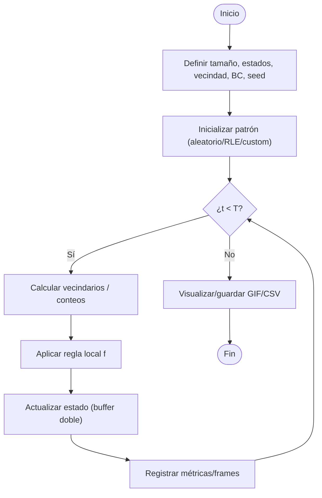
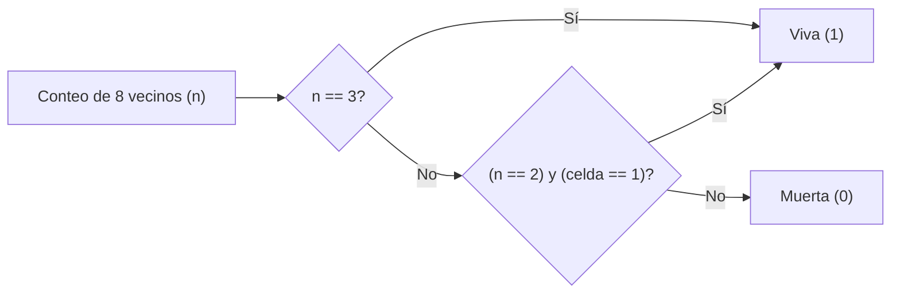

  <h1>🦠 AutoCell — Autómatas Celulares</h1>
  <p>Repositorio integral para el estudio e implementación de <b>Autómatas Celulares (AC)</b>: desde fundamentos teóricos y simulación de reglas clásicas (Conway, Wolfram) hasta variantes reversibles, estocásticas, multi-estado, en grafos y aceleradas por GPU.</p>

  <!-- Badges -->
  <p>
    <a href="https://www.python.org/"></a>
    <a href="../LICENSE"></a>
    <a href="https://pre-commit.com/"></a>
    <a href="https://colab.research.google.com/"></a>
    <a href="#"></a>
    <a href="#"></a>
  </p>

  <!-- Navigation -->
  <p>
    <a href="./notebooks/"></a>
    <a href="./src/"></a>
    <a href="./data/"></a>
    <a href="./references/"></a>
  </p>
</div>

---

## 🎯 Visión General

**AutoCell** te guía desde la definición básica de celdas, vecindades y reglas de transición hasta temas avanzados: **clases de Wolfram (I–IV)**, **universalidad** (p.ej., Regla 110 y Juego de la Vida), **AC reversibles** (Margolus), **estocásticos** (ruido/temperatura), **outer/totalistic** y **AC en grafos** (vecindad no-regular). Incluye APIs limpias en Python, notebooks demostrativos y herramientas para reproducibilidad y benchmarking.

### Demo — Evolución de patrones (Conway)


---
## 📂 Estructura del Repositorio

```
AutoCell/
├── README.md
├── notebooks/               # Tutoriales y experimentos (Colab-ready)
├── src/
│   ├── autocell/
│   │   ├── core.py          # Motor de actualización (1D/2D/ND)
│   │   ├── rules.py         # Reglas: Wolfram, Life, totalistas, custom
│   │   ├── neighborhoods.py # Moore, von Neumann, Margolus, grafos
│   │   ├── bc.py            # Condiciones de frontera
│   │   ├── io.py            # Carga/guardado de patrones (RLE, .npy, .txt)
│   │   ├── viz.py           # Visualización (matplotlib, GIF)
│   │   ├── rng.py           # Semillas y ruido (AC estocásticos)
│   │   └── gpu.py           # Backends opcionales (Numba/CuPy/PyTorch)
│   └── cli.py               # Interfaz de línea de comandos
├── data/
│   ├── patterns/            # .rle, .txt, .npy (gliders, pulsars, etc.)
│   └── random/              # Semillas aleatorias reproducibles
├── images/                  # Figuras, diagramas, animaciones
├── tests/                   # Pruebas unitarias/propiedad
├── references/              # Bibliografía y recursos
├── CITATION.cff
└── pyproject.toml           # Dependencias/estilo/linters/packaging
```

---

## 🎓 Objetivos de Aprendizaje

1. **Comprender** formalmente un AC: estados, vecindades, reglas y dinámica.
2. **Distinguir** clases de comportamiento (I–IV), estabilidad, periodicidad, caos y complejidad.
3. **Implementar** AC 1D/2D/ND y variantes (totalistas, outer-totalistas, reversibles, estocásticas).
4. **Analizar** métricas: densidad activa, entropía, correlaciones, espectros, velocidades de gliders.
5. **Acelerar** simulaciones con `numpy`, `numba` y backends GPU.
6. **Aplicar** AC en modelado (difusión, percolación, crecimiento, incendios, tráfico, arte generativo).

---

## 🚀 Instalación Rápida

**Requisitos:** Python ≥ 3.10

```bash
git clone <URL_DEL_REPOSITORIO>
cd AutoCell
python -m venv .venv
source .venv/bin/activate     # Windows: .venv\Scripts\activate
pip install -U pip
pip install -e ".[all]"       # o: pip install numpy matplotlib jupyter ipywidgets numba
pre-commit install            # ganchos opcionales
```

---

## 🧪 Quickstart

### CLI

```bash
# Juego de la Vida 200x200 durante 400 pasos con frontera periódica y GIF
python -m src.cli life --size 200 200 --steps 400 --bc periodic \
  --pattern data/patterns/glider_gun.rle --gif images/life_demo.gif
```

### Python API

```python
import numpy as np
from autocell.core import step_life
from autocell.viz import animate_gif

grid = np.zeros((100, 100), dtype=np.uint8)
# Ejemplo de patrón inicial (blinker)
grid[50, 49:52] = 1

frames = []
for _ in range(200):
    frames.append(grid.copy())
    grid = step_life(grid, bc="periodic")  # Moore 8-neighbors

animate_gif(frames, "images/blinker.gif", fps=10, cmap="binary")
```

---

## 📜 Tabla de Contenidos

* [1. Fundamentos Teóricos](#1-fundamentos-teóricos)
* [2. Componentes de un AC](#2-componentes-de-un-ac)
* [3. Implementaciones Esenciales](#3-implementaciones-esenciales)
* [4. Dinámicas Emergentes y Métricas](#4-dinámicas-emergentes-y-métricas)
* [5. Datos y Formatos](#5-datos-y-formatos)
* [6. Rendimiento y GPU](#6-rendimiento-y-gpu)
* [7. Aplicaciones](#7-aplicaciones)
* [8. Roadmap de Notebooks](#8-roadmap-de-notebooks)
* [9. Ejercicios Propuestos](#9-ejercicios-propuestos)
* [10. Errores Comunes](#10-errores-comunes)
* [11. API Breve](#11-api-breve)
* [12. Cómo Contribuir](#12-cómo-contribuir)
* [13. Licencia](#13-licencia)
* [Apéndice A: Diagramas Mermaid](#apéndice-a-diagramas-mermaid)
* [Apéndice B: Pseudocódigo y Reglas](#apéndice-b-pseudocódigo-y-reglas)
* [Apéndice C: Plantilla de Notebook](#apéndice-c-plantilla-de-notebook)

---

## 1. Fundamentos Teóricos

Un **autómata celular** es una tupla $(\mathcal{L}, \mathcal{S}, \mathcal{N}, f)$:

* **$\mathcal{L}$**: retícula de celdas (1D, 2D, ND o grafo).
* **$\mathcal{S}$**: conjunto de estados por celda (binario, multi-estado, continuo).
* **$\mathcal{N}$**: vecindad (Moore, von Neumann, radio $r$, bloques Margolus, vecinos en grafos).
* **$f$**: regla local $f:\mathcal{S}^{|\mathcal{N}|} \to \mathcal{S}$.

**Clases de Wolfram** (para 1D binario, vecindad radio 1):

* **I**: fijación (atractores puntuales)
* **II**: periodicidad (osciladores/estripes)
* **III**: caos (pseudoaleatoriedad; ej. Regla 30)
* **IV**: complejidad/estructuras móviles (gliders; ej. Regla 110 — universal)

**Familias**:

* **Totalistas / Outer-totalistas** (Life): la transición depende del conteo de vecinos.
* **Reversibles** (Margolus/HPP-like): dinámica invertible paso a paso.
* **Estocásticos**: $f$ incorpora ruido o probabilidad (temperatura, percolación).
* **En grafos**: $\mathcal{N}$ definida por aristas (redes sociales, carreteras).

---

## 2. Componentes de un AC

* **Estados**: `uint8`/`int8` para binario; `uint16`/`int32` para multi-estado; `float` para CA continuos.
* **Vecindad**: máscaras convolutivas o desplazamientos `np.roll`.
* **Condiciones de frontera (BC)**: `periodic`, `fixed(0|1|k)`, `reflect`.
* **Calendario de actualización**: síncrono (clásico), asíncrono (aleatorio), por bloques (Margolus).
* **Inicialización**: aleatoria (densidad p), patrones (`.rle`), semillas reproducibles.

---

## 3. Implementaciones Esenciales

### 3.1 Life (outer-totalista 2D, Moore)

```python
import numpy as np

def step_life(grid: np.ndarray, bc="periodic") -> np.ndarray:
    # 8 vecinos usando roll (toro) o padding (otras BC)
    def neigh_sum(a):
        s = sum(np.roll(np.roll(a, dx, 0), dy, 1)
                for dx in (-1,0,1) for dy in (-1,0,1) if (dx,dy)!=(0,0))
        return s
    
    # Esta es una versión simplificada, una implementación real manejaría los BC de otra forma
    n = neigh_sum(grid)
    return ((n==3) | ((grid==1) & (n==2))).astype(grid.dtype)
```

### 3.2 Wolfram 1D (radio 1, 8 patrones)

```python
def step_wolfram(cells, rule: int):
    lut = f"{rule:08b}"[::-1]  # little-endian por índice 0..7
    L = len(cells)
    nxt = np.empty_like(cells)
    for i in range(L):
        a,b,c = cells[(i-1)%L], cells[i], cells[(i+1)%L]
        idx = (a<<2)|(b<<1)|c
        nxt[i] = int(lut[idx])
    return nxt
```

### 3.3 Reversible por bloques (Margolus)

* Alterna particiones de bloques 2×2; aplica permutación local reversible; conmuta el enmallado en t par/impar.

---

## 4. Dinámicas Emergentes y Métricas

* **Patrones**: *still lifes*, osciladores, *spaceships/gliders*, *guns*, *puffers*.
* **Métricas**:

  * Densidad activa $\rho_t = \frac{1}{|\mathcal{L}|}\sum c_t$
  * Entropía de Shannon por ventana o global
  * Autocorrelación/longitud de correlación
  * Espectro (FFT) y detección de periodicidad
  * Velocidad/glider census (detección por *pattern matching*)

---

## 5. Datos y Formatos

* **`data/patterns/*.rle`**: Run Length Encoded (estándar Conway).
* **`.txt` / `.npy`**: matrices binarias o multi-estado.
* **`config.yaml`** (opcional):

```yaml
model: life
size:
steps: 2000
bc: periodic
seed: 42
record:
  gif: images/run.gif
  fps: 15
metrics: [density, entropy]
```

---

## 6. Rendimiento y GPU

* **Vectoriza** con `numpy` y evita bucles Python en el *hot path*.
* **Numba** JIT: acelera kernels; ideal para reglas custom (x3–x30).
* **CuPy/PyTorch** (opcional): mallas grandes en GPU; evita transferencias host↔device.
* **Convolución**: usa sumas con `np.roll` (rápido y simple) o kernels 3×3; FFT solo para kernels grandes.
* **Batching**: simula múltiples seeds en paralelo (extrae estadísticos).

---

## 7. Aplicaciones

* **Física/Química**: difusión/reacción simple, percolación, modelos tipo LBM simplificados.
* **Biología**: crecimiento, morfogénesis simple, colonias bacterianas, *Lenia*-like (continuo).
* **Ciencias Sociales**: contagio/rumores/opinión en grafos.
* **Ingeniería/Arte**: texturas procedurales, arte generativo, cifrados ligeros (CA caóticos).

---

## 8. Roadmap de Notebooks

| Notebook              | Tema                                   |                                     Abrir en Colab                                    |
| :-------------------- | :------------------------------------- | :-----------------------------------------------------------------------------------: |
| `01_intro_ac.ipynb`   | Conceptos básicos, vecindades y BC     | <a href="#"></a> |
| `02_wolfram_1d.ipynb` | Reglas 1D (0–255), clases I–IV         | <a href="#"></a> |
| `03_life_2d.ipynb`    | Juego de la Vida: gliders, osciladores | <a href="#"></a> |
| `04_reversible.ipynb` | Bloques Margolus y reversibilidad      | <a href="#"></a> |
| `05_stochastic.ipynb` | AC con ruido, percolación, incendios   | <a href="#"></a> |
| `06_gpu_perf.ipynb`   | Numba/CuPy/PyTorch benchmarks          | <a href="#"></a> |

---

## 9. Ejercicios Propuestos

**Teóricos**

1. Clasifica el comportamiento de Regla 30 y 110; discute universalidad de 110.
2. Demuestra que un esquema por bloques apropiado hace la dinámica reversible.

**Prácticos**

1. Implementa un AC estocástico de incendios (árbol, fuego, vacío) y calcula el umbral de percolación.
2. Detecta y mide la velocidad de un *glider* automáticamente.
3. Implementa Life con `numba` y compara con `numpy` puro (tiempos y escalado).
4. Construye un CA en un grafo (red de Barabási–Albert) y analiza propagación.

---

## 10. Errores Comunes

* ❌ Confundir BC: usar `periodic` cuando el experimento requiere `fixed`.
* ❌ Bucles Python internos en mallas grandes (lento); preferir vectorización/JIT.
* ❌ No fijar semillas → irreproducible.
* ❌ Interpretar ruido transitorio como clase III sin analizar escala temporal.

---

## 11. API Breve

```python
# src/autocell/core.py
step_life(grid, bc="periodic") -> np.ndarray
step_wolfram(cells, rule: int, bc="periodic") -> np.ndarray
evolve(init, step_fn, steps: int, record: bool=False, **kwargs) -> Iterator[np.ndarray]

# src/autocell/neighborhoods.py
neighbors(grid, kind="moore", radius=1, bc="periodic") -> np.ndarray  # suma o stack

# src/autocell/rules.py
rule_totalistic(counts, survive=(2,), born=(3,)) -> np.ndarray
rule_wolfram_table(rule: int) -> np.ndarray  # LUT 8→1

# src/autocell/viz.py
animate_gif(frames, path, fps=10, cmap="binary")
```

---

## 12. Cómo Contribuir

1. **Fork** y rama (`feature/mi-aporte`).
2. Sigue el estilo (Black/ruff) y agrega **tests**.
3. Ejecuta `pre-commit run -a` y `pytest -q`.
4. Haz **PR** con descripción clara y benchmarks si aplica.

---

## 13. Licencia

Código bajo **MIT**. Contenido docente (texto/notebooks/figuras) bajo **CC BY 4.0**. Ver `LICENSE`.

---

## Apéndice A: Diagramas Mermaid

### A.1 Flujo general de simulación



### A.2 Life (outer-totalista, Moore 3×3)



---

## Apéndice B: Pseudocódigo y Reglas

**Genérico (síncrono, buffer doble)**

```
func Evolve(L, S, N, f, T, bc, seed):
    x ← init_state(L, seed)
    for t in 1..T:
        for cell in L:
            v ← neighborhood(x, cell, N, bc)
            y[cell] ← f(v)
        x ← y
    return x
```

**Wolfram 1D (radio 1)**
Representa la tabla de 8 patrones (111..000) como entero 0–255. Índice `idx = 4*a + 2*b + c`.

**Life (B3/S23)**

* Nace con 3 vecinos (B3).
* Sobrevive si tiene 2 o 3 (S23).
  Extensiones: HighLife (B36/S23), Seeds, Day\&Night, etc.

---

## Apéndice C: Plantilla de Notebook

```markdown
# <Título: p.ej., Life acelerado con Numba>

## 1. Objetivos
- Qué aprenderás y qué medirás.

## 2. Configuración
- `SEED = 42`, tamaño, pasos, BC, backend.

## 3. Implementación
- Kernel base (`numpy`) y versión acelerada (`numba`/GPU).

## 4. Experimentos
- Distintas densidades/patrones, medición de tiempo, métricas.

## 5. Resultados
- Gráficos (densidad/entropía), GIFs, tablas de tiempos.

## 6. Conclusiones y trabajo futuro
- Qué funcionó, límites y siguientes mejoras.
```

---

## 📚 Referencias y Recursos

* S. Wolfram, *A New Kind of Science*.
* A. Ilachinski, *Cellular Automata: A Discrete Universe*.
* A. Adamatzky (Ed.), *Game of Life Cellular Automata*.
* Papers y enlaces adicionales en `references/`.
```
