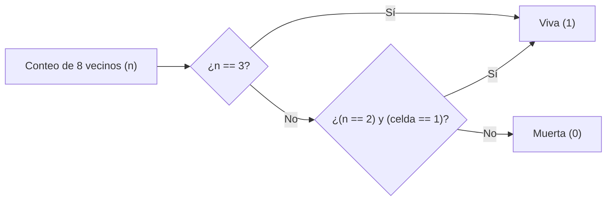

# 🦠 AutoCell — Autómatas Celulares

<p align="center">
  
</p>

<p align="center">
  <strong>Repositorio integral para el estudio e implementación de Autómatas Celulares (AC)</strong><br>
  Desde fundamentos teóricos hasta variantes avanzadas: Reversibles, Estocásticos, Multi-estado,<br>
  en Grafos y Acelerados por GPU 🚀
</p>

---

## 🎯 Características Principales

| ✨ Característica | 📝 Descripción |
|-------------------|---------------|
| 🔬 **Fundamentos** | Conway, Wolfram, clases I–IV, universalidad |
| 🔄 **Variantes Avanzadas** | Reversibles (Margolus), Estocásticos, Outer-totalistas |
| 🕸️ **Grafos** | Vecindades no-regulares en redes complejas |
| ⚡ **GPU Acceleration** | Numba, CuPy, PyTorch para simulaciones masivas |
| 📊 **Métricas Integradas** | Entropía, densidad, autocorrelación, censos de gliders |
| 🎨 **Visualización** | GIFs, heatmaps, diagramas de espacio-tiempo |
| 📦 **Formatos Estándar** | Soporte RLE, .npy, .txt, configuraciones YAML |
| 🧪 **Reproducibilidad** | Seeds controladas, tests unitarios, pre-commit hooks |

---

## 🚀 Empieza Aquí (Modo Clases)

<div align="center">

### 📚 Notebook Central: AC 1D, 2D y Máquina de Turing

<a href="https://colab.research.google.com/github/sgevatschnaider/GraphAI-Data-Science-ML/blob/a59bee63ffa0f5452fc13aa79136e458ef9262e5/notebooks/Aut%C3%B3matas_celulares_unidimensionales%2C_bidimensional_y_maquina_de_turing.ipynb">
  
</a>
<a href="https://github.com/sgevatschnaider/GraphAI-Data-Science-ML/blob/a59bee63ffa0f5452fc13aa79136e458ef9262e5/notebooks/Aut%C3%B3matas_celulares_unidimensionales%2C_bidimensional_y_maquina_de_turing.ipynb">
  
</a>

### 🎨 Lección Interactiva: Origami + Autómatas Celulares

<a href="https://htmlpreview.github.io/?https://github.com/sgevatschnaider/BigData-Graphs-Evo-CA-Classroom/blob/main/src/classroom/graphs/recursos/Origami_origami_Cuando_%20el_Papel_%20Empieza_a_Calcular.html">
  
</a>

### 📂 Explorar Todos los Notebooks

<a href="./notebooks/">
  
</a>

</div>

> 💡 **Guía Rápida para Estudiantes**
> 
> 1. **Inicia** con el notebook central en Colab (no necesitas instalación)
> 2. **Explora** la lección interactiva de origami para ver la conexión teórica
> 3. **Practica** con los ejercicios propuestos en cada notebook
> 4. **Experimenta** modificando reglas y parámetros en tiempo real

---

## 🔖 Estado del Proyecto

### 🛠️ Tecnologías & Calidad

<p>
  <a href="https://www.python.org/">
    
  </a>
  <a href="../LICENSE">
    
  </a>
  <a href="https://pre-commit.com/">
    
  </a>
  <a href="https://colab.research.google.com/">
    
  </a>
  <a href="#">
    
  </a>
  <a href="#">
    
  </a>
</p>

### 📁 Navegación Rápida

<p>
  <a href="./notebooks/">
    
  </a>
  <a href="./src/">
    
  </a>
  <a href="./data/">
    
  </a>
  <a href="./references/">
    
  </a>
</p>

---

## 🎯 Visión General

**AutoCell** es un framework educacional y de investigación que te guía desde la definición básica de autómatas celulares hasta aplicaciones de vanguardia. Cubre:

- **Fundamentos**: Celdas, vecindades, reglas de transición, condiciones de frontera
- **Clásicos**: Juego de la Vida de Conway, Reglas de Wolfram (0-255)
- **Clasificación**: Clases de comportamiento I–IV, universalidad computacional (Regla 110)
- **Variantes Avanzadas**: Reversibles (Margolus), Estocásticos, Outer-totalistas, Multi-estado
- **Grafos**: AC en redes complejas con vecindades no-regulares
- **Rendimiento**: Optimización NumPy, aceleración JIT con Numba, backends GPU (CuPy/PyTorch)

---

## 🧮 Origami Turing Machine — Cómputo Inscrito en el Papel

<p align="center">
  
</p>

### 🧩 Conceptos Clave

<details>
<summary><strong>Ver explicación completa del modelo computacional</strong></summary>

La animación muestra un patrón de origami que implementa una **Máquina de Turing** mediante geometría pura. Cada pliegue actúa como una **instrucción**, cada región como un **estado**, y las capas superpuestas funcionan como **memoria física**.

**Principios fundamentales:**

- **Montaña = 1, Valle = 0**: Los pliegues codifican bits directamente
- **Compatibilidad física = Lógica**: Pliegues opcionales implementan compuertas AND, OR, NOT
- **Teselación = Autómata**: Replicando estos "gadgets" se simula la **Regla 110**, un AC Turing-completo

Una hoja de papel con el patrón correcto se convierte en una **computadora universal**. La lección interactiva HTML explora esta conexión en profundidad con simuladores y diagramas paso a paso.

</details>

---

## 📂 Estructura del Repositorio

```text
AutoCell/
├── README.md                          # Este archivo
├── notebooks/                         # 📚 Tutoriales y experimentos (Colab-ready)
│   ├── 01_intro_ac.ipynb             # Introducción y fundamentos
│   ├── 02_wolfram_1d.ipynb           # AC 1D y clases de Wolfram
│   ├── 03_life_2d.ipynb              # Juego de la Vida y patrones
│   ├── 04_reversible.ipynb           # Bloques Margolus
│   ├── 05_stochastic.ipynb           # Ruido y percolación
│   └── 06_gpu_perf.ipynb             # Benchmarks y optimización
├── src/
│   ├── autocell/
│   │   ├── core.py                   # Motor de evolución (1D/2D/ND)
│   │   ├── rules.py                  # Reglas: Wolfram, Life, totalistas, custom
│   │   ├── neighborhoods.py          # Vecindades: Moore, von Neumann, Margolus, grafos
│   │   ├── bc.py                     # Condiciones de frontera (BC)
│   │   ├── io.py                     # Carga/guardado: RLE, .npy, .txt
│   │   ├── viz.py                    # Visualización: matplotlib, GIF
│   │   ├── rng.py                    # Semillas y ruido
│   │   └── gpu.py                    # Backends: Numba/CuPy/PyTorch
│   └── cli.py                        # Interfaz de línea de comandos
├── data/
│   ├── patterns/                     # Patrones RLE: gliders, pulsars, guns
│   └── random/                       # Semillas aleatorias reproducibles
├── images/                           # Figuras, diagramas y animaciones
├── tests/                            # Pruebas unitarias y de propiedad
├── references/                       # Bibliografía y papers clave
├── CITATION.cff                      # Cita académica
└── pyproject.toml                    # Dependencias y configuración
```

---

## 🎓 Objetivos de Aprendizaje

Al completar este repositorio, podrás:

- [x] **Definir** formalmente un AC: estados, vecindades, reglas y dinámica
- [x] **Distinguir** clases de comportamiento (I–IV), estabilidad, periodicidad y caos
- [x] **Implementar** AC 1D/2D/ND con variantes avanzadas (reversibles, estocásticos)
- [x] **Analizar** métricas cuantitativas: densidad, entropía, correlaciones, espectros
- [x] **Optimizar** simulaciones con técnicas vectorizadas, JIT y GPU
- [x] **Aplicar** AC en modelado real: difusión, percolación, crecimiento, tráfico
- [x] **Extender** a grafos complejos y redes sociales

---

## ⚙️ Instalación Rápida

### 🖥️ Local Development

```bash
# 1. Clona el repositorio
git clone <URL_DEL_REPOSITORIO>
cd AutoCell

# 2. Crea entorno virtual
python -m venv .venv
source .venv/bin/activate     # Linux/macOS
# .venv\Scripts\activate      # Windows

# 3. Instala dependencias
pip install -U pip
pip install -e ".[all]"       # Instala todo: numpy, matplotlib, numba, cupy, etc.

# 4. (Opcional) Configura pre-commit hooks
pre-commit install
```

### ☁️ Sin Instalación: Google Colab

Abre directamente cualquier notebook en Colab (ver sección [Empieza Aquí](#-empieza-aquí-modo-clases)). No necesitas instalar nada.

---

## 🧪 Quickstart

### 🔧 Interfaz de Línea de Comandos

```bash
# Juego de la Vida con "glider gun" de 200x200, 400 pasos, frontera periódica
python -m src.cli life \
  --size 200 200 \
  --steps 400 \
  --bc periodic \
  --pattern data/patterns/glider_gun.rle \
  --gif images/life_demo.gif
```

### 🐍 Python API

```python
import numpy as np
from autocell.core import evolve, step_life
from autocell.viz import animate_gif
from autocell.io import load_rle

# Opción 1: Usar patrón RLE (glider gun)
grid = load_rle("data/patterns/glider_gun.rle")

# Opción 2: Crear patrón manual (blinker)
# grid = np.zeros((100, 100), dtype=np.uint8)
# grid[50, 49:52] = 1

# Evolucionar y guardar GIF
frames = list(evolve(grid, step_life, steps=200, record=True))
animate_gif(frames, "images/blinker.gif", fps=10, cmap="binary")
```

### 🎛️ Configuración con YAML

```python
from autocell.io import load_config, run_from_config

config = load_config("config.yaml")
# config.yaml define: model, size, steps, bc, seed, record, metrics
results = run_from_config(config)
```

---

## 📚 Recursos Docentes (Notebooks + HTML)

### 📓 Notebook Fundamentos: AC 1D, 2D y Máquina de Turing

| Descripción | Acceso |
|-------------|--------|
| **Autómatas celulares unidimensionales, bidimensionales y máquina de Turing** | [](https://github.com/sgevatschnaider/GraphAI-Data-Science-ML/blob/a59bee63ffa0f5452fc13aa79136e458ef9262e5/notebooks/Aut%C3%B3matas_celulares_unidimensionales%2C_bidimensional_y_maquina_de_turing.ipynb) [](https://colab.research.google.com/github/sgevatschnaider/GraphAI-Data-Science-ML/blob/a59bee63ffa0f5452fc13aa79136e458ef9262e5/notebooks/Aut%C3%B3matas_celulares_unidimensionales%2C_bidimensional_y_maquina_de_turing.ipynb) |

### 🎨 Lección Interactiva: Origami + Autómatas Celulares

| Descripción | Acceso |
|-------------|--------|
| **Origami origami Cuando el Papel Empieza a Calcular (HTML interactivo)** | [](https://htmlpreview.github.io/?https://github.com/sgevatschnaider/BigData-Graphs-Evo-CA-Classroom/blob/main/src/classroom/graphs/recursos/Origami_origami_Cuando_%20el_Papel_%20Empieza_a_Calcular.html) |

<details>
<summary><strong>¿Qué contiene esta lección?</strong></summary>

- **6 secciones interactivas** con simuladores en vivo
- Fundamentos geométricos del origami computacional
- Axioma H6 y resolución de ecuaciones cúbicas
- Codificación binaria en pliegues (Montaña=1, Valle=0)
- Simulación de la **Regla 110** mediante teselaciones de origami
- Demostración de universalidad de Turing en papel

</details>

---

## 📖 Tabla de Contenidos

1. [Fundamentos Teóricos](#1-fundamentos-teóricos)
2. [Componentes de un AC](#2-componentes-de-un-ac)
3. [Implementaciones Esenciales](#3-implementaciones-esenciales)
4. [Dinámicas Emergentes y Métricas](#4-dinámicas-emergentes-y-métricas)
5. [Datos y Formatos](#5-datos-y-formatos)
6. [Rendimiento y GPU](#6-rendimiento-y-gpu)
7. [Aplicaciones](#7-aplicaciones)
8. [Roadmap de Notebooks](#8-roadmap-de-notebooks)
9. [Ejercicios Propuestos](#9-ejercicios-propuestos)
10. [Errores Comunes](#10-errores-comunes)
11. [API Breve](#11-api-breve)
12. [Cómo Contribuir](#12-cómo-contribuir)
13. [Licencia](#13-licencia)
14. [Apéndices](#apéndice-a-diagramas-mermaid)

---

## 1. Fundamentos Teóricos

Un **autómata celular** es formalmente una tupla $(\mathcal{L}, \mathcal{S}, \mathcal{N}, f)$:

| Símbolo | Definición |
|---------|------------|
| $\mathcal{L}$ | Retícula de celdas (1D, 2D, ND o grafo) |
| $\mathcal{S}$ | Conjunto de estados por celda (binario, multi-estado, continuo) |
| $\mathcal{N}$ | Vecindad (Moore, von Neumann, radio $r$, Margolus, grafos) |
| $f$ | Función de transición local $f:\mathcal{S}^{|\mathcal{N}|} \to \mathcal{S}$ |

### 🔢 Clases de Wolfram (1D binario, radio 1)

| Clase | Comportamiento | Ejemplo |
|-------|----------------|---------|
| **I** | Fijación atractor puntual | Regla 0, 8, 160 |
| **II** | Periodicidad (osciladores) | Regla 108, 178 |
| **III** | Caos (pseudoaleatorio) | Regla 30, 90, 126 |
| **IV** | Complejidad + estructuras móviles | **Regla 110 (universal)** |

### 🏷️ Familias de AC

- **Totalistas**: $f$ depende del conteo de estados vecinos
- **Outer-totalistas** (Life): $f$ depende del conteo y el estado central
- **Reversibles**: $f$ es biyectiva (invertible paso a paso)
- **Estocásticos**: $f$ incorpora probabilidad $p \in [0,1]$
- **En grafos**: $\mathcal{N}$ definida por matriz de adyacencia

---

## 2. Componentes de un AC

```python
# Ejemplo de componentes en AutoCell
from autocell import neighborhoods as nb

# Estados: uint8 (binario) hasta uint32 (multi-estado)
# Vecindad: box de 3×3 desplazada con roll
# BC: periodic, fixed(k), reflect, zero-gradient
# Calendario: síncrono (default), async_random, block_margolus

grid = np.random.randint(0, 2, size=(100, 100), dtype=np.uint8)
neighbors = nb.moore_sum(grid, radius=1, bc="periodic")  # Suma de 8 vecinos
```

---

## 3. Implementaciones Esenciales

### 3.1 Juego de la Vida (outer-totalista 2D)

```python
import numpy as np
from autocell.neighborhoods import moore_sum

def step_life(grid: np.ndarray, bc="periodic") -> np.ndarray:
    """Implementación vectorizada del Juego de la Vida B3/S23."""
    # Cuenta vecinos (8 para Moore)
    n = moore_sum(grid, radius=1, bc=bc)
    
    # Aplica reglas: nace con 3, sobrevive con 2-3
    births = (n == 3)
    survives = (grid == 1) & (n == 2)
    
    return (births | survives).astype(grid.dtype)
```

### 3.2 Wolfram 1D (radio 1, 8 patrones)

```python
def step_wolfram(cells: np.ndarray, rule: int, bc="periodic") -> np.ndarray:
    """Evolución de regla Wolfram 1D usando LUT."""
    lut = np.array([int(b) for b in f"{rule:08b}"[::-1]], dtype=np.uint8)
    
    # Vecindades: 3 celdas (izq, centro, der)
    left = np.roll(cells, -1)
    right = np.roll(cells, 1)
    idx = (left << 2) | (cells << 1) | right
    
    return lut[idx]
```

### 3.3 Reversible por Bloques (Margolus)

```python
def step_margolus(grid, block_rule, parity):
    """AC reversible usando partición de bloques 2×2."""
    # Alterna partición según paridad t%2
    # Aplica permutación reversible en cada bloque
    # Garantiza invertibilidad física
    pass  # Ver notebook 04_reversible.ipynb
```

---

## 4. Dinámicas Emergentes y Métricas

### 🎭 Patrones Clásicos

| Tipo | Descripción | Ejemplo Life |
|------|-------------|--------------|
| **Still Life** | Configuración estática | Block, Beehive, Loaf |
| **Oscillator** | Período finito >1 | Blinker, Toad, Pulsar |
| **Spaceship** | Se mueve en espacio | Glider, LWSS, MWSS, HWSS |
| **Gun** | Emite spaceships periódicamente | Gosper Glider Gun |

### 📈 Métricas Cuantitativas

```python
from autocell.metrics import density, shannon_entropy, glider_census

# Densidad activa
rho_t = density(grid)

# Entropía de Shannon (por ventana o global)
H = shannon_entropy(grid, base=2)

# Censo de gliders (pattern matching)
gliders = glider_census(frames, pattern="glider")
```

**Fórmulas:**

- **Densidad**: $\rho_t = \frac{1}{|\mathcal{L}|} \sum_{c \in \mathcal{L}} s_t(c)$
- **Entropía**: $H = -\sum_{s \in \mathcal{S}} p(s) \log_2 p(s)$
- **Autocorrelación**: $C(\tau) = \langle s_t \cdot s_{t+\tau} \rangle$

---

## 5. Datos y Formatos

### 📦 Formatos Soportados

| Formato | Extensión | Uso | Carga |
|---------|-----------|-----|-------|
| **RLE** | `.rle` | Patrones clásicos (Life) | `load_rle()` |
| **Numpy** | `.npy` | Estados binarios/multi | `np.load()` |
| **Texto** | `.txt` | Matriz simple | `np.loadtxt()` |
| **YAML** | `.yaml` | Configuración completa | `load_config()` |

**Ejemplo de `config.yaml`:**
```yaml
model: life
size: [100, 100]
steps: 2000
bc: periodic
seed: 42
record:
  gif: images/run.gif
  fps: 15
metrics: [density, entropy, glider_census]
output_dir: results/
```

---

## 6. Rendimiento y GPU

### ⚡ Benchmarks (1000×1000, 100 steps)

| Backend | Tiempo | Speedup | Notas |
|---------|--------|---------|-------|
| Pure Python | 120s | 1× | No recomendado |
| NumPy | 2.1s | 57× | Vectorización |
| Numba JIT | 0.3s | 400× | Ideal para reglas custom |
| CuPy (GPU) | 0.08s | 1500× | Requiere CUDA |
| PyTorch (GPU) | 0.05s | 2400× | Mejor para batches |

**Best Practices:**
- ✅ Usa `np.roll` para vecindades pequeñas (≤ radio 3)
- ✅ Pre-alloca buffers con `np.empty_like`
- ✅ JIT con `@nb.njit` para reglas complejas
- ❌ Evita loops Python en el hot path
- ❌ Minimiza host↔device transfers en GPU

---

## 7. Aplicaciones

### 🌐 Modelado Interdisciplinario

| Campo | Modelo AC | Métrica Clave |
|-------|-----------|---------------|
| 🔬 **Física** | Difusión, Percolación, LBM simplificado | Umbral crítico $p_c$ |
| 🧬 **Biología** | Crecimiento, Morfogénesis, Lenia | Entropía espacial |
| 🏙️ **Sociales** | Contagio, Opinión, Rumores en grafos | Tiempo de convergencia |
| 🎨 **Ingeniería** | Texturas procedurales, Arte generativo | Estética/diversidad |
| 🔐 **Criptografía** | CA caóticos (Rule 30) | Entropía/aperiodicidad |

---

## 8. Roadmap de Notebooks

| # | Notebook | Tema | Duración | Dificultad |
|---|----------|------|----------|------------|
| 01 | `01_intro_ac.ipynb` | Conceptos básicos, vecindades y BC | 30 min | ⭐ |
| 02 | `02_wolfram_1d.ipynb` | Reglas 1D (0-255), clases I-IV | 45 min | ⭐⭐ |
| 03 | `03_life_2d.ipynb` | Juego de la Vida: gliders y osciladores | 60 min | ⭐⭐ |
| 04 | `04_reversible.ipynb` | Bloques Margolus y reversibilidad | 45 min | ⭐⭐⭐ |
| 05 | `05_stochastic.ipynb` | Ruido, percolación, incendios | 60 min | ⭐⭐ |
| 06 | `06_gpu_perf.ipynb` | Numba/CuPy/PyTorch benchmarks | 45 min | ⭐⭐⭐ |
| 07 | `07_graph_ca.ipynb` | AC en grafos complejos | 60 min | ⭐⭐⭐ |

*Todos los notebooks son **Colab-ready** con ejemplos ejecutables.*

---

## 9. Ejercicios Propuestos

### 📝 Teóricos (Pensamiento Crítico)

1. **Clasificación**: Analiza Regla 18 vs 110. ¿Por qué 110 es universal y 18 no? Argumenta con gliders y gaps.
2. **Reversibilidad**: Diseña un esquema por bloques 3×3 que sea reversible. Demuestra la inversibilidad matemática.
3. **Universalidad**: Si Rule 110 es universal, ¿por qué el Juego de la Vida es más famoso? Discute trade-offs.

### 🔬 Prácticos (Implementación)

| Ejercicio | Objetivo | Dificultad | Hints |
|-----------|----------|------------|-------|
| **Incendios** | AC estocástico B/S con probabilidad $p$. Encuentra $p_c$ de percolación | ⭐⭐ | Usa `np.random.random` |
| **Detector de Gliders** | Automatiza detección de gliders en Life | ⭐⭐⭐ | Pattern matching con `scipy.signal` |
| **Numba vs NumPy** | Benchmark: Life 1000×1000, 100 steps | ⭐ | `@nb.njit(parallel=True)` |
| **CA en Grafos** | Implementa SIR en red Barabási-Albert | ⭐⭐⭐ | Usa `networkx` para el grafo |
| **Lenia Continuo** | AC continuo en 2D con kernel gaussiano | ⭐⭐⭐⭐ | Ver paper de Bert Wang-Chak Chan |

---

## 10. Errores Comunes & Soluciones

| ❌ Error | ⚠️ Impacto | ✅ Solución |
|----------|------------|--------------|
| **BC incorrecta** | Artefactos en bordes | Verifica `bc="fixed"` para experimentos abiertos |
| **Loops Python** | Simulaciones lentas | Vectoriza con NumPy o JIT con Numba |
| **Seed no fijada** | Resultados irreproducibles | `np.random.seed(42)` o usa `rng.py` |
| **Ruido transitorio** | Clasificación errónea | Analiza $t \to \infty$ y múltiples seeds |
| **Overflow en estados** | Valores incorrectos | Usa `dtype=np.uint8` o superior |

---

## 11. API Breve (Completa)

```python
# src/autocell/core.py
evolve(init: np.ndarray, step_fn: Callable, steps: int, 
       record: bool = False, **kwargs) -> Iterator[np.ndarray]
step_life(grid: np.ndarray, bc="periodic") -> np.ndarray
step_wolfram(grid: np.ndarray, rule: int, bc="periodic") -> np.ndarray
step_margolus(grid, block_rule, parity: int) -> np.ndarray

# src/autocell/neighborhoods.py
moore_sum(grid, radius=1, bc="periodic") -> np.ndarray
von_neumann_sum(grid, radius=1, bc="periodic") -> np.ndarray
graph_neighbors(grid, adjacency_matrix) -> np.ndarray

# src/autocell/rules.py
rule_totalistic(counts, survive: tuple, born: tuple) -> np.ndarray
rule_outer_totalistic(counts, center, survive: tuple, born: tuple) -> np.ndarray
rule_wolfram_table(rule: int) -> np.ndarray  # LUT 8→1

# src/autocell/viz.py
animate_gif(frames: List[np.ndarray], path: str, fps: int = 10, 
            cmap: str = "binary", dpi: int = 100)
plot_space_time(evolution, rule: int = None) -> plt.Figure

# src/autocell/metrics.py
density(grid) -> float
entropy(grid, base: int = 2) -> float
glider_census(frames, pattern: str = "glider") -> Dict
```

---

## 12. Cómo Contribuir

¡Nos encanta la colaboración! Sigue estos pasos:

1. **Fork** el repo y crea una rama: `git checkout -b feature/mi-aporte`
2. **Sigue el estilo**: `black` y `ruff` (configurado en `pyproject.toml`)
3. **Añade tests**: Usa `pytest` y `hypothesis` para propiedades
4. **Ejecuta checks**: `pre-commit run -a && pytest -q`
5. **Haz PR**: Describe el cambio, añade benchmarks si aplica

**Áreas abiertas:**
- [ ] AC cuánticos (QCA)
- [ ] Optimización multi-GPU
- [ ] Más formatos de importación (CATIA, Life 1.06)
- [ ] Visualización 3D para AC 3D
- [ ] Exportación a WebGL para web

---

## 13. Licencia

- **Código fuente**: [MIT License](../LICENSE) — Usa, modifica, distribuye libremente
- **Contenido educativo**: [CC BY 4.0](https://creativecommons.org/licenses/by/4.0/) — Atribuye al autor

---

## Apéndice A: Diagramas Mermaid

### A.1 Flujo General de Simulación


### A.2 Juego de la Vida (outer-totalista)



---

## Apéndice B: Pseudocódigo y Reglas

### Genérico (Síncrono, Buffer Doble)

```text
func Evolve(L, S, N, f, T, bc, seed):
    x ← init_state(L, seed)
    for t in 1..T:
        for cell in L:
            v ← neighborhood(x, cell, N, bc)
            y[cell] ← f(v)
        swap(x, y)
    return x
```

### Wolfram 1D (radio 1)

```python
# Representación como entero 0-255
# Índice: idx = 4*a + 2*b + c
# Patrón 111..000 → bits 7..0
lut = np.array([int(b) for b in f"{rule:08b}"[::-1]])
```

### Life (B3/S23)

```python
# Nace con 3 vecinos (B3)
# Sobrevive con 2-3 vecinos (S23)
births = (n == 3)
survives = (grid == 1) & (n == 2)
new_grid = (births | survives).astype(np.uint8)
```

---

## Apéndice C: Plantilla de Notebook

Usa esta plantilla para crear notebooks consistentes:

```markdown
# Título: [AC Tema] — [Enfoque]

## 1. Objetivos
- Qué aprenderás y qué métricas medirás.

## 2. Configuración
```python
SEED = 42
SIZE = (100, 100)
STEPS = 200
BC = "periodic"
BACKEND = "numba"  # numpy, numba, cupy
```

## 3. Implementación
- Código base
- Versión optimizada

## 4. Experimentos
- Variación de parámetros
- Benchmarks

## 5. Resultados
- Visualizaciones (GIFs, plots)
- Tablas de métricas

## 6. Conclusiones
- Qué funcionó y límites encontrados
- Trabajo futuro
```

---

## 📚 Referencias y Recursos Clave

### 📄 Bibliografía Fundamental

* **S. Wolfram**, *A New Kind of Science* (2002) — Clases de comportamiento
* **A. Ilachinski**, *Cellular Automata: A Discrete Universe* (2001) — Fundamentos matemáticos
* **A. Adamatzky** (Ed.), *Game of Life Cellular Automata* (2010) — Life avanzado
* **T. Toffoli & N. Margolus**, *Cellular Automata Machines* (1987) — Reversibilidad
* **B. Chopard & M. Droz**, *Cellular Automata Modeling of Physical Systems* (1998) — Aplicaciones físicas

### 🔗 Enlaces Adicionales

- [ConwayLife.com](http://conwaylife.com) — Base de datos de patrones Life
- [Catagolue](https://catagolue.appspot.com) — Censo de objetos en Life
- [Wolfram Atlas](http://atlas.wolfram.com) — Reglas elementales 1D

> 🎯 **Cita este trabajo**: Si usas AutoCell en tu investigación, por favor cita usando el archivo [`CITATION.cff`](../CITATION.cff).

---

<p align="center">
  <em>Desarrollado con ❤️ para la comunidad de ciencias de la computación</em><br>
  <em>¿Preguntas? Abre un issue o contacta: <a href="mailto:contact@example.com">contact@example.com</a></em>
</p>
