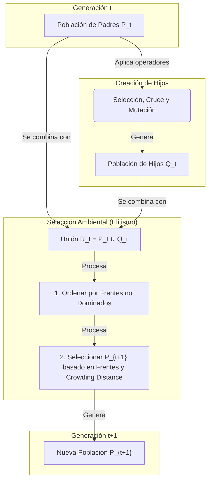

---

<div align="center">
  <h1> EvoAlgo — Algoritmos Evolutivos</h1>
  <p>Un repositorio dedicado a la teoría y práctica de <b>Algoritmos Evolutivos (EA)</b>, diseñado para docencia, investigación y desarrollo.</p>
  <!-- Badges -->
  <p>
    <a href="https://www.python.org/"></a>
    <a href="../LICENSE"></a>
    <a href="https://pre-commit.com/"></a>
    <a href="https://colab.research.google.com/"></a>
  </p>

  <!-- Navigation -->
  <p>
    <a href="./notebooks/"></a>
    <a href="./src/"></a>
    <a href="./data/"></a>
    <a href="./references/"></a>
  </p>
</div>

---

## 👁️ Visión General

Este repositorio ofrece una ruta de aprendizaje estructurada, desde los fundamentos teóricos de los Algoritmos Evolutivos (EA) hasta su implementación práctica en problemas de optimización, incluyendo algoritmos multiobjetivo (MOEA).

### Recurso Visual — Frente de Pareto (MOEA)

La siguiente animación ilustra la evolución de una población con **NSGA-II** hacia el frente de Pareto. Es una herramienta útil para explicar conceptos clave como **dominancia**, **diversidad** (usando *crowding distance*) y **elitismo**.


---

## 📂 Estructura del Repositorio

```
EvoAlgo/
├── README.md              # Este archivo
├── notebooks/             # Guías prácticas y tutoriales
├── src/                   # Módulos: operadores, estrategias y utilidades
├── data/                  # Instancias de problemas (TSP, Knapsack, etc.)
├── images/                # Figuras, diagramas y animaciones
└── references/            # Bibliografía, papers y recursos teóricos
```

---

## 🎯 Objetivos de Aprendizaje

Al finalizar el estudio de este material, serás capaz de:

1.  **Comprender** el ciclo de vida de un Algoritmo Evolutivo: `Inicialización → Selección Parental → Recombinación → Mutación → Selección Ambiental → Criterio de Parada`.
2.  **Identificar** las principales familias de EA: Algoritmos Genéticos (GA/SGA), Estrategias de Evolución (ES), Programación Evolutiva (EP) y Programación Genética (GP).
3.  **Implementar** algoritmos clave como Evolución Diferencial (DE) y Optimización por Enjambre de Partículas (PSO), y compararlos con arquitecturas clásicas.
4.  **Aplicar** técnicas de optimización multiobjetivo (MOEA), incluyendo los conceptos de dominancia de Pareto y algoritmos como NSGA-II/III.
5.  **Analizar** la relación entre los principios de variación y selección y el **Teorema "No Free Lunch"** para diseñar variantes de algoritmos específicas a un dominio.

---

## 🎓 Ruta de Aprendizaje Interactiva

### 1. Algoritmos Genéticos Aplicados

| 📄 Recurso | 📥 Acceso |
|---|---|
|**algoritmo_genético_y_el_problema_del_viajante.py** <br><br> <details><summary><strong>Resumen:</strong> <em>(haz clic para expandir/colapsar)</em></summary><p>Este notebook de Colab es un módulo educativo integral sobre Algoritmos Genéticos (AG), que abarca desde la teoría fundamental hasta implementaciones avanzadas. El contenido se estructura a través de documentos HTML interactivos y celdas de código Python ejecutables, cubriendo:<br><ul><li><b>Teoría:</b> Introducciones detalladas, formulación matemática, justificación de aplicabilidad, FAQs y un glosario completo.</li><li><b>Implementaciones Prácticas:</b> Contiene solvers basados en AG para diversos problemas clásicos, incluyendo: optimización de funciones matemáticas, búsqueda de ciclos Hamiltonianos, resolución del Problema del Viajante (TSP) y navegación en laberintos.</li><li><b>Técnicas Avanzadas:</b> Las implementaciones demuestran conceptos avanzados como mutación adaptativa, reseteo parcial de población, búsqueda local híbrida (algoritmos meméticos como 2-opt) y elitismo.</li><li><b>Visualización Dinámica:</b> Los solvers más complejos incluyen visualizaciones en tiempo real para analizar la evolución del fitness, la diversidad, el comportamiento de los parámetros y la calidad de la mejor solución encontrada en cada generación.</li><li><b>Conceptos Modernos:</b> Introduce la idea de "AlphaEvolve", un enfoque que hibrida AG con Aprendizaje por Refuerzo, y proporciona un análisis del sistema homónimo de Google DeepMind que utiliza LLMs para el descubrimiento algorítmico.</li></ul></p></details> | [](https://colab.research.google.com/drive/1TZHeEzV5YuyXC4SlCBWbTzClo5h4sUP2?usp=sharing) |

---

### 2. Teoría de Algoritmos Genéticos y Optimización

| 📄 Recurso | 📥 Acceso |
|---|---|
|**Algoritmos_Genéticos Introducción.html** <br><br> <details><summary><strong>Resumen:</strong> <em>(haz clic para expandir/colapsar)</em></summary><p>Este documento proporciona una completa introducción académica a los Algoritmos Genéticos (AG). Se inicia con la teoría fundamental, estableciendo paralelismos con la evolución natural, y detalla los componentes esenciales para la formulación de un problema: codificación, función de aptitud, operadores genéticos y criterios de parada. Explora el concepto clave de "paisaje de aptitud" (fitness landscape), y profundiza en los mecanismos de selección, cruce y mutación. El material se consolida con ejemplos detallados paso a paso para problemas discretos (codificación binaria) y continuos (codificación real), concluyendo con una discusión sobre temas avanzados y un balance de las fortalezas y limitaciones de los AG.</p></details> | [](https://clinquant-meringue-3930c2.netlify.app/src/classroom/graphs/recursos/algoritmos_gen%C3%A9ticos%20introducci%C3%B3n) |
|**Algoritmo_Genético_Optimización en Big Data y Machine Learning.html** <br><br> <details><summary><strong>Resumen:</strong> <em>(haz clic para expandir/colapsar)</em></summary><p>Este recurso enmarca la optimización en el contexto del Machine Learning y Big Data. Establece que todo el ML es fundamentalmente un problema de optimización, explorando conceptos clave como la "maldición de la dimensionalidad" y la distinción crítica entre paisajes de optimización convexos (Clase P) y no convexos (NP-hard). Analiza el rol de optimizadores como SGD y Adam, y cómo las estrategias de regularización (L1/L2) moldean el paisaje de pérdida para combatir el sobreajuste. El documento posiciona a las metaheurísticas, como los algoritmos genéticos, como herramientas esenciales para tareas de optimización de alto nivel, como AutoML y la Búsqueda de Arquitecturas Neuronales (NAS).</p></details> | [](https://clinquant-meringue-3930c2.netlify.app/src/classroom/graphs/recursos/algoritmo_gen%C3%A9tico_optimizaci%C3%B3n%20en%20big%20data%20y%20machine%20learning) |
|**Algoritmo_Genético_Simulación.html** <br><br> <details><summary><strong>Resumen:</strong> <em>(haz clic para expandir/colapsar)</em></summary><p>Esta es una sofisticada simulación interactiva de un Algoritmo Genético resolviendo un problema de navegación en laberintos. Permite al usuario configurar un amplio conjunto de parámetros del AG, incluyendo tasas de operadores, tamaño de población y heurísticas avanzadas como mutación adaptativa, reseteo de población y búsqueda local. La interfaz ofrece una visualización dinámica en tiempo real que muestra el mejor camino encontrado, gráficos de evolución de fitness y diversidad, y un panel único para el seguimiento de "índices topológicos" (como la característica de Euler y un "Índice Genético" personalizado). Es una herramienta práctica y potente para experimentar y comprender el comportamiento de los AG.</p></details> | [](https://clinquant-meringue-3930c2.netlify.app/src/classroom/graphs/recursos/algoritmo_gen%C3%A9tico_simulaci%C3%B3n) |
|**Alogritmo_Genetico_Optimización y Complejidad.html** <br><br> <details><summary><strong>Resumen:</strong> <em>(haz clic para expandir/colapsar)</em></summary><p>Este documento ofrece una guía teórica fundamental sobre la optimización y su íntima relación con la complejidad computacional. Define formalmente un problema de optimización (espacio de búsqueda, función objetivo, restricciones) y explora en profundidad la dicotomía entre problemas convexos y no convexos. El texto establece el vínculo crucial entre la geometría de un problema y su clase de complejidad (P vs. NP-hard), justificando así la necesidad de metaheurísticas como los Algoritmos Genéticos para abordar problemas del mundo real donde las soluciones exactas son computacionalmente intratables.</p></details> | [](https://clinquant-meringue-3930c2.netlify.app/src/classroom/graphs/recursos/alogritmo_genetico_optimizaci%C3%B3n%20y%20complejidad) |

### 3. Cuestionario: Algoritmos Genéticos
| 📄 Recurso | 📥 Acceso |
|---|---|
| **Algoritmo_Genetico_Cuestionario.html** <br><br> <details><summary><strong>Resumen:</strong> <em>(haz clic para expandir/colapsar)</em></summary><p>Este cuestionario interactivo de 20 preguntas evalúa el conocimiento sobre los componentes y la dinámica de los Algoritmos Genéticos. Abarca desde su inspiración biológica y fundamentos teóricos hasta el rol de sus operadores clave: selección, cruce y mutación. Se analizan conceptos como la función de aptitud, la convergencia prematura, el elitismo y la naturaleza estocástica del proceso, proporcionando una base sólida sobre su funcionamiento.</p></details> | [](https://htmlpreview.github.io/?https://github.com/sgevatschnaider/BigData-Graphs-Evo-CA-Classroom/blob/main/src/classroom/graphs/recursos/Algoritmo_Genetico_Cuestionario_Algoritmo%20Gen%C3%A9tico.html) |

---
### 4. Topología y Característica de Euler

| 📄 Recurso | 📥 Acceso |
|---|---|
|**Poliedro_Euler.html** <br><br> <details><summary><strong>Resumen:</strong> <em>(haz clic para expandir/colapsar)</em></summary><p>Este recurso proporciona una demostración 3D interactiva de la Fórmula de Euler para poliedros (V - E + F = χ). Permite a los usuarios seleccionar sólidos platónicos (cubo, icosaedro, etc.), visualizarlos junto a su proyección esférica y verificar cómo la relación entre sus Vértices, Aristas y Caras resulta consistentemente en la característica de Euler χ = 2. Incluye una guía paso a paso para reforzar el aprendizaje.</p></details> | [](https://clinquant-meringue-3930c2.netlify.app/src/classroom/graphs/recursos/poliedro_euler) |
| **Poliedro_Euler_topologia-index.html** <br><br> <details><summary><strong>Resumen:</strong> <em>(haz clic para expandir/colapsar)</em></summary><p>Esta avanzada herramienta interactiva conecta la característica de Euler (χ) con teoremas fundamentales de la topología. A través de tres pestañas, visualiza: 1) El Teorema de Poincaré-Hopf, sumando los índices de un campo vectorial sobre una esfera. 2) El Teorema de Gauss-Bonnet discreto, calculando la curvatura a través de los "defectos angulares" en los vértices de un cubo. 3) La relación entre el género de una superficie y su característica (χ = 2 - 2g).</p></details> | [](https://clinquant-meringue-3930c2.netlify.app/src/classroom/graphs/recursos/poliedro_euler_topologia-index) |
| **Poliedro_Superficies y su característica de Euler (χ).html** <br><br> <details><summary><strong>Resumen:</strong> <em>(haz clic para expandir/colapsar)</em></summary><p>Este recurso visualiza la conexión entre el género (g, el número de "agujeros") de una superficie y su característica de Euler (χ). Presenta renderizados 3D de superficies con g=0 (esfera), g=1 (toro), g=2 (doble toro) y g=3. Para cada una, muestra cómo se cumple la fórmula χ = 2 - 2g, ayudando a construir una comprensión intuitiva de este importante invariante topológico.</p></details> | [](https://clinquant-meringue-3930c2.netlify.app/src/classroom/graphs/recursos/poliedro_superficies%20y%20su%20caracter%C3%ADstica%20de%20euler%20(%CF%87)) |
|**Poliedro_homorfo.html** <br><br> <details><summary><strong>Resumen:</strong> <em>(haz clic para expandir/colapsar)</em></summary><p>Esta es una clara demostración interactiva del concepto de homeomorfismo. Visualiza la deformación continua entre una esfera y un cubo mediante una proyección radial. Un deslizador permite al usuario transformar una figura en la otra, reforzando la idea de que, aunque geométricamente distintas, son topológicamente equivalentes. El recurso también presenta las fórmulas matemáticas que definen la transformación.</p></details> | [](https://clinquant-meringue-3930c2.netlify.app/src/classroom/graphs/recursos/poliedro_homorfo) |
|**Poliedro_teoria.html** <br><br> <details><summary><strong>Resumen:</strong> <em>(haz clic para expandir/colapsar)</em></summary><p>Este recurso ofrece un marco teórico completo sobre los conceptos topológicos fundamentales, partiendo desde los orígenes en el trabajo de Euler. Explica la transición de la geometría rígida a las propiedades cualitativas, define los espacios topológicos y homeomorfismos, y detalla la importancia de los invariantes. El documento analiza en profundidad la fórmula de Euler (V-E+F=χ) y su conexión con el género (χ = 2 - 2g), sirviendo como un sólido respaldo teórico para las demostraciones interactivas.</p></details> | [](https://clinquant-meringue-3930c2.netlify.app/src/classroom/graphs/recursos/poliedro_teoria) |

### 5. Cuestionario: Topología, Grafos y la Característica de Euler
| 📄 Recurso | 📥 Acceso |
|---|---|
|**Poliedro_Cuestionario_topologia.html** <br><br> <details><summary><strong>Resumen:</strong> <em>(haz clic para expandir/colapsar)</em></summary><p>Este cuestionario interactivo de 20 preguntas profundiza en los conceptos fundamentales de la topología, partiendo de la fórmula de Euler para poliedros. Explora su generalización a través de la característica de Euler y el género de las superficies, y su conexión con la teoría de grafos. Además, introduce temas avanzados como los números de Betti y el teorema de Poincaré-Hopf, estableciendo analogías conceptuales entre los invariantes topológicos y la dinámica de los algoritmos evolutivos.</p></details> | [](https://htmlpreview.github.io/?https://github.com/sgevatschnaider/BigData-Graphs-Evo-CA-Classroom/blob/main/src/classroom/graphs/recursos/Poliedro_Cuestionario_topologia.html) |

---

## 🚀 Instalación Rápida

Se recomienda un entorno virtual para gestionar las dependencias.

**Requisitos:**
*   Python (versión ≥ 3.10)
*   Librerías principales: `numpy`, `pandas`, `matplotlib`, `scipy`, `jupyter`, `deap`, `pymoo`
*   Librerías opcionales: `networkx` (para grafos/TSP), `plotly` (visualizaciones interactivas)

```bash
# 1. Clona el repositorio y navega al directorio
git clone <URL_DEL_REPOSITORIO>
cd EvoAlgo

# 2. Crea y activa un entorno virtual
python -m venv .venv
source .venv/bin/activate  # En Windows: .venv\Scripts\activate

# 3. Instala las dependencias
pip install -U pip
pip install numpy pandas matplotlib scipy jupyter deap pymoo

# 4. Inicia Jupyter
jupyter lab
```

---

## 📜 Tabla de Contenidos

*   [1. Fundamentos Teóricos](#1-fundamentos-teóricos)
*   [2. Componentes de un EA](#2-componentes-de-un-ea)
*   [3. Algoritmos Esenciales](#3-algoritmos-esenciales)
*   [4. Optimización Multiobjetivo (MOEA)](#4-optimización-multiobjetivo-moea)
*   [5. Práctica con Datos](#5-práctica-con-datos)
*   [6. Buenas Prácticas](#6-buenas-prácticas)
*   [7. Aplicaciones Típicas](#7-aplicaciones-típicas)
*   [8. Roadmap de Notebooks](#8-roadmap-de-notebooks)
*   [9. Ejercicios Propuestos](#9-ejercicios-propuestos)
*   [10. Errores Comunes](#10-errores-comunes)
*   [11. Bibliografía y Recursos](#11-bibliografía-y-recursos)
*   [12. Cómo Contribuir](#12-cómo-contribuir)
*   [13. Licencia](#13-licencia)
*   [Apéndice A: Pseudocódigo](#apéndice-a--pseudocódigo)
*   [Apéndice B: Plantilla de Notebook](#apéndice-b--plantilla-de-notebook)

---

## 1. Fundamentos Teóricos

> **¿Qué es un Algoritmo Evolutivo?**
> Los EA son metaheurísticas de búsqueda estocástica basadas en poblaciones. Inspirados en la evolución biológica, utilizan operadores de **variación** (recombinación y mutación) para explorar el espacio de soluciones y un mecanismo de **selección** para explotar las regiones más prometedoras.

> **Teorema "No Free Lunch" (NFL)**
> No existe un algoritmo de optimización que sea universalmente superior para todos los problemas. Por ello, es crucial diseñar o adaptar la **representación** y los **operadores** de un EA a las características del dominio del problema.

---

## 2. Componentes de un EA

*   **Representación**: Cómo se codifica una solución (genotipo). Ej: binaria, entera, real, permutaciones, árboles (GP), grafos.
*   **Selección Parental**: Mecanismo para elegir individuos para la reproducción. Ej: Ruleta, Torneo, Selección Universal Estocástica (SUS).
*   **Recombinación (Cruce)**: Combina el material genético de dos o más padres. Ej: Cruce de 1-punto, uniforme, aritmético (para valores reales).
*   **Mutación**: Introduce variación aleatoria en un individuo. Ej: Bit-flip (binario), ruido Gaussiano (valores reales).
*   **Selección Ambiental**: Determina qué individuos sobreviven para la siguiente generación. Ej: esquemas (μ, λ) y (μ+λ).
*   **Elitismo**: Estrategia que asegura que los mejores individuos de una generación pasen a la siguiente.

---

## 3. Algoritmos Esenciales

| Familia | Idea Central | Notas Clave |
| :--- | :--- | :--- |
| **GA/SGA** | Población binaria, cruce de 1-punto, mutación bit-flip y selección por ruleta. | El modelo canónico de Holland, DeJong y Goldberg. |
| **ES** | Vectores reales, auto-adaptación de parámetros de mutación, selección determinista (μ,λ) o (μ+λ). | Potente para optimización numérica continua. |
| **DE** | Mutación mediante vectores diferenciales: $v = x_a + F \cdot (x_b - x_c)$. | Convergencia rápida y robusta, con pocos hiperparámetros. |
| **PSO** | Partículas con posición y velocidad, influenciadas por su mejor experiencia personal (*pBest*) y la global (*gBest*). | No usa operadores genéticos; la cooperación guía la búsqueda. |

---

## 4. Optimización Multiobjetivo (MOEA)

El objetivo es encontrar un conjunto de soluciones que representen el mejor compromiso posible entre objetivos en conflicto.

*   **Dominancia de Pareto**: Una solución **A** domina a **B** si **A** es mejor o igual que **B** en todos los objetivos, y estrictamente mejor en al menos uno.
*   **Frente de Pareto**: El conjunto de todas las soluciones no dominadas del espacio de búsqueda.
*   **NSGA-II**: Algoritmo de referencia que introduce **ordenamiento rápido no dominado**, **elitismo** (preservando las mejores soluciones de padres e hijos) y **distancia de apilamiento** (*crowding distance*) para mantener la diversidad en el frente.
*   **NSGA-III**: Evolución de NSGA-II para problemas con muchos objetivos (MaOPs), que utiliza puntos de referencia para guiar la selección y mantener la diversidad.

### Diagrama del Ciclo de Selección en NSGA-II



---

## 5. Práctica con Datos

### 5.1 Formatos en `data/`

Los problemas benchmark están disponibles en `data/` con formatos estándar:
*   `*.tsp` / `*.csv`: Para el Problema del Viajante (coordenadas, matrices).
*   `knapsack/*.csv`: Para el Problema de la Mochila (ítems, pesos, valores).
*   `*.json` / `*.yaml`: Para configuraciones de experimentos.

### 5.2 Ejemplo Mínimo (SGA con DEAP)

Este código resuelve el problema OneMax (maximizar la suma de bits en una cadena).

```python
import random
from deap import base, creator, tools

# --- Configuración del problema ---
# Maximizar una función objetivo, por lo tanto `weights=(1.0,)`
creator.create("FitnessMax", base.Fitness, weights=(1.0,))
# Cada individuo es una lista con un atributo de fitness
creator.create("Individual", list, fitness=creator.FitnessMax)

# --- Inicialización de herramientas (Toolbox) ---
toolbox = base.Toolbox()
N_BITS = 50 # Longitud del cromosoma

# Registro de operadores
toolbox.register("attr_bool", random.randint, 0, 1) # Generador de genes (0 o 1)
toolbox.register("individual", tools.initRepeat, creator.Individual, toolbox.attr_bool, N_BITS)
toolbox.register("population", tools.initRepeat, list, toolbox.individual)

# Operadores genéticos
toolbox.register("evaluate", lambda ind: (sum(ind),)) # Función de evaluación
toolbox.register("mate", tools.cxOnePoint) # Cruce de un punto
toolbox.register("mutate", tools.mutFlipBit, indpb=1.0/N_BITS) # Mutación bit-flip
toolbox.register("select", tools.selTournament, tournsize=3) # Selección por torneo

# --- Algoritmo Evolutivo ---
def main():
    pop = toolbox.population(n=100)
    CXPB, MUTPB, NGEN = 0.5, 0.2, 40

    # Bucle principal del algoritmo
    for gen in range(NGEN):
        offspring = toolbox.select(pop, len(pop))
        offspring = list(map(toolbox.clone, offspring))

        # Aplicar cruce y mutación
        for child1, child2 in zip(offspring[::2], offspring[1::2]):
            if random.random() < CXPB:
                toolbox.mate(child1, child2)
                del child1.fitness.values
                del child2.fitness.values

        for mutant in offspring:
            if random.random() < MUTPB:
                toolbox.mutate(mutant)
                del mutant.fitness.values

        # Evaluar individuos inválidos
        invalid_ind = [ind for ind in offspring if not ind.fitness.valid]
        fitnesses = map(toolbox.evaluate, invalid_ind)
        for ind, fit in zip(invalid_ind, fitnesses):
            ind.fitness.values = fit

        # Reemplazo generacional
        pop[:] = offspring

    best_ind = tools.selBest(pop, 1)[0]
    print(f"Mejor individuo: {sum(best_ind)}/{N_BITS}")

if __name__ == "__main__":
    main()
```

### 5.3 Problemas Combinatorios

*   **TSP**: Requiere operadores específicos para permutaciones (ej. PMX, OX, CX) para evitar la generación de soluciones inválidas.
*   **Knapsack**: La representación binaria es natural. Las restricciones se pueden manejar con penalizaciones en la función de fitness o tratarlo como un problema multiobjetivo.

---

## 6. Buenas Prácticas

-   **Reproducibilidad**: Fija siempre las semillas aleatorias (`random.seed()`, `np.random.seed()`) y documenta la configuración del experimento.
-   **Representación**: Elige una codificación que sea natural para el problema. Una mala representación puede impedir que el EA encuentre buenas soluciones.
-   **Balance Exploración-Explotación**: Ajusta los operadores y sus probabilidades. Un elitismo fuerte puede llevar a convergencia prematura; una mutación muy alta puede impedir la convergencia.
-   **Sigue el NFL**: No asumas que un algoritmo funcionará bien en todos los problemas. Adapta los componentes al dominio específico.

---

## 7. Aplicaciones Típicas

*   **Optimización Combinatoria**: Rutas de vehículos (TSP), asignación de tareas (scheduling), problemas de empaquetado (knapsack).
*   **Machine Learning**: Búsqueda de arquitecturas neuronales (Neuroevolución), diseño de sistemas de clasificación de aprendizaje (LCS/XCS), entrenamiento de políticas en Aprendizaje por Refuerzo.
*   **Programación Genética (GP)**: Evolución de programas, árboles de expresión y modelos simbólicos.

---

## 8. Roadmap de Notebooks

| Notebook | Tema | Abrir en Colab |
| :--- | :--- | :---: |
| `01_intro_ea.ipynb` | Motivación, ciclo EA, Teorema NFL | <a href="#"></a> |
| `02_ga_sga.ipynb` | SGA: ruleta, 1-punto, bit-flip, esquemas | <a href="#"></a> |
| `03_es_de.ipynb` | ES ((μ,λ)/(μ+λ)) + DE (rand/1, best/1) | <a href="#"></a> |
| `04_pso.ipynb` | PSO: ecuaciones y variantes | <a href="#"></a> |
| `05_moea_nsga.ipynb` | Pareto, NSGA-II/III, hipervolumen | <a href="#"></a> |
| `06_combinatoria_tsp_knap.ipynb` | Operadores de permutación (PMX/OX), knapsack | <a href="#"></a> |
| `07_gp.ipynb` | Programación Genética (árboles) | <a href="#"></a> |
| `08_lcs_xcs.ipynb`| Sistemas Clasificadores de Aprendizaje (LCS/XCS) | <a href="#"></a> |

---

## 9. Ejercicios Propuestos

#### Teóricos

1.  **Justifica** por qué la combinación de elitismo y *crowding distance* en NSGA-II mejora la preservación y diversidad del frente de Pareto respecto a un enfoque sin estas técnicas.
2.  **Compara** las estrategias de selección ambiental `(μ,λ)` y `(μ+λ)` en términos de exploración y explotación. ¿En qué escenarios preferirías una sobre la otra?
3.  **Explica** con un ejemplo práctico las implicaciones del Teorema "No Free Lunch" al diseñar un operador de cruce para el problema del viajante (TSP).

#### Prácticos

1.  **Implementa** un SGA para el problema *OneMax* y un algoritmo DE para la función *Sphere*. Compara sus curvas de convergencia (mejor fitness vs. número de evaluaciones).
2.  **Resuelve** una instancia de TSP (50–100 ciudades) comparando el rendimiento de los operadores de cruce PMX, OX y CX. Opcional: añade un operador de búsqueda local como 2-opt.
3.  **Modela** el problema de la mochila como un problema multiobjetivo (maximizar valor, minimizar peso) y resuélvelo con NSGA-II. Visualiza el frente de Pareto resultante.
4.  **Compara** el rendimiento de PSO y GA en un conjunto de 5 funciones benchmark. Analiza la sensibilidad de PSO a los parámetros `c1` y `c2`.

---

## 10. Errores Comunes

*   ❌ **Usar operadores de cruce estándar en permutaciones (TSP)**. Esto genera soluciones inválidas. Siempre utiliza operadores específicos como PMX, OX, CX o ER.
*   ❌ **Ignorar la gestión de la diversidad en MOEA**. Sin mecanismos como *crowding distance* o puntos de referencia, el frente de Pareto puede colapsar en una región pequeña.
*   ❌ **Elegir una representación inadecuada**. Codificar un problema de valores reales con una representación binaria de baja precisión puede limitar la calidad de la solución.
*   ❌ **Asumir que existe "el mejor EA"**. El rendimiento de un algoritmo depende del problema (NFL). La experimentación y adaptación son clave.

---

## 11. Bibliografía y Recursos

*   **Notebooks**: [`./notebooks/`](./notebooks/)
*   **Datos**: [`./data/`](./data/)
*   **Imágenes**: [`./images/`](./images/)
*   **Referencias**: [`./references/`](./references/)

#### Libros Clave

*   Eiben, A. E., & Smith, J. E. (2007). *Introduction to Evolutionary Computing*. Springer.
*   Goldberg, D. E. (1989). *Genetic Algorithms in Search, Optimization and Machine Learning*. Addison-Wesley.
*   Mitchell, M. (1996). *An Introduction to Genetic Algorithms*. MIT Press.
*   Holland, J. H. (1992). *Adaptation in Natural and Artificial Systems*. MIT Press.

---

## 12. Cómo Contribuir

¡Las contribuciones son bienvenidas!

1.  Crea un **Fork** de este repositorio.
2.  Crea una nueva rama para tu funcionalidad (`git checkout -b feature/mi-aporte`).
3.  Realiza tus cambios y haz **commit** (`git commit -m 'Añade X cosa'`).
4.  Haz **push** a tu rama (`git push origin feature/mi-aporte`).
5.  Abre un **Pull Request**.

---

## 13. Licencia

El código de este proyecto se distribuye bajo la **Licencia MIT**. El contenido docente (texto, imágenes, notebooks) se sugiere utilizar bajo **CC BY 4.0**. Consulta el archivo `LICENSE` para más detalles.

---

## Apéndice A: Pseudocódigo

#### Esqueleto Genérico de un EA
```
Función EA(problema):
  Población ← Inicializar_Población()
  Evaluar(Población)
  Mientras NO criterio_de_parada:
      Padres ← Selección_Parental(Población)
      Hijos  ← Recombinar_y_Mutar(Padres)
      Evaluar(Hijos)
      Población ← Selección_Ambiental(Población, Hijos)
  Retornar Mejor_Solución(Población)
```

#### Evolución Diferencial (DE/rand/1/bin)
```
Función DE(f, N, F, CR):
  P ← Inicializar_Población(N)
  Mientras NO criterio_de_parada:
      Para cada individuo x_i en P:
          Seleccionar a, b, c distintos de i
          v ← x_a + F * (x_b - x_c)  // Vector donante
          u ← Cruce_Binomial(x_i, v, CR)
          Si f(u) es mejor que f(x_i):
              x_i ← u
```

---

## Apéndice B: Plantilla de Notebook

````markdown
# Título: <Tema del Notebook>

## 1. Objetivos de Aprendizaje
- Describir el objetivo principal del notebook.
- Listar los conceptos clave que se cubrirán.

## 2. Descripción del Problema
- Explicar el problema a resolver.
- Mencionar la ruta al dataset en `data/`.

## 3. Configuración del Experimento
- Semilla aleatoria: `SEED = 42`
- Parámetros del algoritmo (tamaño de población, generaciones, etc.).
- Presupuesto computacional (ej. número de evaluaciones).

## 4. Implementación
### 4.1. Carga de Datos y Librerías
### 4.2. Definición de la Representación y Operadores
### 4.3. Bucle Evolutivo
### 4.4. Ejecución y Registro de Resultados

## 5. Análisis de Resultados
- Mostrar métricas de rendimiento (tablas).
- Visualizar curvas de convergencia o frentes de Pareto.

## 6. Conclusiones
- Resumir los hallazgos clave.
- Discutir posibles mejoras o próximos pasos.
````
