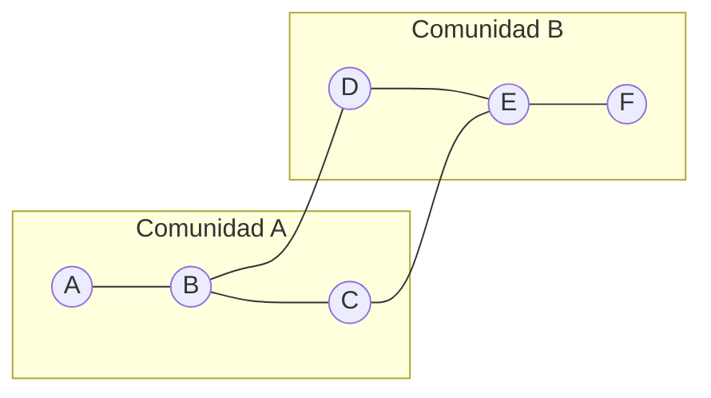
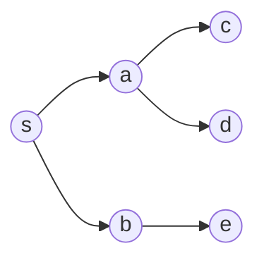

<div align="center">
  <h1>📘 Teoría de los grafos — README</h1>
  <p>Teoría y práctica aplicada de <b>Teoría de Grafos</b> para docencia y desarrollo.</p>

## Recurso visual — Hipercubo 4D (Tesseracto)

Esta animación ilustra la **proyección y rotación** de un hipercubo 4D.  
Es útil para conectar el grafo hipercubo \(Q_n\) con **distancia de Hamming**, capas de **BFS** y propiedades de **regularidad**.


  <p>
    <a href="https://www.python.org/"></a>
    <a href="../LICENSE"></a>
    <a href="https://pre-commit.com/"></a>
  </p>

  <p>
    <a href="./notebooks/"></a>
    <a href="./data/"></a>
    <a href="./images/"></a>
    <a href="./references/"></a>
  </p>
</div>

---

## Estructura local

```

Graph/
├── README.md
├── notebooks/
├── data/
├── images/
└── references/

````

---

## Objetivos de aprendizaje

Al completar esta sección podrás:

- Modelar problemas como grafos (no dirigidos, dirigidos, ponderados, multigrafos).
- Elegir **representaciones** adecuadas (lista de adyacencia, matriz, lista de aristas).
- Analizar **complejidad** y aplicar algoritmos (BFS/DFS, caminos mínimos, MST, flujo, emparejamientos).
- Medir redes con **métricas** estructurales y de **centralidad**.
- Usar **herramientas** prácticas para cargar, procesar y visualizar grafos.
- Diseñar **experimentos reproducibles** con notebooks.

---

## Instalación rápida

Requisitos sugeridos:

- Python ≥ 3.10
- Paquetes: `networkx`, `numpy`, `pandas`, `matplotlib`, `scipy`, `jupyter`
- *(opcionales)*: `pyvis` (visualización web), `python-igraph` (escala), `pygraphviz` (layouts)

```bash
# Desde Graph/
python -m venv .venv && source .venv/bin/activate  # Windows: .venv\Scripts\activate
pip install -U pip
pip install networkx numpy pandas matplotlib scipy jupyter pyvis
jupyter lab  # o jupyter notebook
````

Abre los cuadernos en `notebooks/` para la ruta guiada.

---

## Tabla de contenidos

* [1) Fundamentos teóricos](#1-fundamentos-teóricos)
* [2) Algoritmos esenciales (y complejidad)](#2-algoritmos-esenciales-y-complejidad)
* [3) Métricas y análisis de redes](#3-métricas-y-análisis-de-redes)
* [4) Modelos de grafos](#4-modelos-de-grafos)
* [5) Práctica con datos](#5-práctica-con-datos)
* [6) Buenas prácticas (ingeniería + docencia)](#6-buenas-prácticas-ingeniería--docencia)
* [7) Aplicaciones típicas](#7-aplicaciones-típicas)
* [8) Roadmap sugerido de notebooks](#8-roadmap-sugerido-de-notebooks)
* [9) Ejercicios propuestos](#9-ejercicios-propuestos)
* [10) Errores comunes](#10-errores-comunes)
* [11) Enlaces internos y bibliografía](#11-enlaces-internos-y-bibliografía)
* [12) Contribución](#12-contribución)
* [13) Licencia](#13-licencia)
* [Apéndice A — Pseudocódigo docente](#apéndice-a--pseudocódigo-docente)
* [Apéndice B — Plantilla mínima de notebook](#apéndice-b--plantilla-mínima-de-notebook)

---

## 📝 El Problema de los Puentes de Königsberg y Teoremas Fundamentales (Lección Interactiva)

| 📄 Recurso | 📥 Acceso |
|---|---|
| **El Problema de los Puentes de Königsberg y Teoremas Fundamentales (Lección Interactiva)** <br><br> <details><summary><strong>Resumen:</strong> <em>(haz clic para expandir/colapsar)</em></summary><p>Este cuaderno interactivo explora el problema histórico de los puentes de Königsberg como punto de partida para explicar los teoremas fundacionales de la teoría de grafos. Analiza en detalle el Teorema de Euler sobre caminos y ciclos eulerianos y el Teorema del Apretón de Manos (Handshaking Theorem), demostrando matemáticamente por qué el famoso recorrido era imposible. El material combina explicaciones teóricas con demostraciones, tablas comparativas y un glosario completo para facilitar la comprensión. Técnicamente, el cuaderno utiliza Python para generar contenido HTML dinámico, mostrando cómo los conceptos matemáticos pueden presentarse en un formato web interactivo y atractivo.</p></details> | [](https://github.com/sgevatschnaider/BigData-Graphs-Evo-CA-Classroom/blob/399214fc89b3e76cb77650899b45d259af3fdaf1/src/classroom/graphs/notebooks/Los_puentes_de_K%C3%B6nigsberg_y_el_teorema_de_apret%C3%B3n_de_manos.ipynb) [](https://colab.research.google.com/github/sgevatschnaider/BigData-Graphs-Evo-CA-Classroom/blob/399214fc89b3e76cb77650899b45d259af3fdaf1/src/classroom/graphs/notebooks/Los_puentes_de_K%C3%B6nigsberg_y_el_teorema_de_apret%C3%B3n_de_manos.ipynb) <br><br> [](https://economiayetica.blogspot.com/2025/08/el-paseo-de-euler-teoria-de-grafos_30.html) |

## 📝 Fundamentos de la Teoría de Grafos

| 📄 Recurso | 📥 Acceso |
|---|---|
| **Introducción a la Teoría de Grafos (Taller Interactivo)** <br><br> <details><summary><strong>Resumen:</strong> <em>(haz clic para expandir/colapsar)</em></summary><p>Este cuaderno interactivo introduce los conceptos esenciales de la teoría de grafos, transformando una lección teórica en una aplicación web visual y dinámica. Explora las definiciones de vértices y aristas, y detalla los distintos tipos de grafos (dirigidos, no dirigidos, ponderados, bipartitos, etc.) a través de visualizaciones claras. La lección destaca por su construcción técnica: utiliza Python con <code>networkx</code> y <code>matplotlib</code> para generar los grafos, los convierte a formato Base64 y los incrusta en una página HTML con CSS y JavaScript para ofrecer una interfaz interactiva con temas claro/oscuro y secciones colapsables. El objetivo es proporcionar una comprensión intuitiva y práctica de cómo se modelan y analizan las redes y relaciones.</p></details> | [](https://github.com/sgevatschnaider/BigData-Graphs-Evo-CA-Classroom/blob/fdacac884643cdc9f8d15c59e720ed19f50afca7/src/classroom/graphs/notebooks/Introducci%C3%B3n_a_la_teor%C3%ADa_y_aplicaciones_de_los_grafos_.ipynb) [](https://colab.research.google.com/github/sgevatschnaider/BigData-Graphs-Evo-CA-Classroom/blob/fdacac884643cdc9f8d15c59e720ed19f50afca7/src/classroom/graphs/notebooks/Introducci%C3%B3n_a_la_teor%C3%ADa_y_aplicaciones_de_los_grafos_.ipynb) |

## ​ Gráfico de Cuadrícula

| 📄 Recurso | 📥 Acceso |
|---|---|
| **Gráfico de Cuadrícula (Taller Interactivo)** <br><br> <details><summary><strong>Resumen:</strong> <em>(haz clic para expandir/colapsar)</em></summary><p>Este cuaderno interactivo presenta el concepto de **grafo de cuadrícula**, una estructura donde los vértices representan coordenadas en una matriz y las aristas conectan posiciones adyacentes. Mediante `networkx` y `matplotlib`, se construyen y visualizan cuadrículas de distintos tamaños, y las imágenes resultantes se incrustan en HTML usando Base64, complementadas con una interfaz interactiva —modo claro/oscuro y secciones colapsables— para facilitar el aprendizaje.</p></details> | [](https://github.com/sgevatschnaider/BigData-Graphs-Evo-CA-Classroom/blob/9300aff017c293b2ecc5123dd9642f5a841c5e53/src/classroom/graphs/notebooks/Gr%C3%A1fico_de_cuadr%C3%ADcula_.ipynb) [](https://colab.research.google.com/github/sgevatschnaider/BigData-Graphs-Evo-CA-Classroom/blob/9300aff017c293b2ecc5123dd9642f5a841c5e53/src/classroom/graphs/notebooks/Gr%C3%A1fico_de_cuadr%C3%ADcula_.ipynb) |

# 📚 Introducción a los Grafos Irregulares

Esta es una colección de lecciones y simulaciones interactivas diseñadas para explorar los conceptos fundamentales y avanzados de la teoría de grafos, desde los preliminares hasta aplicaciones en computación de alto rendimiento. Cada recurso es una página web autocontenida con visualizaciones dinámicas construidas con HTML, CSS y JavaScript.

---

##  Preliminares y Conceptos Fundamentales

| 📄 Recurso | 📥 Acceso |
|---|---|
| **Preliminares.html** <br><br> <details><summary><strong>Resumen:</strong> <em>(haz clic para expandir/colapsar)</em></summary><p>Esta lección interactiva introduce los pilares de la teoría de grafos. Diferencia visualmente entre grafos simples, multigrafos y grafos ponderados. A través de un lienzo dinámico, los usuarios pueden generar grafos aleatorios para comprender el concepto de grado y secuencia de grados. La página culmina con una demostración interactiva del Lema del Apretón de Manos, permitiendo verificar la suma de grados y la paridad de vértices de grado impar en tiempo real. Es el punto de partida esencial para cualquier estudiante del área.</p></details> | [](https://github.com/sgevatschnaider/BigData-Graphs-Evo-CA-Classroom/blob/9127ad4a5fcc319a99faed0a61031a68a0f277ab/src/classroom/graphs/recursos/Preliminares.html) |

## ⚖️ Grafos Regulares: Simetría en la Conectividad

| 📄 Recurso | 📥 Acceso |
|---|---|
| **2.Grafos_regulares.html** <br><br> <details><summary><strong>Resumen:</strong> <em>(haz clic para expandir/colapsar)</em></summary><p>Este recurso se enfoca en la familia de los grafos regulares, destacando su simetría estructural. Explica la definición de un grafo k-regular y la propiedad fundamental que relaciona su orden, grado y tamaño (nk = 2m). Su principal característica es un explorador interactivo que permite generar y visualizar familias canónicas de grafos regulares, incluyendo Ciclos (Cₙ), Grafos Completos (Kₙ), Hipercubos (Qd) y Grafos Bipartitos Completos (Kₙ,ₙ), ajustando sus parámetros con deslizadores para observar cómo cambian su estructura y propiedades.</p></details> | [](https://github.com/sgevatschnaider/BigData-Graphs-Evo-CA-Classroom/blob/9127ad4a5fcc319a99faed0a61031a68a0f277ab/src/classroom/graphs/recursos/2.Grafos_regulares.html) |

## 🚫 El Límite de la Diversidad: Grafos Irregulares

| 📄 Recurso | 📥 Acceso |
|---|---|
| **3.Grafos_ Irregulares.html** <br><br> <details><summary><strong>Resumen:</strong> <em>(haz clic para expandir/colapsar)</em></summary><p>Esta página aborda una pregunta fundamental: ¿puede un grafo ser "totalmente diverso" en sus conexiones? Define formalmente los grafos completamente irregulares y presenta la demostración clásica de su imposibilidad en el mundo de los grafos simples. El recurso incluye una innovadora demostración interactiva que visualiza la contradicción lógica fundamental: la coexistencia forzada de un vértice de grado 0 (aislado) y un vértice de grado n-1 (universalmente conectado). Los usuarios pueden manipular el orden del grafo para ver por qué este conflicto es inevitable.</p></details> | [](https://github.com/sgevatschnaider/BigData-Graphs-Evo-CA-Classroom/blob/9127ad4a5fcc319a99faed0a61031a68a0f277ab/src/classroom/graphs/recursos/3.Grafos_%20Irregulares.html) |

## ✨ Grafos Casi Irregulares: Lo Más Cerca Posible

| 📄 Recurso | 📥 Acceso |
|---|---|
| **Grafos_cuasiirregulares.html** <br><br> <details><summary><strong>Resumen:</strong> <em>(haz clic para expandir/colapsar)</em></summary><p>Tras demostrar que la irregularidad total es imposible, esta lección explora lo más cerca que se puede llegar: los grafos casi irregulares. Presenta el elegante teorema que afirma que para cada orden n, existen exactamente dos de estos grafos y son complementarios entre sí. El recurso incluye un constructor interactivo que, al seleccionar un orden n, genera y visualiza automáticamente la única pareja de grafos casi irregulares existente, resaltando los vértices con el grado repetido y demostrando visualmente la relación de complementariedad.</p></details> | [](https://github.com/sgevatschnaider/BigData-Graphs-Evo-CA-Classroom/blob/9127ad4a5fcc319a99faed0a61031a68a0f277ab/src/classroom/graphs/recursos/Grafos_cuasiirregulares.html) |

## 🔄 El Complemento de un Grafo

| 📄 Recurso | 📥 Acceso |
|---|---|
| **El Complemento de un Grafo-irregular.html** <br><br> <details><summary><strong>Resumen:</strong> <em>(haz clic para expandir/colapsar)</em></summary><p>Este recurso didáctico se centra en una de las transformaciones más fundamentales: el complemento. Explica la definición, la fórmula de relación de grados (deg_G̅(v) = (n-1) - deg_G(v)) y la relación de aristas. Su componente principal es un "laboratorio interactivo" donde los usuarios pueden dibujar un grafo G añadiendo o quitando aristas, y ver cómo su grafo complemento G̅ se actualiza en tiempo real. Esto permite una comprensión intuitiva y visual de cómo la operación de complemento "invierte" la estructura de conectividad y preserva propiedades como la casi irregularidad.</p></details> | [](https://github.com/sgevatschnaider/BigData-Graphs-Evo-CA-Classroom/blob/9127ad4a5fcc319a99faed0a61031a68a0f277ab/src/classroom/graphs/recursos/El%20Complemento%20de%20un%20Grafo-irregular.html) |

## 🧮 Realización de Secuencias de Grados

| 📄 Recurso | 📥 Acceso |
|---|---|
| **Realización de secuencias de grados y “casi irregularidad”.html** <br><br> <details><summary><strong>Resumen:</strong> <em>(haz clic para expandir/colapsar)</em></summary><p>Esta página aborda la pregunta: ¿dada una lista de números, puede corresponder a los grados de un grafo simple? Explica los dos enfoques principales: el algoritmo constructivo de Havel-Hakimi y el teorema existencial de Erdős-Gallai. El recurso brilla por su laboratorio interactivo del algoritmo de Havel-Hakimi, que permite a los usuarios introducir cualquier secuencia de grados y ver el proceso de reducción paso a paso, mostrando visualmente si la secuencia es gráfica o no. También incluye una tabla con las secuencias canónicas de los grafos casi irregulares.</p></details> | [](https://github.com/sgevatschnaider/BigData-Graphs-Evo-CA-Classroom/blob/9127ad4a5fcc319a99faed0a61031a68a0f277ab/src/classroom/graphs/recursos/Realizaci%C3%B3n%20de%20secuencias%20de%20grados%20y%20%E2%80%9Ccasi%20irregularidad%E2%80%9D.html) |

## 🕊️ El Principio del Palomar

| 📄 Recurso | 📥 Acceso |
|---|---|
| **Palomar.html** <br><br> <details><summary><strong>Resumen:</strong> <em>(haz clic para expandir/colapsar)</em></summary><p>Este recurso se dedica a explicar una de las herramientas de demostración más elegantes y potentes de la matemática discreta. Define la versión básica y generalizada del Principio del Palomar (o Principio de Dirichlet). El componente central es un simulador interactivo donde se puede ajustar el número de "palomas" (objetos) y "palomares" (cajas) para ver visualmente por qué una colisión es inevitable cuando hay más objetos que contenedores. La página aplica este principio de manera explícita para reforzar la demostración de la imposibilidad de los grafos completamente irregulares.</p></details> | [](https://github.com/sgevatschnaider/BigData-Graphs-Evo-CA-Classroom/blob/9127ad4a5fcc319a99faed0a61031a68a0f277ab/src/classroom/graphs/recursos/Palomar.html) |

## 🔗 Perspectiva Algebraica: Grafos de Cayley

| 📄 Recurso | 📥 Acceso |
|---|---|
| **Grafo_Cayley.html** <br><br> <details><summary><strong>Resumen:</strong> <em>(haz clic para expandir/colapsar)</em></summary><p>Esta lección explora la profunda conexión entre el álgebra abstracta y la teoría de grafos. Define la construcción de un Grafo de Cayley a partir de un grupo finito y un conjunto de generadores. Explica propiedades clave como la regularidad garantizada y la vértice-transitividad. Incluye un explorador interactivo que permite generar y visualizar diferentes tipos de Grafos de Cayley, como ciclos (sobre ℤₙ), hipercubos (sobre (ℤ₂)ᵈ), grafos completos e incluso grafos bipartitos regulares (sobre el grupo Diedral), demostrando la versatilidad de esta construcción.</p></details> | [](https://github.com/sgevatschnaider/BigData-Graphs-Evo-CA-Classroom/blob/9127ad4a5fcc319a99faed0a61031a68a0f277ab/src/classroom/graphs/recursos/Grafo_Cayley.html) |

## ⚡ Análisis de Rendimiento en GPU con Grafos

| 📄 Recurso | 📥 Acceso |
|---|---|
| **Análisis de Rendimiento en GPU con Grafos_irregulares.html** <br><br> <details><summary><strong>Resumen:</strong> <em>(haz clic para expandir/colapsar)</em></summary><p>Este recurso avanzado sirve como un caso de estudio sobre los desafíos de procesar grafos en arquitecturas paralelas como las GPUs. Utiliza grafos casi irregulares para exacerbar y analizar cuellos de botella. La página incluye un panel de simulación de rendimiento que visualiza y compara métricas clave como la divergencia de warp (actividad de hilos), el tamaño de la frontera de una Búsqueda en Amplitud (BFS) y la coalescencia de memoria. Además, contiene un glosario detallado con conceptos de computación en GPU (SIMT, Warp, etc.), ofreciendo una visión práctica de los problemas de balanceo de carga en HPC.</p></details> | [](https://github.com/sgevatschnaider/BigData-Graphs-Evo-CA-Classroom/blob/9127ad4a5fcc319a99faed0a61031a68a0f277ab/src/classroom/graphs/recursos/An%C3%A1lisis%20de%20Rendimiento%20en%20GPU%20con%20Grafos_irregulares.html) |

## 1) Fundamentos teóricos

### 1.1 Definiciones

* **Grafo** $G=(V,E)$ con conjunto de **vértices** $V$ y **aristas**:

  * No dirigido: $E \subseteq \{\{u,v\}:u,v\in V\}$
  * Dirigido (digrafo): $E \subseteq V\times V$
* **Orden** $|V|$, **tamaño** $|E|$, **grado** $\deg(v)$, **caminos**, **ciclos**, **conectividad**.
* **Subgrafo**, **componente conexa**, **árbol** (conexo y acíclico), **bosque**.
* **Ponderación**: $w:E\to \mathbb{R}$
* **DAG**: dirigido acíclico → **orden topológico**.

### 1.2 Representaciones

* **Lista de adyacencia** → eficiente en espacio para grafos dispersos; operaciones locales $O(\deg(v))$.
* **Matriz de adyacencia** $A\in\{0,1\}^{n\times n}$ → útil para álgebra; coste $O(n^2)$.
* **Lista de aristas** → $E=\{(u,v,w)\}$; simple y portable.

### 1.3 Álgebra de grafos

* **Grado**: $D=\mathrm{diag}(d_1,\dots,d_n)$.
* **Laplaciano**: $L = D - A$.
  La **conectividad algebraica** $\lambda_2(L)$ mide cuán bien conectado está un grafo.
* **Árboles generadores** (teorema de matriz-árbol de Kirchhoff): el número de árboles generadores es cualquier cofactor de $L$.

---

## 2) Algoritmos esenciales (y complejidad)

| Problema                     | Algoritmo (idea)          | Complejidad típica |
| ---------------------------- | ------------------------- | ------------------ |
| Recorridos                   | **BFS**, **DFS**          | $O(V+E)$           |
| Camino mínimo (≥ 0)          | **Dijkstra** (heap)       | $O(E\log V)$       |
| Camino con pesos negativos   | **Bellman–Ford**          | $O(VE)$            |
| Todos los pares              | **Floyd–Warshall**        | $O(V^3)$           |
| Árbol generador mínimo (MST) | **Kruskal**, **Prim**     | $O(E\log V)$       |
| Flujo máximo                 | **Edmonds–Karp**          | $O(VE^2)$          |
| Emparejamiento bipartito     | **Hopcroft–Karp**         | $O(E\sqrt{V})$     |
| Orden topológico (DAG)       | DFS+pila / **Kahn**       | $O(V+E)$           |
| Planaridad                   | Hopcroft–Tarjan           | $O(V)$ teórico     |
| Coloración de grafos         | NP-Completo (heurísticas) | —                  |

> **Nota docente**: *Dijkstra no admite pesos negativos*; usa Bellman–Ford o Johnson.

---

## 3) Métricas y análisis de redes

* **Distribución de grados**, **densidad** $2|E|/(|V|(|V|-1))$, **diámetro**, **longitud de camino media**.
* **Clustering** (transitividad): coeficiente local y global.
* **Centralidades**: **grado**, **intermediación** (betweenness), **cercanía** (closeness), **vector propio**, **PageRank**.
* **Comunidades** (Louvain/Leiden), **modularidad** $Q$.
* **Asortatividad** por grado/atributos.

**Diagrama (Mermaid) — esquema de comunidades:**



---

## 4) Modelos de grafos

* **Erdős–Rényi** $G(n,p)$: aleatorio homogéneo.
* **Watts–Strogatz**: pequeño mundo (alto clustering, distancias cortas).
* **Barabási–Albert**: libre de escala (colas pesadas de grados).
* **Stochastic Block Model (SBM)**: comunidades explícitas.

---

## 5) Práctica con datos

### 5.1 Formatos en `data/`

* `*.edgelist` (u,v\[,w])
* `*.gml`, `*.graphml` (metadatos enriquecidos)
* `*.csv` con `source,target[,weight]`
* `*.json` para atributos personalizados (grafos pequeños)

### 5.2 Carga y visualización básica (NetworkX)

```python
import networkx as nx
import pandas as pd
import matplotlib.pyplot as plt

# Cargar desde CSV (data/graphs.csv con columnas: source,target,weight opcional)
df = pd.read_csv('data/graphs.csv')
G = nx.from_pandas_edgelist(df, 'source', 'target', edge_attr='weight', create_using=nx.Graph())

print(nx.info(G))
print("Densidad:", nx.density(G))
print("Clustering medio:", nx.average_clustering(G))

# Camino mínimo (no ponderado)
s, t = list(G.nodes())[:2]
path = nx.shortest_path(G, s, t)
print(f"Camino de {s} a {t}: {path}")

# Visualización rápida
pos = nx.spring_layout(G, seed=7)
nx.draw(G, pos, node_size=80, edge_color="#bbb", with_labels=False)
plt.show()
```

### 5.3 Recorridos y árboles (BFS)

```python
from collections import deque

def bfs_tree(G, s):
    parent = {s: None}
    q = deque([s])
    while q:
        u = q.popleft()
        for v in G[u]:
            if v not in parent:
                parent[v] = u
                q.append(v)
    return parent

root = next(iter(G.nodes))
parents = bfs_tree(G, root)
```

### 5.4 Laplaciano y conectividad (espectral)

```python
import numpy as np
from scipy.sparse import csgraph

A = nx.to_scipy_sparse_matrix(G, format='csr')
L = csgraph.laplacian(A, normed=False)
evals = np.linalg.eigvalsh(L.toarray())
lambda2 = evals[1] if len(evals) > 1 else 0.0
print("Conectividad algebraica λ2:", float(lambda2))
```

**Diagrama (Mermaid) — BFS vs DFS:**



---

## 6) Buenas prácticas (ingeniería + docencia)

* **Representación adecuada**: listas de adyacencia para grafos grandes/dispersos; matrices si necesitas álgebra densa.
* **Tipos correctos**: dirigido vs no dirigido, ponderado, multigrafo; documenta decisiones en `data/README.md`.
* **Validación**: sin bucles inesperados, tipos consistentes (int/str), pesos numéricos, atributos obligatorios.
* **Reproducibilidad**: fija semillas (`seed`), versiona datos y dependencias (`requirements.txt`).
* **Escalabilidad**: para millones de aristas, considera `igraph`, `graph-tool` o frameworks distribuidos.
* **Docencia**: empieza con problemas concretos y visuales; escala a formalismos y demostraciones.

---

## 7) Aplicaciones típicas

* **Rutas y logística** (caminos mínimos, flujos)
* **Redes sociales** (centralidades, comunidades)
* **Bioinformática** (PPI, vías metabólicas)
* **PLN** (grafos de palabras/conceptos)
* **Compiladores/dependencias** (DAG + orden topológico)
* **Energía/telecom** (confiabilidad, flujo)
* **Fraude** (subgrafos anómalos, motifs)

---

## 8) Roadmap sugerido de notebooks

| Notebook                         | Tema                                           | Abrir en Colab                                                                                                                                                                                                          |
| -------------------------------- | ---------------------------------------------- | ----------------------------------------------------------------------------------------------------------------------------------------------------------------------------------------------------------------------- |
| `01_intro_graphs.ipynb`          | Modelado, definiciones, ejemplos               | [](https://colab.research.google.com/github/sgevatschnaider/BigData-Graphs-Evo-CA-Classroom/blob/main/Graph/notebooks/01_intro_graphs.ipynb) |
| `02_graph_representations.ipynb` | Listas, matrices, formatos de `data/`          | [](https://colab.research.google.com/github/sgevatschnaider/BigData-Graphs-Evo-CA-Classroom/blob/main/Graph/notebooks/02_graph_representations.ipynb) |
| `03_traversals.ipynb`            | BFS/DFS, árboles de búsqueda, orden topológico | [](https://colab.research.google.com/github/sgevatschnaider/BigData-Graphs-Evo-CA-Classroom/blob/main/Graph/notebooks/03_traversals.ipynb)            |
| `04_graph_algorithms.ipynb`      | Dijkstra, Bellman–Ford, Kruskal/Prim, flujo    | [](https://colab.research.google.com/github/sgevatschnaider/BigData-Graphs-Evo-CA-Classroom/blob/main/Graph/notebooks/04_graph_algorithms.ipynb)      |
| `05_real_world_apps.ipynb`       | Caso real + métricas y comunidades             | [](https://colab.research.google.com/github/sgevatschnaider/BigData-Graphs-Evo-CA-Classroom/blob/main/Graph/notebooks/05_real_world_apps.ipynb)       |
| `utils.ipynb`                    | Snippets reutilizables                         | [](https://colab.research.google.com/github/sgevatschnaider/BigData-Graphs-Evo-CA-Classroom/blob/main/Graph/notebooks/utils.ipynb)                    |

> **Nota**: si aún no existen, crea estos notebooks en `Graph/notebooks/`.

---

## 9) Ejercicios propuestos

### Teoría

1. Demuestra que $\sum_{v\in V}\deg(v)=2|E|$.
2. Prueba que un grafo conexo con $n$ nodos y $n-1$ aristas es un árbol.
3. Discute condiciones para camino **euleriano** y **hamiltoniano**.
4. Aplica el **Teorema Matriz-Árbol** a un grafo de 5–8 nodos.

### Práctica

1. Carga `data/graph_theory_cases/social_network.gml`. Calcula centralidades y **visualiza** top-k nodos.
2. Compara Dijkstra vs Bellman–Ford en un grafo con pesos negativos **sin** ciclos negativos.
3. Detecta comunidades (Louvain/Leiden) y evalúa **modularidad** $Q$.
4. Genera grafos $G(n,p)$, WS y BA con igual $|V|$; compara **clustering** y **longitud media**.
5. Construye un **DAG** de dependencias y realiza **orden topológico**; detecta ciclos.

---

## 10) Errores comunes

* Usar **Dijkstra con pesos negativos** → usa Bellman–Ford/Johnson.
* Asumir conectividad/simetría sin verificar → revisa componentes y direccionalidad.
* Mezclar IDs de nodos con tipos distintos (int/str) → normaliza.
* Visualizaciones ilegibles → submuestrea, fija layout (`spring_layout`), controla tamaños.
* Memoria desbordada con matrices densas $O(n^2)$ → usa estructuras dispersas.

---

## 11) Enlaces internos y bibliografía

* **Notebooks**: `./notebooks/`
* **Datos**: `./data/` (incluye `graphs.csv`, `graph_theory_cases/`)
* **Imágenes**: `./images/`
* **Referencias**: `./references/`

**Bibliografía sugerida** (añade en `references/bibliography.bib`):

* West — *Introduction to Graph Theory*
* Newman — *Networks: An Introduction*
* Diestel — *Graph Theory*
* Cormen et al. — *Introduction to Algorithms* (capítulos de grafos)

---

## 12) Contribución

1. Crea una rama: `feature/graph-tema`.
2. Añade datasets en `data/` con `README.md` describiendo columnas/atributos.
3. Incluye notebooks autocontenidos (semillas fijas, dependencias indicadas).
4. Abre un **Pull Request** con resultados y figuras en `images/`.

---

## 13) Licencia

Este material se distribuye bajo **MIT** (código) y sugiere **CC BY 4.0** para contenidos docentes (textos/figuras). Revisa `LICENSE` en la raíz del repositorio.

---

## Apéndice A — Pseudocódigo docente

**BFS (no ponderado)**

```
BFS(G, s):
  for v in V(G): color[v] ← blanco; dist[v] ← ∞; padre[v] ← NIL
  color[s] ← gris; dist[s] ← 0; Q ← {s}
  while Q ≠ ∅:
    u ← pop_left(Q)
    for v in Adj[u]:
      if color[v] = blanco:
        color[v] ← gris; dist[v] ← dist[u] + 1; padre[v] ← u; push_right(Q, v)
    color[u] ← negro
```

**Dijkstra (pesos ≥ 0)**

```
DIJKSTRA(G, w, s):
  for v in V: dist[v] ← ∞; padre[v] ← NIL
  dist[s] ← 0; H ← heap((0,s))
  while H ≠ ∅:
    (d,u) ← extract_min(H)
    if d > dist[u]: continue
    for (u,v) in Adj[u]:
      if dist[v] > dist[u] + w(u,v):
        dist[v] ← dist[u] + w(u,v); padre[v] ← u; decrease_key(H, v, dist[v])
```

---

## Apéndice B — Plantilla mínima de notebook

```markdown
# Título: <Tema del notebook>

## Objetivos
- …

## Dataset
- Ruta: data/…

## Pasos
1. …
2. …

## Resultados
- Métricas / Figuras

## Conclusiones
- …
```


```

