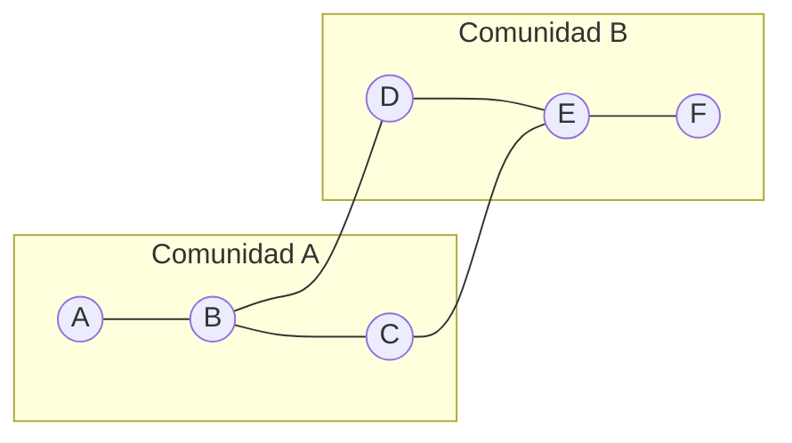
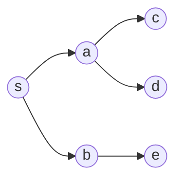

<div align="center">
  <h1>📘 Graph — README</h1>
  <p>Teoría y práctica aplicada de <b>Teoría de Grafos</b> para docencia y desarrollo.</p>

  <!-- Enlaza al sitio general si lo usas -->
  <a href="https://sgevatschnaider.github.io/BigData-Graphs-Evo-CA-Classroom/">
    
  </a>

  <p>
    <a href="https://www.python.org/"></a>
    <a href="../LICENSE"></a>
    <a href="https://pre-commit.com/"></a>
  </p>

  <p>
    <a href="./notebooks/"></a>
    <a href="./data/"></a>
    <a href="./images/"></a>
    <a href="./references/"></a>
  </p>
</div>

---

## Estructura local

```

Graph/
├── README.md
├── notebooks/
├── data/
├── images/
└── references/

````

---

## Objetivos de aprendizaje

Al completar esta sección podrás:

- Modelar problemas como grafos (no dirigidos, dirigidos, ponderados, multigrafos).
- Elegir **representaciones** adecuadas (lista de adyacencia, matriz, lista de aristas).
- Analizar **complejidad** y aplicar algoritmos (BFS/DFS, caminos mínimos, MST, flujo, emparejamientos).
- Medir redes con **métricas** estructurales y de **centralidad**.
- Usar **herramientas** prácticas para cargar, procesar y visualizar grafos.
- Diseñar **experimentos reproducibles** con notebooks.

---

## Instalación rápida

Requisitos sugeridos:

- Python ≥ 3.10
- Paquetes: `networkx`, `numpy`, `pandas`, `matplotlib`, `scipy`, `jupyter`
- *(opcionales)*: `pyvis` (visualización web), `python-igraph` (escala), `pygraphviz` (layouts)

```bash
# Desde Graph/
python -m venv .venv && source .venv/bin/activate  # Windows: .venv\Scripts\activate
pip install -U pip
pip install networkx numpy pandas matplotlib scipy jupyter pyvis
jupyter lab  # o jupyter notebook
````

Abre los cuadernos en `notebooks/` para la ruta guiada.

---

## Tabla de contenidos

* [1) Fundamentos teóricos](#1-fundamentos-teóricos)
* [2) Algoritmos esenciales (y complejidad)](#2-algoritmos-esenciales-y-complejidad)
* [3) Métricas y análisis de redes](#3-métricas-y-análisis-de-redes)
* [4) Modelos de grafos](#4-modelos-de-grafos)
* [5) Práctica con datos](#5-práctica-con-datos)
* [6) Buenas prácticas (ingeniería + docencia)](#6-buenas-prácticas-ingeniería--docencia)
* [7) Aplicaciones típicas](#7-aplicaciones-típicas)
* [8) Roadmap sugerido de notebooks](#8-roadmap-sugerido-de-notebooks)
* [9) Ejercicios propuestos](#9-ejercicios-propuestos)
* [10) Errores comunes](#10-errores-comunes)
* [11) Enlaces internos y bibliografía](#11-enlaces-internos-y-bibliografía)
* [12) Contribución](#12-contribución)
* [13) Licencia](#13-licencia)
* [Apéndice A — Pseudocódigo docente](#apéndice-a--pseudocódigo-docente)
* [Apéndice B — Plantilla mínima de notebook](#apéndice-b--plantilla-mínima-de-notebook)

---

## 1) Fundamentos teóricos

### 1.1 Definiciones

* **Grafo** $G=(V,E)$ con conjunto de **vértices** $V$ y **aristas**:

  * No dirigido: $E \subseteq \{\{u,v\}:u,v\in V\}$
  * Dirigido (digrafo): $E \subseteq V\times V$
* **Orden** $|V|$, **tamaño** $|E|$, **grado** $\deg(v)$, **caminos**, **ciclos**, **conectividad**.
* **Subgrafo**, **componente conexa**, **árbol** (conexo y acíclico), **bosque**.
* **Ponderación**: $w:E\to \mathbb{R}$
* **DAG**: dirigido acíclico → **orden topológico**.

### 1.2 Representaciones

* **Lista de adyacencia** → eficiente en espacio para grafos dispersos; operaciones locales $O(\deg(v))$.
* **Matriz de adyacencia** $A\in\{0,1\}^{n\times n}$ → útil para álgebra; coste $O(n^2)$.
* **Lista de aristas** → $E=\{(u,v,w)\}$; simple y portable.

### 1.3 Álgebra de grafos

* **Grado**: $D=\mathrm{diag}(d_1,\dots,d_n)$.
* **Laplaciano**: $L = D - A$.
  La **conectividad algebraica** $\lambda_2(L)$ mide cuán bien conectado está un grafo.
* **Árboles generadores** (teorema de matriz-árbol de Kirchhoff): el número de árboles generadores es cualquier cofactor de $L$.

---

## 2) Algoritmos esenciales (y complejidad)

| Problema                     | Algoritmo (idea)          | Complejidad típica |
| ---------------------------- | ------------------------- | ------------------ |
| Recorridos                   | **BFS**, **DFS**          | $O(V+E)$           |
| Camino mínimo (≥ 0)          | **Dijkstra** (heap)       | $O(E\log V)$       |
| Camino con pesos negativos   | **Bellman–Ford**          | $O(VE)$            |
| Todos los pares              | **Floyd–Warshall**        | $O(V^3)$           |
| Árbol generador mínimo (MST) | **Kruskal**, **Prim**     | $O(E\log V)$       |
| Flujo máximo                 | **Edmonds–Karp**          | $O(VE^2)$          |
| Emparejamiento bipartito     | **Hopcroft–Karp**         | $O(E\sqrt{V})$     |
| Orden topológico (DAG)       | DFS+pila / **Kahn**       | $O(V+E)$           |
| Planaridad                   | Hopcroft–Tarjan           | $O(V)$ teórico     |
| Coloración de grafos         | NP-Completo (heurísticas) | —                  |

> **Nota docente**: *Dijkstra no admite pesos negativos*; usa Bellman–Ford o Johnson.

---

## 3) Métricas y análisis de redes

* **Distribución de grados**, **densidad** $2|E|/(|V|(|V|-1))$, **diámetro**, **longitud de camino media**.
* **Clustering** (transitividad): coeficiente local y global.
* **Centralidades**: **grado**, **intermediación** (betweenness), **cercanía** (closeness), **vector propio**, **PageRank**.
* **Comunidades** (Louvain/Leiden), **modularidad** $Q$.
* **Asortatividad** por grado/atributos.

**Diagrama (Mermaid) — esquema de comunidades:**



---

## 4) Modelos de grafos

* **Erdős–Rényi** $G(n,p)$: aleatorio homogéneo.
* **Watts–Strogatz**: pequeño mundo (alto clustering, distancias cortas).
* **Barabási–Albert**: libre de escala (colas pesadas de grados).
* **Stochastic Block Model (SBM)**: comunidades explícitas.

---

## 5) Práctica con datos

### 5.1 Formatos en `data/`

* `*.edgelist` (u,v\[,w])
* `*.gml`, `*.graphml` (metadatos enriquecidos)
* `*.csv` con `source,target[,weight]`
* `*.json` para atributos personalizados (grafos pequeños)

### 5.2 Carga y visualización básica (NetworkX)

```python
import networkx as nx
import pandas as pd
import matplotlib.pyplot as plt

# Cargar desde CSV (data/graphs.csv con columnas: source,target,weight opcional)
df = pd.read_csv('data/graphs.csv')
G = nx.from_pandas_edgelist(df, 'source', 'target', edge_attr='weight', create_using=nx.Graph())

print(nx.info(G))
print("Densidad:", nx.density(G))
print("Clustering medio:", nx.average_clustering(G))

# Camino mínimo (no ponderado)
s, t = list(G.nodes())[:2]
path = nx.shortest_path(G, s, t)
print(f"Camino de {s} a {t}: {path}")

# Visualización rápida
pos = nx.spring_layout(G, seed=7)
nx.draw(G, pos, node_size=80, edge_color="#bbb", with_labels=False)
plt.show()
```

### 5.3 Recorridos y árboles (BFS)

```python
from collections import deque

def bfs_tree(G, s):
    parent = {s: None}
    q = deque([s])
    while q:
        u = q.popleft()
        for v in G[u]:
            if v not in parent:
                parent[v] = u
                q.append(v)
    return parent

root = next(iter(G.nodes))
parents = bfs_tree(G, root)
```

### 5.4 Laplaciano y conectividad (espectral)

```python
import numpy as np
from scipy.sparse import csgraph

A = nx.to_scipy_sparse_matrix(G, format='csr')
L = csgraph.laplacian(A, normed=False)
evals = np.linalg.eigvalsh(L.toarray())
lambda2 = evals[1] if len(evals) > 1 else 0.0
print("Conectividad algebraica λ2:", float(lambda2))
```

**Diagrama (Mermaid) — BFS vs DFS:**



---

## 6) Buenas prácticas (ingeniería + docencia)

* **Representación adecuada**: listas de adyacencia para grafos grandes/dispersos; matrices si necesitas álgebra densa.
* **Tipos correctos**: dirigido vs no dirigido, ponderado, multigrafo; documenta decisiones en `data/README.md`.
* **Validación**: sin bucles inesperados, tipos consistentes (int/str), pesos numéricos, atributos obligatorios.
* **Reproducibilidad**: fija semillas (`seed`), versiona datos y dependencias (`requirements.txt`).
* **Escalabilidad**: para millones de aristas, considera `igraph`, `graph-tool` o frameworks distribuidos.
* **Docencia**: empieza con problemas concretos y visuales; escala a formalismos y demostraciones.

---

## 7) Aplicaciones típicas

* **Rutas y logística** (caminos mínimos, flujos)
* **Redes sociales** (centralidades, comunidades)
* **Bioinformática** (PPI, vías metabólicas)
* **PLN** (grafos de palabras/conceptos)
* **Compiladores/dependencias** (DAG + orden topológico)
* **Energía/telecom** (confiabilidad, flujo)
* **Fraude** (subgrafos anómalos, motifs)

---

## 8) Roadmap sugerido de notebooks

| Notebook                         | Tema                                           | Abrir en Colab                                                                                                                                                                                                          |
| -------------------------------- | ---------------------------------------------- | ----------------------------------------------------------------------------------------------------------------------------------------------------------------------------------------------------------------------- |
| `01_intro_graphs.ipynb`          | Modelado, definiciones, ejemplos               | [](https://colab.research.google.com/github/sgevatschnaider/BigData-Graphs-Evo-CA-Classroom/blob/main/Graph/notebooks/01_intro_graphs.ipynb) |
| `02_graph_representations.ipynb` | Listas, matrices, formatos de `data/`          | [](https://colab.research.google.com/github/sgevatschnaider/BigData-Graphs-Evo-CA-Classroom/blob/main/Graph/notebooks/02_graph_representations.ipynb) |
| `03_traversals.ipynb`            | BFS/DFS, árboles de búsqueda, orden topológico | [](https://colab.research.google.com/github/sgevatschnaider/BigData-Graphs-Evo-CA-Classroom/blob/main/Graph/notebooks/03_traversals.ipynb)            |
| `04_graph_algorithms.ipynb`      | Dijkstra, Bellman–Ford, Kruskal/Prim, flujo    | [](https://colab.research.google.com/github/sgevatschnaider/BigData-Graphs-Evo-CA-Classroom/blob/main/Graph/notebooks/04_graph_algorithms.ipynb)      |
| `05_real_world_apps.ipynb`       | Caso real + métricas y comunidades             | [](https://colab.research.google.com/github/sgevatschnaider/BigData-Graphs-Evo-CA-Classroom/blob/main/Graph/notebooks/05_real_world_apps.ipynb)       |
| `utils.ipynb`                    | Snippets reutilizables                         | [](https://colab.research.google.com/github/sgevatschnaider/BigData-Graphs-Evo-CA-Classroom/blob/main/Graph/notebooks/utils.ipynb)                    |

> **Nota**: si aún no existen, crea estos notebooks en `Graph/notebooks/`.

---

## 9) Ejercicios propuestos

### Teoría

1. Demuestra que $\sum_{v\in V}\deg(v)=2|E|$.
2. Prueba que un grafo conexo con $n$ nodos y $n-1$ aristas es un árbol.
3. Discute condiciones para camino **euleriano** y **hamiltoniano**.
4. Aplica el **Teorema Matriz-Árbol** a un grafo de 5–8 nodos.

### Práctica

1. Carga `data/graph_theory_cases/social_network.gml`. Calcula centralidades y **visualiza** top-k nodos.
2. Compara Dijkstra vs Bellman–Ford en un grafo con pesos negativos **sin** ciclos negativos.
3. Detecta comunidades (Louvain/Leiden) y evalúa **modularidad** $Q$.
4. Genera grafos $G(n,p)$, WS y BA con igual $|V|$; compara **clustering** y **longitud media**.
5. Construye un **DAG** de dependencias y realiza **orden topológico**; detecta ciclos.

---

## 10) Errores comunes

* Usar **Dijkstra con pesos negativos** → usa Bellman–Ford/Johnson.
* Asumir conectividad/simetría sin verificar → revisa componentes y direccionalidad.
* Mezclar IDs de nodos con tipos distintos (int/str) → normaliza.
* Visualizaciones ilegibles → submuestrea, fija layout (`spring_layout`), controla tamaños.
* Memoria desbordada con matrices densas $O(n^2)$ → usa estructuras dispersas.

---

## 11) Enlaces internos y bibliografía

* **Notebooks**: `./notebooks/`
* **Datos**: `./data/` (incluye `graphs.csv`, `graph_theory_cases/`)
* **Imágenes**: `./images/`
* **Referencias**: `./references/`

**Bibliografía sugerida** (añade en `references/bibliography.bib`):

* West — *Introduction to Graph Theory*
* Newman — *Networks: An Introduction*
* Diestel — *Graph Theory*
* Cormen et al. — *Introduction to Algorithms* (capítulos de grafos)

---

## 12) Contribución

1. Crea una rama: `feature/graph-tema`.
2. Añade datasets en `data/` con `README.md` describiendo columnas/atributos.
3. Incluye notebooks autocontenidos (semillas fijas, dependencias indicadas).
4. Abre un **Pull Request** con resultados y figuras en `images/`.

---

## 13) Licencia

Este material se distribuye bajo **MIT** (código) y sugiere **CC BY 4.0** para contenidos docentes (textos/figuras). Revisa `LICENSE` en la raíz del repositorio.

---

## Apéndice A — Pseudocódigo docente

**BFS (no ponderado)**

```
BFS(G, s):
  for v in V(G): color[v] ← blanco; dist[v] ← ∞; padre[v] ← NIL
  color[s] ← gris; dist[s] ← 0; Q ← {s}
  while Q ≠ ∅:
    u ← pop_left(Q)
    for v in Adj[u]:
      if color[v] = blanco:
        color[v] ← gris; dist[v] ← dist[u] + 1; padre[v] ← u; push_right(Q, v)
    color[u] ← negro
```

**Dijkstra (pesos ≥ 0)**

```
DIJKSTRA(G, w, s):
  for v in V: dist[v] ← ∞; padre[v] ← NIL
  dist[s] ← 0; H ← heap((0,s))
  while H ≠ ∅:
    (d,u) ← extract_min(H)
    if d > dist[u]: continue
    for (u,v) in Adj[u]:
      if dist[v] > dist[u] + w(u,v):
        dist[v] ← dist[u] + w(u,v); padre[v] ← u; decrease_key(H, v, dist[v])
```

---

## Apéndice B — Plantilla mínima de notebook

```markdown
# Título: <Tema del notebook>

## Objetivos
- …

## Dataset
- Ruta: data/…

## Pasos
1. …
2. …

## Resultados
- Métricas / Figuras

## Conclusiones
- …
```


```

