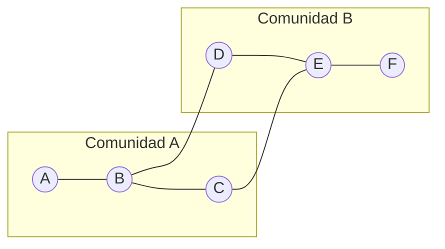
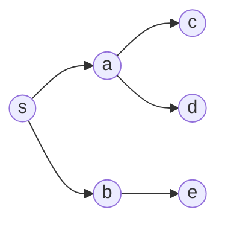

<div align="center">
  <h1>📘 Teoría de los grafos — README</h1>
  <p>Teoría y práctica aplicada de <b>Teoría de Grafos</b> para docencia y desarrollo.</p>

  <h2>🧊 Recurso visual — Hipercubo 4D (Tesseracto)</h2>
  <p>
    Esta animación ilustra la <b>proyección y rotación</b> de un hipercubo 4D.<br/>
    Es útil para conectar el grafo hipercubo <code>Q<sub>n</sub></code> con <b>distancia de Hamming</b>, capas de <b>BFS</b> y propiedades de <b>regularidad</b>.
  </p>

  

  <br/><br/>

  <h2>🌀  Árbol hiperbólico y embeddings (Disco de Poincaré)</h2>
  <p>
    Recurso interactivo para comparar <b>Euclídeo vs Hiperbólico</b> en grafos jerárquicos (árboles/taxonomías).<br/>
    Introduce <b>geometría hiperbólica</b> y <b>Poincaré embeddings</b> para representaciones jerárquicas.
  </p>
  <p>
    <a href="./recursos/arbol_hiperbolico.html"><b>Abrir recurso interactivo</b>: <code>recursos/arbol_hiperbolico.html</code></a>
  </p>

  <p>
    <a href="https://www.python.org/"></a>
    <a href="../LICENSE"></a>
    <a href="https://pre-commit.com/"></a>
  </p>

  <p>
    <a href="./notebooks/"></a>
    <a href="./data/"></a>
    <a href="./images/"></a>
    <a href="./references/"></a>
    <a href="./recursos/"></a>
  </p>
</div>

---

## 🧭 Mapa del curso (temas y rutas)

### A) Fundamentos y visualizaciones iniciales
- Puentes de Königsberg, teoremas fundamentales, handshaking.
- Introducción general a grafos + grafo de cuadrícula (talleres interactivos).

### B) Irregularidad, complemento y secuencias de grados
- Grafos regulares / irregulares / cuasi-irregulares.
- Complemento de un grafo.
- Secuencias gráficas: Havel–Hakimi y Teorema de Erdős–Gallai.
- Principio del Palomar (herramienta de demostración).

### C) Perspectiva algebraica: Cayley, hipercubos y distancia de Hamming
- Grafos de Cayley (explorador).
- Hipercubo Qₙ, tesseracto (GIF), relación con Hamming y BFS por capas.
- Recursos HTML: C₄, Q₃, Q₄, Hamming, Gossip + Havel-Hakimi.

### D) Algoritmos clásicos y Big Data
- BFS/DFS, caminos mínimos (Dijkstra/Bellman–Ford), MST, etc.
- Dijkstra aplicado a escalabilidad (Big Data / vertex-centric).

### E) Complejidad y NP: Hamilton y TSP
- Caminos/ciclos hamiltonianos, reducción a TSP (decisión).
- Fuerza bruta vs Held–Karp, explosión combinatoria.
- Visualizaciones y cuestionarios.

### F) Aplicaciones avanzadas
- GPU/HPC: cuellos de botella en grafos irregulares (BFS frontera, divergencia, memoria).
- Blockchain: Lightning Network como grafo ponderado + Dijkstra.
- ZKP / ZK-Rollups: simuladores, guías y dashboards conectados a grafos/isomorfismos.

### G) Geometría hiperbólica y embeddings (Poincaré)
- Jerarquías en grafos (árboles/taxonomías) y por qué hiperbólico ayuda.
- Recurso interactivo: `recursos/arbol_hiperbolico.html`
- Notebook/script: `notebooks/06_hyperbolic_embeddings_poincare.(ipynb|py)`
- Referencias: `references/README.md`

---

## Estructura local

```text
graphs/
├── README.md
├── notebooks/
├── data/
├── images/
├── recursos/
└── references/
---

## Objetivos de aprendizaje

Al completar esta sección podrás:

- Modelar problemas como grafos (no dirigidos, dirigidos, ponderados, multigrafos).
- Elegir **representaciones** adecuadas (lista de adyacencia, matriz, lista de aristas).
- Analizar **complejidad** y aplicar algoritmos (BFS/DFS, caminos mínimos, MST, flujo, emparejamientos).
- Medir redes con **métricas** estructurales y de **centralidad**.
- Usar **herramientas** prácticas para cargar, procesar y visualizar grafos.
- Diseñar **experimentos reproducibles** con notebooks.

---

## Instalación rápida

Requisitos sugeridos:

- Python ≥ 3.10
- Paquetes: `networkx`, `numpy`, `pandas`, `matplotlib`, `scipy`, `jupyter`
- *(opcionales)*: `pyvis` (visualización web), `python-igraph` (escala), `pygraphviz` (layouts)

```bash
# Desde Graph/
python -m venv .venv && source .venv/bin/activate  # Windows: .venv\Scripts\activate
pip install -U pip
pip install networkx numpy pandas matplotlib scipy jupyter pyvis
jupyter lab  # o jupyter notebook
````

Abre los cuadernos en `notebooks/` para la ruta guiada.

---

## Tabla de contenidos

* [1) Fundamentos teóricos](#1-fundamentos-teóricos)
* [2) Algoritmos esenciales (y complejidad)](#2-algoritmos-esenciales-y-complejidad)
* [3) Métricas y análisis de redes](#3-métricas-y-análisis-de-redes)
* [4) Modelos de grafos](#4-modelos-de-grafos)
* [5) Práctica con datos](#5-práctica-con-datos)
* [6) Buenas prácticas (ingeniería + docencia)](#6-buenas-prácticas-ingeniería--docencia)
* [7) Aplicaciones típicas](#7-aplicaciones-típicas)
* [8) Roadmap sugerido de notebooks](#8-roadmap-sugerido-de-notebooks)
* [9) Ejercicios propuestos](#9-ejercicios-propuestos)
* [10) Errores comunes](#10-errores-comunes)
* [11) Enlaces internos y bibliografía](#11-enlaces-internos-y-bibliografía)
* [12) Contribución](#12-contribución)
* [13) Licencia](#13-licencia)
* [Apéndice A — Pseudocódigo docente](#apéndice-a--pseudocódigo-docente)
* [Apéndice B — Plantilla mínima de notebook](#apéndice-b--plantilla-mínima-de-notebook)

---

## 📝 Fundamentos de la Teoría de Grafos

| 📄 Recurso | 📥 Acceso |
|---|---|
| **Introducción a la Teoría y Aplicaciones de los Grafos — Volumen** <br><br> <details><summary><strong>Resumen:</strong> <em>(haz clic para expandir/colapsar)</em></summary><p>Este cuaderno interactivo introduce los conceptos esenciales de la teoría de grafos, transformando una lección teórica en una aplicación web visual y dinámica. Explora las definiciones de vértices y aristas, y detalla los distintos tipos de grafos (dirigidos, no dirigidos, ponderados, bipartitos, etc.) a través de visualizaciones claras. La lección destaca por su construcción técnica: utiliza Python con <code>networkx</code> y <code>matplotlib</code> para generar los grafos, los convierte a formato Base64 y los incrusta en una página HTML con CSS y JavaScript para ofrecer una interfaz interactiva con temas claro/oscuro y secciones colapsables. El objetivo es proporcionar una comprensión intuitiva y práctica de cómo se modelan y analizan las redes y relaciones.</p></details> | [](https://github.com/sgevatschnaider/BigData-Graphs-Evo-CA-Classroom/blob/fdacac884643cdc9f8d15c59e720ed19f50afca7/src/classroom/graphs/notebooks/Introducci%C3%B3n_a_la_teor%C3%ADa_y_aplicaciones_de_los_grafos_.ipynb) <br> [](https://colab.research.google.com/github/sgevatschnaider/BigData-Graphs-Evo-CA-Classroom/blob/fdacac884643cdc9f8d15c59e720ed19f50afca7/src/classroom/graphs/notebooks/Introducci%C3%B3n_a_la_teor%C3%ADa_y_aplicaciones_de_los_grafos_.ipynb) <br><br>[](https://htmlpreview.github.io/?https://github.com/sgevatschnaider/BigData-Graphs-Evo-CA-Classroom/blob/70bb59083bd25cde5233f9eb44385f6de074c436/src/classroom/graphs/recursos/Introducci%C3%B3n_a_la_teor%C3%ADa_y_aplicaciones_de_los_grafos_Internet_Volumen.html) |
| **Introducción a la Teoría y Aplicaciones de los Grafos — Variedad (Velocidad y Flujos)** <br><br> <details><summary><strong>Resumen:</strong> <em>(haz clic para expandir/colapsar)</em></summary><p>Este recurso web interactivo explora el procesamiento de redes en tiempo real mediante <strong>grafos dinámicos</strong> $G_t = (V, E_t)$. Aborda los desafíos de calcular métricas en flujos de datos a alta velocidad, donde es físicamente imposible almacenar el grafo completo $\Theta(m)$ o recalcular desde cero en cada iteración $O(m)$. A través de potentes simulaciones visuales con Canvas, la lección explica modelos de <em>streaming</em> (Insertion-Only, Turnstile), técnicas de memoria sublineal (Reservoir Sampling, Sketching), estimación probabilística de triángulos (TRIEST) y conectividad dinámica mediante Union-Find en $O(1)$. Ilustra cómo estas restricciones computacionales se resuelven en aplicaciones del mundo real como ciberseguridad, prevención de fraude y redes sociales con una sola pasada sobre los datos.</p></details> | [](https://github.com/sgevatschnaider/BigData-Graphs-Evo-CA-Classroom/blob/4ded1a2f40e8fbc6044b358868080e69e7dd0ccb/src/classroom/graphs/notebooks/Introducci%C3%B3n_a_la_teor%C3%ADa_y_aplicaciones_de_los_grafos_Internet_Variedad.ipynb) <br> [](https://colab.research.google.com/github/sgevatschnaider/BigData-Graphs-Evo-CA-Classroom/blob/4ded1a2f40e8fbc6044b358868080e69e7dd0ccb/src/classroom/graphs/notebooks/Introducci%C3%B3n_a_la_teor%C3%ADa_y_aplicaciones_de_los_grafos_Internet_Variedad.ipynb) <br><br>[](https://htmlpreview.github.io/?https://github.com/sgevatschnaider/BigData-Graphs-Evo-CA-Classroom/blob/4ded1a2f40e8fbc6044b358868080e69e7dd0ccb/src/classroom/graphs/recursos/Introducci%C3%B3n_a_la_teor%C3%ADa_y_aplicaciones_de_los_grafos_Internet_Variedad.html) |


## 📝 El Problema de los Puentes de Königsberg y Teoremas Fundamentales (Lección Interactiva)
| 📄 Recurso | 📥 Acceso |
|---|---|
| **El Paseo de Euler — Teoría de Grafos** <br><br> <details><summary><strong>Resumen:</strong> <em>(haz clic para expandir/colapsar)</em></summary><p>Este recurso aborda el clásico problema de los puentes de Königsberg y establece los fundamentos de los caminos y circuitos eulerianos. A través del artículo teórico y su cuaderno interactivo, se analizan las condiciones necesarias y suficientes para recorrer un grafo pasando por cada arista exactamente una vez, sentando las bases históricas y topológicas de la disciplina.</p></details> | [](https://economiayetica.blogspot.com/2025/08/el-paseo-de-euler-teoria-de-grafos_30.html) <br><br> [](https://colab.research.google.com/drive/15POW1YAoE3Z2CU3LBXLZZYIPlvOO5-x9) |

## ​ Gráfico de Cuadrícula

| 📄 Recurso | 📥 Acceso |
|---|---|
| **Gráfico de Cuadrícula (Taller Interactivo)** <br><br> <details><summary><strong>Resumen:</strong> <em>(haz clic para expandir/colapsar)</em></summary><p>Este cuaderno interactivo presenta el concepto de **grafo de cuadrícula**, una estructura donde los vértices representan coordenadas en una matriz y las aristas conectan posiciones adyacentes. Mediante `networkx` y `matplotlib`, se construyen y visualizan cuadrículas de distintos tamaños, y las imágenes resultantes se incrustan en HTML usando Base64, complementadas con una interfaz interactiva —modo claro/oscuro y secciones colapsables— para facilitar el aprendizaje.</p></details> | [](https://github.com/sgevatschnaider/BigData-Graphs-Evo-CA-Classroom/blob/9300aff017c293b2ecc5123dd9642f5a841c5e53/src/classroom/graphs/notebooks/Gr%C3%A1fico_de_cuadr%C3%ADcula_.ipynb) [](https://colab.research.google.com/github/sgevatschnaider/BigData-Graphs-Evo-CA-Classroom/blob/9300aff017c293b2ecc5123dd9642f5a841c5e53/src/classroom/graphs/notebooks/Gr%C3%A1fico_de_cuadr%C3%ADcula_.ipynb) |


# 📚 Introducción a los grafos irregulares y grafo de Cayley

Esta es una colección de lecciones y simulaciones interactivas diseñadas para explorar los conceptos fundamentales y avanzados de la teoría de grafos, desde los preliminares hasta aplicaciones en computación de alto rendimiento. Cada recurso es una página web autocontenida con visualizaciones dinámicas construidas con HTML, CSS y JavaScript.

---

## 🧭Indice y Cuestionario

| 📄 Recurso | 📥 Acceso |
|---|---|
| **Indice.html** <br><br> <details><summary><strong>Resumen:</strong> <em>(haz clic para expandir/colapsar)</em></summary><p>Punto de partida y centro de navegación para todo el curso. Este índice interactivo no es solo una lista, sino una herramienta de estudio completa. Permite a los usuarios seguir su progreso, filtrar temas por dificultad (básico, intermedio, avanzado) y buscar conceptos específicos en tiempo real. Incluye un panel de estadísticas y una barra de progreso para una experiencia de aprendizaje gamificada y organizada.</p></details> | [](https://htmlpreview.github.io/?https://github.com/sgevatschnaider/BigData-Graphs-Evo-CA-Classroom/blob/e847caa13e2682aff7a380202b22eb2672b8c250/src/classroom/graphs/recursos/Indice.html) |
| **Cuestionario.html** <br><br> <details><summary><strong>Resumen:</strong> <em>(haz clic para expandir/colapsar)</em></summary><p>Una herramienta de autoevaluación con 30 preguntas de nivel experto, diseñadas para preparar un examen. Cada pregunta es un acordeón desplegable que revela una respuesta exhaustiva y detallada. La interfaz incluye una barra de progreso para seguir los temas dominados, un buscador para encontrar conceptos específicos y una función de 'pregunta aleatoria' para simulacros de examen. Es el recurso ideal para consolidar y poner a prueba los conocimientos adquiridos.</p></details> | [](https://htmlpreview.github.io/?https://github.com/sgevatschnaider/BigData-Graphs-Evo-CA-Classroom/blob/e847caa13e2682aff7a380202b22eb2672b8c250/src/classroom/graphs/recursos/Cuestionario.html) |
---

### 1. Preliminares y Conceptos Fundamentales
| 📄 Recurso | 📥 Acceso |
|---|---|
| **Preliminares.html** <br><br> <details><summary><strong>Resumen:</strong> <em>(haz clic para expandir/colapsar)</em></summary><p>Esta lección interactiva introduce los pilares de la teoría de grafos. Diferencia visualmente entre grafos simples, multigrafos y grafos ponderados. A través de un lienzo dinámico, los usuarios pueden generar grafos aleatorios para comprender el concepto de grado y secuencia de grados. La página culmina con una demostración interactiva del Lema del Apretón de Manos, permitiendo verificar la suma de grados y la paridad de vértices de grado impar en tiempo real. Es el punto de partida esencial para cualquier estudiante del área.</p></details> | [](https://htmlpreview.github.io/?https://github.com/sgevatschnaider/BigData-Graphs-Evo-CA-Classroom/blob/9127ad4a5fcc319a99faed0a61031a68a0f277ab/src/classroom/graphs/recursos/Preliminares.html) |

### 2. Grafos Regulares: Simetría en la Conectividad
| 📄 Recurso | 📥 Acceso |
|---|---|
| **2.Grafos_regulares.html** <br><br> <details><summary><strong>Resumen:</strong> <em>(haz clic para expandir/colapsar)</em></summary><p>Este recurso se enfoca en la familia de los grafos regulares, destacando su simetría estructural. Explica la definición de un grafo k-regular y la propiedad fundamental que relaciona su orden, grado y tamaño (nk = 2m). Su principal característica es un explorador interactivo que permite generar y visualizar familias canónicas de grafos regulares, incluyendo Ciclos (Cₙ), Grafos Completos (Kₙ), Hipercubos (Qd) y Grafos Bipartitos Completos (Kₙ,ₙ), ajustando sus parámetros con deslizadores para observar cómo cambian su estructura y propiedades.</p></details> | [](https://htmlpreview.github.io/?https://github.com/sgevatschnaider/BigData-Graphs-Evo-CA-Classroom/blob/9127ad4a5fcc319a99faed0a61031a68a0f277ab/src/classroom/graphs/recursos/2.Grafos_regulares.html) |

### 3. El Límite de la Diversidad: Grafos Irregulares
| 📄 Recurso | 📥 Acceso |
|---|---|
| **3.Grafos_ Irregulares.html** <br><br> <details><summary><strong>Resumen:</strong> <em>(haz clic para expandir/colapsar)</em></summary><p>Esta página aborda una pregunta fundamental: ¿puede un grafo ser "totalmente diverso" en sus conexiones? Define formalmente los grafos completamente irregulares y presenta la demostración clásica de su imposibilidad en el mundo de los grafos simples. El recurso incluye una innovadora demostración interactiva que visualiza la contradicción lógica fundamental: la coexistencia forzada de un vértice de grado 0 (aislado) y un vértice de grado n-1 (universalmente conectado). Los usuarios pueden manipular el orden del grafo para ver por qué este conflicto es inevitable.</p></details> | [](https://htmlpreview.github.io/?https://github.com/sgevatschnaider/BigData-Graphs-Evo-CA-Classroom/blob/9127ad4a5fcc319a99faed0a61031a68a0f277ab/src/classroom/graphs/recursos/3.Grafos_%20Irregulares.html) |

### 4. Grafos Casi Irregulares: Lo Más Cerca Posible
| 📄 Recurso | 📥 Acceso |
|---|---|
| **Grafos_cuasiirregulares.html** <br><br> <details><summary><strong>Resumen:</strong> <em>(haz clic para expandir/colapsar)</em></summary><p>Tras demostrar que la irregularidad total es imposible, esta lección explora lo más cerca que se puede llegar: los grafos casi irregulares. Presenta el elegante teorema que afirma que para cada orden n, existen exactamente dos de estos grafos y son complementarios entre sí. El recurso incluye un constructor interactivo que, al seleccionar un orden n, genera y visualiza automáticamente la única pareja de grafos casi irregulares existente, resaltando los vértices con el grado repetido y demostrando visualmente la relación de complementariedad.</p></details> | [](https://htmlpreview.github.io/?https://github.com/sgevatschnaider/BigData-Graphs-Evo-CA-Classroom/blob/9127ad4a5fcc319a99faed0a61031a68a0f277ab/src/classroom/graphs/recursos/Grafos_cuasiirregulares.html) |

### 5. El Complemento de un Grafo
| 📄 Recurso | 📥 Acceso |
|---|---|
| **El Complemento de un Grafo-irregular.html** <br><br> <details><summary><strong>Resumen:</strong> <em>(haz clic para expandir/colapsar)</em></summary><p>Este recurso didáctico se centra en una de las transformaciones más fundamentales: el complemento. Explica la definición, la fórmula de relación de grados (deg_G̅(v) = (n-1) - deg_G(v)) y la relación de aristas. Su componente principal es un "laboratorio interactivo" donde los usuarios pueden dibujar un grafo G añadiendo o quitando aristas, y ver cómo su grafo complemento G̅ se actualiza en tiempo real. Esto permite una comprensión intuitiva y visual de cómo la operación de complemento "invierte" la estructura de conectividad y preserva propiedades como la casi irregularidad.</p></details> | [](https://htmlpreview.github.io/?https://github.com/sgevatschnaider/BigData-Graphs-Evo-CA-Classroom/blob/9127ad4a5fcc319a99faed0a61031a68a0f277ab/src/classroom/graphs/recursos/El%20Complemento%20de%20un%20Grafo-irregular.html) |

### 6. Realización de Secuencias de Grados
| 📄 Recurso | 📥 Acceso |
|---|---|
| **Realización de secuencias de grados y “casi irregularidad”.html** <br><br> <details><summary><strong>Resumen:</strong> <em>(haz clic para expandir/colapsar)</em></summary><p>Esta página aborda la pregunta: ¿dada una lista de números, puede corresponder a los grados de un grafo simple? Explica los dos enfoques principales: el algoritmo constructivo de Havel-Hakimi y el teorema existencial de Erdős-Gallai. El recurso brilla por su laboratorio interactivo del algoritmo de Havel-Hakimi, que permite a los usuarios introducir cualquier secuencia de grados y ver el proceso de reducción paso a paso, mostrando visualmente si la secuencia es gráfica o no. También incluye una tabla con las secuencias canónicas de los grafos casi irregulares.</p></details> | [](https://htmlpreview.github.io/?https://github.com/sgevatschnaider/BigData-Graphs-Evo-CA-Classroom/blob/9127ad4a5fcc319a99faed0a61031a68a0f277ab/src/classroom/graphs/recursos/Realizaci%C3%B3n%20de%20secuencias%20de%20grados%20y%20%E2%80%9Ccasi%20irregularidad%E2%80%9D.html) |

### 7. El Principio del Palomar
| 📄 Recurso | 📥 Acceso |
|---|---|
| **Palomar.html** <br><br> <details><summary><strong>Resumen:</strong> <em>(haz clic para expandir/colapsar)</em></summary><p>Este recurso se dedica a explicar una de las herramientas de demostración más elegantes y potentes de la matemática discreta. Define la versión básica y generalizada del Principio del Palomar (o Principio de Dirichlet). El componente central es un simulador interactivo donde se puede ajustar el número de "palomas" (objetos) y "palomares" (cajas) para ver visualmente por qué una colisión es inevitable cuando hay más objetos que contenedores. La página aplica este principio de manera explícita para reforzar la demostración de la imposibilidad de los grafos completamente irregulares.</p></details> | [](https://htmlpreview.github.io/?https://github.com/sgevatschnaider/BigData-Graphs-Evo-CA-Classroom/blob/9127ad4a5fcc319a99faed0a61031a68a0f277ab/src/classroom/graphs/recursos/Palomar.html) |

### Embeddings Hiperbólicos y Teoría de Grafos
| 📄 Recurso | 📥 Acceso |
|---|---|
| **El Problema del Embedding: Geometría Hiperbólica y Jerarquías** <br><br> <details><summary><strong>Resumen:</strong> <em>(haz clic para expandir/colapsar)</em></summary><p>Un recorrido exhaustivo de 6 módulos sobre la representación de jerarquías y grafos en espacios continuos. Aborda el <em>mismatch</em> geométrico del espacio euclidiano frente al crecimiento exponencial de los árboles, introduciendo la <strong>Geometría Hiperbólica (Bola de Poincaré)</strong> como la solución estructural natural. Incluye optimización riemanniana (RSGD), enfoques constructivos con garantías de baja distorsión (Sarkar), trade-offs numéricos, y aplicaciones directas en taxonomías (WordNet), link prediction y redes filogenéticas.</p></details> | [](https://colab.research.google.com/drive/1WDxb8kUw6F6HJ6hJG1s0zGCz6YaE-ksU?usp=sharing) <br><br> [](https://htmlpreview.github.io/?https://github.com/sgevatschnaider/BigData-Graphs-Evo-CA-Classroom/blob/5eff3f62f4b8f22d48d610183af72e47438d4ca6/src/classroom/graphs/recursos/arbol_hiperbolico.html) |

### 8. Perspectiva Algebraica: Grafos de Cayley
| 📄 Recurso | 📥 Acceso |
|---|---|
| **Grafo_Cayley.html** <br><br> <details><summary><strong>Resumen:</strong> <em>(haz clic para expandir/colapsar)</em></summary><p>Esta lección explora la profunda conexión entre el álgebra abstracta y la teoría de grafos. Define la construcción de un Grafo de Cayley a partir de un grupo finito y un conjunto de generadores. Explica propiedades clave como la regularidad garantizada y la vértice-transitividad. Incluye un explorador interactivo que permite generar y visualizar diferentes tipos de Grafos de Cayley, como ciclos (sobre ℤₙ), hipercubos (sobre (ℤ₂)ᵈ), grafos completos e incluso grafos bipartitos regulares (sobre el grupo Diedral), demostrando la versatilidad de esta construcción.</p></details> | [](https://htmlpreview.github.io/?https://github.com/sgevatschnaider/BigData-Graphs-Evo-CA-Classroom/blob/9127ad4a5fcc319a99faed0a61031a68a0f277ab/src/classroom/graphs/recursos/Grafo_Cayley.html) |


### 9. Análisis de Rendimiento en GPU con Grafos
| 📄 Recurso | 📥 Acceso |
|---|---|
| **Análisis de Rendimiento en GPU con Grafos_irregulares.html** <br><br> <details><summary><strong>Resumen:</strong> <em>(haz clic para expandir/colapsar)</em></summary><p>Este recurso avanzado sirve como un caso de estudio sobre los desafíos de procesar grafos en arquitecturas paralelas como las GPUs. Utiliza grafos casi irregulares para exacerbar y analizar cuellos de botella. La página incluye un panel de simulación de rendimiento que visualiza y compara métricas clave como la divergencia de warp (actividad de hilos), el tamaño de la frontera de una Búsqueda en Amplitud (BFS) y la coalescencia de memoria. Además, contiene un glosario detallado con conceptos de computación en GPU (SIMT, Warp, etc.), ofreciendo una visión práctica de los problemas de balanceo de carga en HPC.</p></details> | [](https://htmlpreview.github.io/?https://github.com/sgevatschnaider/BigData-Graphs-Evo-CA-Classroom/blob/9127ad4a5fcc319a99faed0a61031a68a0f277ab/src/classroom/graphs/recursos/An%C3%A1lisis%20de%20Rendimiento%20en%20GPU%20con%20Grafos_irregulares.html) |

## 📕 Material de Referencia

| 📄 Recurso | 📥 Acceso |
|---|---|
| **glosario.html** <br><br> <details><summary><strong>Resumen:</strong> <em>(haz clic para expandir/colapsar)</em></summary><p>Una guía de referencia completa con definiciones expertas de todos los conceptos clave del curso. La interfaz está diseñada para una consulta rápida y eficiente, con una barra de navegación alfabética que permite saltar a secciones específicas y un buscador dinámico que filtra los términos en tiempo real. Cada definición es concisa, precisa y está contextualizada dentro del material de estudio, convirtiéndola en una herramienta indispensable para el aprendizaje.</p></details> | [](https://htmlpreview.github.io/?https://github.com/sgevatschnaider/BigData-Graphs-Evo-CA-Classroom/blob/e847caa13e2682aff7a380202b22eb2672b8c250/src/classroom/graphs/recursos/glosario.html) |

## 🕸️ 10 — Grafos de Cayley y Redes P2P (Recursos HTML)

| 📄 Recurso | 📥 Acceso |
| ---------- | --------- |
| **HTML: Grafo de Cayley del Cuadrado (C₄)** <br><br><details><summary><strong>Resumen:</strong> <em>(clic para expandir/colapsar)</em></summary><p>Visualización interactiva que demuestra paso a paso cómo la estructura algebraica del grupo cíclico $\mathbb{Z}_4$ genera la geometría de un grafo cuadrado ($C_4$). Incluye la definición del grupo, conjunto generador, cálculo de vecindades y propiedades del grafo resultante.</p></details> | [](https://clinquant-meringue-3930c2.netlify.app/src/classroom/graphs/recursos/cayley-cuadrado.html) |
| **HTML: Grafo de Cayley del Cubo (Q₃)** <br><br><details><summary><strong>Resumen:</strong> <em>(clic para expandir/colapsar)</em></summary><p>Demostración de cómo la estructura del cubo tridimensional ($Q_3$) emerge naturalmente como el grafo de Cayley del grupo $(\mathbb{Z}_2)^3$. Explora la definición algebraica, las propiedades del grafo y la conexión entre la operación XOR y la geometría del cubo.</p></details> | [](https://clinquant-meringue-3930c2.netlify.app/src/classroom/graphs/recursos/cubo.html) |
| **HTML: Grafo de Cayley del Teseracto (Q₄)** <br><br><details><summary><strong>Resumen:</strong> <em>(clic para expandir/colapsar)</em></summary><p>Extensión del concepto de hipercubo a 4 dimensiones. Esta página visualiza el Teseracto ($Q_4$) como el grafo de Cayley del grupo $(\mathbb{Z}_2)^4$, detallando su anatomía (conteo de caras de distintas dimensiones) y sus propiedades estructurales clave.</p></details> | [](https://clinquant-meringue-3930c2.netlify.app/src/classroom/graphs/recursos/teseracto.html) |
| **HTML: Hipercubo y Distancia de Hamming** <br><br><details><summary><strong>Resumen:</strong> <em>(clic para expandir/colapsar)</em></summary><p>Análisis de la relación fundamental entre la geometría del hipercubo ($Q_d$) y la métrica de la distancia de Hamming. Demuestra la equivalencia entre la distancia en el grafo y el número de bits diferentes, y explora sus consecuencias y aplicaciones.</p></details> | [](https://clinquant-meringue-3930c2.netlify.app/src/classroom/graphs/recursos/hammigs.html) |
| **HTML: Simulación Gossip + Havel-Hakimi** <br><br><details><summary><strong>Resumen:</strong> <em>(clic para expandir/colapsar)</em></summary><p>Simulador avanzado que primero construye una red P2P a partir de una secuencia de grados usando el algoritmo de Havel-Hakimi. Luego, simula un protocolo de difusión (gossip) sobre el grafo generado, mostrando cómo se propaga un bloque en la red.</p></details> | [](https://clinquant-meringue-3930c2.netlify.app/src/classroom/graphs/recursos/GOSSIP2.html) |


## 📖  — Evaluaciones y Referencias (Recursos HTML)

| 📄 Recurso | 📥 Acceso |
| ---------- | --------- |
| **HTML: Cuestionario Experto (Grafos)** <br><br><details><summary><strong>Resumen:</strong> <em>(clic para expandir/colapsar)</em></summary><p>Cuestionario interactivo con 20 preguntas de nivel experto sobre la construcción de redes P2P con Havel-Hakimi, la estructura de Grafos de Cayley, las propiedades de los hipercubos y los protocolos Gossip. Incluye respuestas detalladas para el estudio.</p></details> | [](https://clinquant-meringue-3930c2.netlify.app/src/classroom/graphs/recursos/Cuestionario_Cayley.html) |
| **HTML: Glosario Interactivo (Grafos)** <br><br><details><summary><strong>Resumen:</strong> <em>(clic para expandir/colapsar)</em></summary><p>Glosario completo con definiciones detalladas sobre Teoría de Grupos, Grafos de Cayley, Hipercubos y Redes P2P. Incluye un filtro de búsqueda en tiempo real y navegación alfabética para facilitar la consulta de términos clave.</p></details> | [](https://clinquant-meringue-3930c2.netlify.app/src/classroom/graphs/recursos/Glosario_Cayley.html) |

### 11. Teorema de Erdős–Gallai y Aplicaciones
| 📄 Recurso | 📥 Acceso |
| ---------- | --------- |
| **Teorema de Erdős–Gallai (EG).html** <br><br> <details><summary><strong>Resumen:</strong> <em>(haz clic para expandir/colapsar)</em></summary><p>Esta lección interactiva se centra en el Teorema de Erdős–Gallai, el criterio definitivo para saber si una secuencia de grados es gráfica. Los usuarios pueden introducir una secuencia para ver una validación paso a paso: el chequeo de paridad y la verificación de cada una de las desigualdades del teorema, explicadas con una intuitiva analogía de "demanda vs. oferta". Si la secuencia es válida, la herramienta construye y visualiza un grafo resultante usando el algoritmo de Havel-Hakimi, ofreciendo una experiencia de aprendizaje completa.</p></details> | [](https://htmlpreview.github.io/?https://github.com/sgevatschnaider/BigData-Graphs-Evo-CA-Classroom/blob/6328cafaba326aa1bbc825590f3eedfc97d6d0fc/src/classroom/graphs/recursos/Teorema%20de%20Erd%C5%91s%E2%80%93Gallai%20(EG).html) |
| **Aplicaciones prácticas.html** <br><br> <details><summary><strong>Resumen:</strong> <em>(haz clic para expandir/colapsar)</em></summary><p>Esta página demuestra el valor práctico del Teorema de Erdős–Gallai como una herramienta de "verificación de factibilidad". Explora aplicaciones concretas en el diseño de redes de telecomunicaciones, la generación de redes sintéticas para simulaciones, la validación de estructuras en química combinatoria y la anonimización de datos en grafos. La lección incluye un estudio de caso interactivo sobre planificación de redes, permitiendo al usuario aplicar el teorema a un problema del mundo real.</p></details> | [](https://htmlpreview.github.io/?https://github.com/sgevatschnaider/BigData-Graphs-Evo-CA-Classroom/blob/6328cafaba326aa1bbc825590f3eedfc97d6d0fc/src/classroom/graphs/recursos/Aplicaciones%20pr%C3%A1cticas.html) |

### 12.Algoritmo_de_Dijkstra
| 📄 Recurso | 📥 Acceso |
| ---------- | --------- |
| **Big_Data_Algoritmo_de_Dijkstra_y_el_BiG_Data_Teoría y aplicaciones.ipynb** <br><br> <details><summary><strong>Resumen:</strong> <em>(haz clic para expandir/colapsar)</em></summary><p>Este notebook de Colab es un material de estudio detallado sobre la optimización de grafos en Big Data. Explica los fundamentos del algoritmo de Dijkstra, sus limitaciones de escalabilidad en entornos masivos, y cómo se adapta utilizando frameworks de procesamiento distribuido como Pregel y Apache Giraph. El contenido, presentado en secciones interactivas, cubre desde el modelo 'vertex-centric' y los 'superpasos' hasta aplicaciones prácticas en logística, redes sociales y transporte.</p></details> | [](https://colab.research.google.com/drive/1szmP01igAa6P6C1eFd4Wf_VelqlYbDIw?usp=sharing) |
| **12.Algoritmo_de_Dijkstra.ipynb** <br><br> <details><summary><strong>Resumen:</strong> <em>(haz clic para expandir/colapsar)</em></summary><p>Este notebook introduce el algoritmo de Dijkstra, uno de los métodos más conocidos para encontrar el camino más corto en un grafo con pesos no negativos en sus aristas. A través de ejemplos prácticos y código, se detalla su funcionamiento paso a paso, el uso de estructuras de datos como colas de prioridad para optimizar su rendimiento y sus aplicaciones fundamentales en problemas de enrutamiento y redes.</p></details> | [](https://colab.research.google.com/drive/1CtCIZqi-R5PN4VeL2h-9dFsUEjnc1wp2?usp=sharing) |

## 🗺️ Blockchain y teoría de los grafos: El caso de Lightning Network y ZPK

###  Lightning Network y algoritmo de Dijkstra 

| Recurso Educativo | Enlace Directo |
| :--- | :--- |
| **Guía Teórica: Lightning Network** <br><br><details><summary><strong>Resumen:</strong> <em>(clic para expandir)</em></summary><p>Una guía de estudio completa sobre la arquitectura de Lightning Network como solución de Capa 2. Explora desde conceptos básicos como canales de pago y HTLCs hasta su representación como un grafo ponderado. Incluye un ejemplo detallado del algoritmo de Dijkstra para el enrutamiento y analiza sus principales casos de uso, como micropagos y aplicaciones en el metaverso.</p></details> | [](https://sgevatschnaider.github.io/blockchain-finanzas-descentralizadas/unidades/u04-algoritmos-criptografia-defi-dijkstra-lightning-zkp-zkrollups/recursos/Ligthling_Teoría.html) |
| **Visualización de Dijkstra (Simple)** <br><br><details><summary><strong>Resumen:</strong> <em>(clic para expandir)</em></summary><p>Una visualización interactiva en SVG que simula el algoritmo de Dijkstra para encontrar la ruta de menor costo en una red Lightning. Permite generar una topología de red, establecer un origen/destino, y animar el proceso paso a paso para observar cómo el algoritmo explora los nodos y relaja las aristas hasta encontrar el camino óptimo.</p></details> | [](https://sgevatschnaider.github.io/blockchain-finanzas-descentralizadas/unidades/u04-algoritmos-criptografia-defi-dijkstra-lightning-zkp-zkrollups/recursos/lightning.Dijstra.html) |
| **Visualización de Dijkstra (Completa)** <br><br><details><summary><strong>Resumen:</strong> <em>(clic para expandir)</em></summary><p>Una versión avanzada del simulador de Dijkstra que incluye un panel de "inspección" detallado. Además de la visualización del grafo, muestra en tiempo real el estado de la <strong>cola de prioridad</strong>, el conjunto de nodos visitados y las tablas de distancias (`dist[v]`) y predecesores (`prev[v]`). Es una herramienta pedagógica ideal para un análisis profundo del algoritmo.</p></details> | [](https://sgevatschnaider.github.io/blockchain-finanzas-descentralizadas/unidades/u04-algoritmos-criptografia-defi-dijkstra-lightning-zkp-zkrollups/recursos/Lighting_Dijistra_completo.html) |
| **Guía: Arquitectura Criptográfica** <br><br><details><summary><strong>Resumen:</strong> <em>(clic para expandir)</em></summary><p>Una guía fundamental sobre los pilares tecnológicos de la Lightning Network. Detalla cómo la red aprovecha las primitivas criptográficas de Bitcoin, como las firmas digitales, las funciones hash y los bloqueos de tiempo. Explica la estructura de los canales multifirma, el rol central de los HTLCs y los mecanismos de seguridad avanzados como las transacciones de penalización y los <em>Watchtowers</em>.</p></details> | [](https://sgevatschnaider.github.io/blockchain-finanzas-descentralizadas/unidades/u04-algoritmos-criptografia-defi-dijkstra-lightning-zkp-zkrollups/recursos/Ligthling-La%20Arquitectura%20Criptogr%C3%A1fica%20de%20la%20Lightning%20Network.html) |
| **Guía: Anatomía de un Pago** <br><br><details><summary><strong>Resumen:</strong> <em>(clic para expandir)</em></summary><p>Ofrece una descripción detallada del ciclo de vida de un pago en la red. Desglosa el proceso en fases claras: la generación del secreto (preimagen) y su hash, la construcción de una cadena de HTLCs con <em>timelocks</em> decrecientes, y la liquidación atómica en cascada que garantiza la seguridad de los fondos. También cubre cómo se manejan los intentos de fraude y la desconexión de nodos.</p></details> | [](https://sgevatschnaider.github.io/blockchain-finanzas-descentralizadas/unidades/u04-algoritmos-criptografia-defi-dijkstra-lightning-zkp-zkrollups/recursos/Ligthling_Anatom%C3%ADa%20de%20un%20Pago%20en%20la%20Lightning%20Network.html) |

---
| **Animación: Flujo de un ZK-Rollup** <br><br> | [](https://raw.githubusercontent.com/sgevatschnaider/blockchain-finanzas-descentralizadas/main/unidades/u04-algoritmos-criptografia-defi-dijkstra-lightning-zkp-zkrollups/recursos/simulacion.gif) |


### Pruebas de Conocimiento Cero (ZKP),  ZK-Rollups y Grafos Isomorfos

| Recurso Educativo | Enlace Directo |
| :--- | :--- |
| **Guía Teórica: Pruebas de Conocimiento Cero (ZKP)** <br><br><details><summary><strong>Resumen:</strong> <em>(clic para expandir)</em></summary><p>Una introducción al paradigma de la "confianza cero" a través de las ZKP. El material explica las propiedades fundamentales (completitud, solidez, cero conocimiento), compara los tipos de ZKP más importantes (SNARKs vs. STARKs), y explora sus casos de uso en producción, con un enfoque en el escalado de blockchain, videojuegos y el metaverso.</p></details> | [](https://sgevatschnaider.github.io/blockchain-finanzas-descentralizadas/unidades/u04-algoritmos-criptografia-defi-dijkstra-lightning-zkp-zkrollups/recursos/ZPK_TEORIA.html) |
| **Guía Teórica: ZK-Rollups** <br><br><details><summary><strong>Resumen:</strong> <em>(clic para expandir)</em></summary><p>Guía enfocada en la arquitectura de los ZK-Rollups como la principal solución de escalado para blockchains. Desglosa el ciclo de vida de un lote, los componentes clave de la infraestructura (Secuenciador, Prover, Verificador) y los fundamentos de su seguridad, incluyendo el concepto de Disponibilidad de Datos (DA) que diferencia a un ZK-Rollup de un Validium.</p></details> | [](https://sgevatschnaider.github.io/blockchain-finanzas-descentralizadas/unidades/u04-algoritmos-criptografia-defi-dijkstra-lightning-zkp-zkrollups/recursos/ZPK_Rollups.html) |
| **Glosario de Términos ZKP** <br><br><details><summary><strong>Resumen:</strong> <em>(clic para expandir)</em></summary><p>Un glosario exhaustivo que define los términos y conceptos clave del ecosistema ZKP. Organizado en secciones temáticas, cubre desde los fundamentos y primitivas criptográficas hasta los componentes de un ZK-Rollup, su flujo operativo, métricas de rendimiento y el stack de herramientas para desarrolladores, convirtiéndolo en una referencia rápida y esencial.</p></details> | [](https://sgevatschnaider.github.io/blockchain-finanzas-descentralizadas/unidades/u04-algoritmos-criptografia-defi-dijkstra-lightning-zkp-zkrollups/recursos/ZPK_Glosario.html) |
| **Simulador ZKP: Cueva de Alí Babá + Compromiso Hash** <br><br><details><summary><strong>Resumen:</strong> <em>(clic para expandir)</em></summary><p>Una demo interactiva doble. La primera parte simula la famosa analogía de la "Cueva de Alí Babá" para ilustrar las propiedades de una ZKP. La segunda parte implementa un sistema de "Commit-Reveal" usando compromisos hash, permitiendo a los usuarios crear un compromiso a un secreto y luego probar que lo conocen sin revelarlo.</p></details> | [](https://htmlpreview.github.io/?https://github.com/sgevatschnaider/BigData-Graphs-Evo-CA-Classroom/blob/428d31c5c38fe236b0f9e00fdd826e19e29f794c/src/classroom/graphs/recursos/Simulador_ZPK.html) |
| **Simulador Interactivo de ZK-Rollups** <br><br><details><summary><strong>Resumen:</strong> <em>(clic para expandir)</em></summary><p>Una simulación visual que modela la dinámica de un ZK-Rollup. Los usuarios pueden ajustar parámetros como el tamaño del lote, la tasa de llegada de transacciones y los costos de gas para observar en tiempo real su impacto en métricas clave como el TPS efectivo, el costo por transacción y la finalidad del lote. Permite comparar el modo ZK-Rollup (DA on-chain) vs. Validium (DA off-chain).</p></details> | [](https://sgevatschnaider.github.io/blockchain-finanzas-descentralizadas/unidades/u04-algoritmos-criptografia-defi-dijkstra-lightning-zkp-zkrollups/recursos/ZPK_ROLLUP_SIMULADOR.HTML) |
| **Panel P&L: Tokenización de Colateral y Stablecoins** <br><br><details><summary><strong>Resumen:</strong> <em>(clic para expandir)</em></summary><p>Un panel didáctico que cuantifica el impacto mensual de la tokenización de colateral y el uso de stablecoins sobre el P&amp;L. Permite ajustar parámetros como haircuts, tiempos de exposición, coste de capital, reconciliaciones operativas y nuevos ingresos por AUM tokenizado, depósitos y eBL financiables. El resultado se visualiza con KPIs y gráficos interactivos que conectan DeFi con métricas financieras tradicionales.</p></details> | [](https://clinquant-meringue-3930c2.netlify.app/src/classroom/graphs/recursos/zpk_layer1_colateral) |
| **Visualizador Inmersivo: Circuito Matemático ZKP** <br><br><details><summary><strong>Resumen:</strong> <em>(clic para expandir)</em></summary><p>Experiencia visual y sonora de estilo <em>Sci-Fi</em> que ilustra el funcionamiento interno de un circuito ZK. Visualiza en tiempo real la transformación de un "Testigo Privado" mediante nodos lógicos e interpolación polinomial P(x). Permite comparar la seguridad de zk-SNARKs (Trusted Setup) vs. zk-STARKs (Transparent) frente a una L1 pública, e incluye integración QR para acceso móvil inmediato.</p></details> | [](https://clinquant-meringue-3930c2.netlify.app/src/classroom/graphs/recursos/zkp_inmersivo) |
| **Laboratorio ZKP con QR: SNARK vs STARK en Acción** <br><br><details><summary><strong>Resumen:</strong> <em>(clic para expandir)</em></summary><p>Un laboratorio interactivo que compara, en tiempo real, el flujo completo de una prueba ZK: desde el <em>witness</em> privado hasta la prueba pública verificada on-chain. El panel permite alternar entre zk-SNARKs y zk-STARKs, visualizar el recorrido de la “partícula” de prueba a través del circuito, y observar métricas clave (gas, tamaño de la prueba, tiempo de cómputo del prover). Incluye consola de eventos y una barra inferior con código QR integrado para abrir el simulador directamente en dispositivos móviles durante la clase.</p></details> | [](https://clinquant-meringue-3930c2.netlify.app/src/classroom/graphs/recursos/zpk_simulador_qr) |
| **Dashboard Comparativo: Tradicional vs. Tokenización vs. ZKP** <br><br><details><summary><strong>Resumen:</strong> <em>(clic para expandir)</em></summary><p>Un dashboard financiero interactivo que compara tres escenarios: el sistema tradicional, la tokenización en una L1, y un modelo de privacidad con ZKP. Los usuarios pueden ajustar más de una docena de variables financieras (volumen, haircuts, coste de capital, fricción operativa, AUM incremental) para cuantificar el impacto mensual en el P&L. El panel visualiza en tiempo real los ahorros y nuevos ingresos, desglosados por Capital, Operaciones y Nuevos Negocios, conectando la tecnología blockchain con métricas de negocio tangibles.</p></details> | [](https://clinquant-meringue-3930c2.netlify.app/src/classroom/graphs/recursos/dashboard_tokenizacion_zk) |
---

| **Animación: Crecimiento n! vs 2ⁿ** <br><br> | [](https://raw.githubusercontent.com/sgevatschnaider/BigData-Graphs-Evo-CA-Classroom/ede30340ef67070fc006e3c2caacea68c57c89f0/src/classroom/graphs/recursos/Hamilton_simulacion_NP.gif) |

## 📝 Camino y Ciclo Hamiltoneano

| 📄 Recurso | 📥 Acceso |
| ---------- | -------- |
| **Camino y Ciclo Hamiltoniano** | [](https://github.com/sgevatschnaider/GraphAI-Data-Science-ML/blob/78624a61be52f4180f30ca5691e5196f2ae3fde9/notebooks/Camino%2C_ciclo_hamiltoneano.ipynb) [](https://colab.research.google.com/github/sgevatschnaider/GraphAI-Data-Science-ML/blob/78624a61be52f4180f30ca5691e5196f2ae3fde9/notebooks/Camino%2C_ciclo_hamiltoneano.ipynb) |


### Algoritmos y Conceptos del Problema del Viajante (TSP)

| 📄 Recurso | 📥 Acceso |
|---|---|
| **Hamilton\_Teoría de Grafos Caminos y Ciclos.html** <br><br> <details><summary><strong>Resumen:</strong> <em>(haz clic para expandir/colapsar)</em></summary><p>Es una guía educativa sobre conceptos fundamentales de la teoría de grafos. A través de secciones colapsables y diagramas claros, define y contrasta términos clave como caminos generales, caminos simples, caminos hamiltonianos y ciclos hamiltonianos. El recurso también aborda preguntas comunes, aclara la diferencia entre caminos hamiltonianos y eulerianos, e introduce condiciones suficientes para la existencia de un ciclo hamiltoniano, como los teoremas de Dirac y Ore.</p></details> | [](https://htmlpreview.github.io/?https://github.com/sgevatschnaider/BigData-Graphs-Evo-CA-Classroom/blob/main/src/classroom/graphs/recursos/Hamilton_Teor%C3%ADa%20de%20Grafos%20Caminos%20y%20Ciclos.html) |
| **Hamilton\_Teoría de la Complejidad Computacional.html** <br><br> <details><summary><strong>Resumen:</strong> <em>(haz clic para expandir/colapsar)</em></summary><p>Esta guía visual explica los conceptos centrales de la Teoría de la Complejidad Computacional. Define clases fundamentales como P, NP, NP-Completo y NP-Difícil usando analogías intuitivas y diagramas. La página aclara qué define a un algoritmo como "eficiente" (tiempo polinómico), discute el famoso problema P vs. NP, y utiliza ejemplos como el TSP y el Sudoku para ilustrar la diferencia entre problemas tratables e intratables.</p></details> | [](https://htmlpreview.github.io/?https://github.com/sgevatschnaider/BigData-Graphs-Evo-CA-Classroom/blob/main/src/classroom/graphs/recursos/Hamilton_Teor%C3%ADa%20de%20la%20Complejidad%20Computacional.html) |
| **Hamilton_Reducción Polinómica Ciclo Hamiltoniano → TSP (Decisión).html** <br><br> <details><summary><strong>Resumen:</strong> <em>(haz clic para expandir/colapsar)</em></summary><p>Esta herramienta visual demuestra la reducción en tiempo polinómico del problema del Ciclo Hamiltoniano al problema de decisión del Viajante de Comercio (TSP). Muestra interactivamente cómo un grafo G se transforma en un grafo completo donde las aristas que existían en G tienen un peso de 1 (verdes) y las que no, un peso de 2 (rojas). La página ilustra el principio clave: el grafo original tiene un ciclo hamiltoniano si y solo si la instancia resultante del TSP tiene un tour de coste igual al número de vértices.</p></details> | [](https://clinquant-meringue-3930c2.netlify.app/src/classroom/graphs/recursos/hamilton_reducci%C3%B3n%20polin%C3%B3mica%20ciclo%20hamiltoniano%20%E2%86%92%20tsp%20(decisi%C3%B3n)) |
| **Hamilton\_Algoritmo de Fuerza Bruta para el TSP.html** <br><br> <details><summary><strong>Resumen:</strong> <em>(haz clic para expandir/colapsar)</em></summary><p>Esta página ofrece una guía detallada sobre el algoritmo de fuerza bruta para el Problema del Viajante de Comercio (TSP). Define formalmente un tour y su costo, explica los pasos del algoritmo (generar todas las (n-1)! permutaciones) e ilustra su explosiva complejidad factorial con un claro ejemplo. El recurso enfatiza la inviabilidad práctica de este método y lo posiciona como una base para evaluar algoritmos más avanzados.</p></details> | [](https://htmlpreview.github.io/?https://github.com/sgevatschnaider/BigData-Graphs-Evo-CA-Classroom/blob/main/src/classroom/graphs/recursos/Hamilton_Algoritmo%20de%20Fuerza%20Bruta%20para%20el%20TSP.html) |
| **Hamilton\_El Algoritmo de Held-Karp.html** <br><br> <details><summary><strong>Resumen:</strong> <em>(haz clic para expandir/colapsar)</em></summary><p>Este recurso es una guía completa del algoritmo de Held-Karp, un método exacto para resolver el TSP mediante programación dinámica. Detalla la fórmula recursiva central que construye soluciones óptimas para subproblemas, memorizando resultados. La página incluye un ejemplo numérico paso a paso (n=4) y analiza su complejidad O(n² * 2ⁿ), presentándolo como una gran mejora sobre la fuerza bruta, capaz de resolver problemas de hasta 20-25 ciudades.</p></details> | [](https://htmlpreview.github.io/?https://github.com/sgevatschnaider/BigData-Graphs-Evo-CA-Classroom/blob/main/src/classroom/graphs/recursos/Hamilton_El%20Algoritmo%20de%20Held-Karp.html) |

### Visualizaciones y Demostraciones Interactivas

| 📄 Recurso | 📥 Acceso |
|---|---|
| **Hamilton\_crecimiento\_factorial\_exponencial.html** <br><br> <details><summary><strong>Resumen:</strong> <em>(haz clic para expandir/colapsar)</em></summary><p>Esta visualización interactiva compara directamente las tasas de crecimiento de la función factorial (n!) y la función exponencial (2ⁿ). Al graficar sus logaritmos, la herramienta permite ver cómo n! supera a 2ⁿ para n ≥ 4 y cómo la brecha entre ellas se amplía drásticamente. Proporciona una clara intuición matemática de por qué los algoritmos de complejidad exponencial son preferibles a los de complejidad factorial.</p></details> | [](https://htmlpreview.github.io/?https://github.com/sgevatschnaider/BigData-Graphs-Evo-CA-Classroom/blob/main/src/classroom/graphs/recursos/Hamilton_crecimiento_factorial_exponencial.html) |
| **Hamilton\_La Explosión Combinatoria del Problema del Viajante (TSP).html** <br><br> <details><summary><strong>Resumen:</strong> <em>(haz clic para expandir/colapsar)</em></summary><p>Demostración interactiva que visualiza el concepto de NP-Hardness usando el TSP. Los usuarios pueden establecer el número de ciudades y ejecutar tanto un algoritmo heurístico rápido (no óptimo) como un algoritmo exacto lento (Held-Karp). La aplicación compara gráficamente las rutas, los tiempos de ejecución y la brecha de calidad entre las soluciones, ilustrando eficazmente la "explosión combinatoria" que hace que las soluciones exactas sean intratables.</p></details> | [](https://htmlpreview.github.io/?https://github.com/sgevatschnaider/BigData-Graphs-Evo-CA-Classroom/blob/main/src/classroom/graphs/recursos/Hamilton_La%20Explosi%C3%B3n%20Combinatoria%20del%20Problema%20del%20Viajante%20(TSP).html) |
| **Hamilton\_visualizacion_hard.html** <br><br> <details><summary><strong>Resumen:</strong> <em>(haz clic para expandir/colapsar)</em></summary><p>Esta herramienta interactiva permite explorar la intratabilidad computacional del TSP. Permite a los usuarios generar un conjunto de ciudades y ejecutar tanto un algoritmo heurístico rápido (Vecino más cercano + 2-opt) como uno exacto mucho más lento (Held-Karp). La aplicación visualiza las rutas resultantes y compara sus costos y tiempos de ejecución, ofreciendo una demostración clara del compromiso entre optimalidad y viabilidad para problemas NP-Hard.</p></details> | [](https://htmlpreview.github.io/?https://github.com/sgevatschnaider/BigData-Graphs-Evo-CA-Classroom/blob/main/src/classroom/graphs/recursos/Hamilton_visualizacionhardduro.html) |

### Cuestionario: El Problema del Viajante (TSP)
| 📄 Recurso | 📥 Acceso |
|---|---|
| **Hamilton_Cuestionario_TSP.html** <br><br> <details><summary><strong>Resumen:</strong> <em>(haz clic para expandir/colapsar)</em></summary><p>Un cuestionario exhaustivo de 30 preguntas que aborda el Problema del Viajante (TSP) desde sus fundamentos. Se analiza su clasificación como NP-duro, su relación con los ciclos hamiltonianos y la teoría de grafos. La evaluación compara algoritmos exactos, como la fuerza bruta y el método de Held-Karp (programación dinámica), con heurísticas de mejora local como 2-Opt. Es una herramienta clave para comprender la intratabilidad computacional y las estrategias de optimización.</p></details> | [](https://htmlpreview.github.io/?https://github.com/sgevatschnaider/BigData-Graphs-Evo-CA-Classroom/blob/main/src/classroom/graphs/recursos/Hamilton_Cuestionario_TSP.html) |

## 1) Fundamentos teóricos

### 1.1 Definiciones

* **Grafo** $G=(V,E)$ con conjunto de **vértices** $V$ y **aristas**:

  * No dirigido: $E \subseteq \{\{u,v\}:u,v\in V\}$
  * Dirigido (digrafo): $E \subseteq V\times V$
* **Orden** $|V|$, **tamaño** $|E|$, **grado** $\deg(v)$, **caminos**, **ciclos**, **conectividad**.
* **Subgrafo**, **componente conexa**, **árbol** (conexo y acíclico), **bosque**.
* **Ponderación**: $w:E\to \mathbb{R}$
* **DAG**: dirigido acíclico → **orden topológico**.

### 1.2 Representaciones

* **Lista de adyacencia** → eficiente en espacio para grafos dispersos; operaciones locales $O(\deg(v))$.
* **Matriz de adyacencia** $A\in\{0,1\}^{n\times n}$ → útil para álgebra; coste $O(n^2)$.
* **Lista de aristas** → $E=\{(u,v,w)\}$; simple y portable.

### 1.3 Álgebra de grafos

* **Grado**: $D=\mathrm{diag}(d_1,\dots,d_n)$.
* **Laplaciano**: $L = D - A$.
  La **conectividad algebraica** $\lambda_2(L)$ mide cuán bien conectado está un grafo.
* **Árboles generadores** (teorema de matriz-árbol de Kirchhoff): el número de árboles generadores es cualquier cofactor de $L$.

---

## 2) Algoritmos esenciales (y complejidad)

| Problema                     | Algoritmo (idea)          | Complejidad típica |
| ---------------------------- | ------------------------- | ------------------ |
| Recorridos                   | **BFS**, **DFS**          | $O(V+E)$           |
| Camino mínimo (≥ 0)          | **Dijkstra** (heap)       | $O(E\log V)$       |
| Camino con pesos negativos   | **Bellman–Ford**          | $O(VE)$            |
| Todos los pares              | **Floyd–Warshall**        | $O(V^3)$           |
| Árbol generador mínimo (MST) | **Kruskal**, **Prim**     | $O(E\log V)$       |
| Flujo máximo                 | **Edmonds–Karp**          | $O(VE^2)$          |
| Emparejamiento bipartito     | **Hopcroft–Karp**         | $O(E\sqrt{V})$     |
| Orden topológico (DAG)       | DFS+pila / **Kahn**       | $O(V+E)$           |
| Planaridad                   | Hopcroft–Tarjan           | $O(V)$ teórico     |
| Coloración de grafos         | NP-Completo (heurísticas) | —                  |

> **Nota docente**: *Dijkstra no admite pesos negativos*; usa Bellman–Ford o Johnson.

---

## 3) Métricas y análisis de redes

* **Distribución de grados**, **densidad** $2|E|/(|V|(|V|-1))$, **diámetro**, **longitud de camino media**.
* **Clustering** (transitividad): coeficiente local y global.
* **Centralidades**: **grado**, **intermediación** (betweenness), **cercanía** (closeness), **vector propio**, **PageRank**.
* **Comunidades** (Louvain/Leiden), **modularidad** $Q$.
* **Asortatividad** por grado/atributos.

**Diagrama (Mermaid) — esquema de comunidades:**


```mermaid
graph LR
  subgraph C1[Comunidad A]
    A((A))---B((B))---C((C))
  end
  subgraph C2[Comunidad B]
    D((D))---E((E))---F((F))
  end
  B---D
  C---E
```

---

## 4) Modelos de grafos

* **Erdős–Rényi** $G(n,p)$: aleatorio homogéneo.
* **Watts–Strogatz**: pequeño mundo (alto clustering, distancias cortas).
* **Barabási–Albert**: libre de escala (colas pesadas de grados).
* **Stochastic Block Model (SBM)**: comunidades explícitas.

---

## 5) Práctica con datos

### 5.1 Formatos en `data/`

* `*.edgelist` (u,v\[,w])
* `*.gml`, `*.graphml` (metadatos enriquecidos)
* `*.csv` con `source,target[,weight]`
* `*.json` para atributos personalizados (grafos pequeños)

### 5.2 Carga y visualización básica (NetworkX)

```python
import networkx as nx
import pandas as pd
import matplotlib.pyplot as plt

# Cargar desde CSV (data/graphs.csv con columnas: source,target,weight opcional)
df = pd.read_csv('data/graphs.csv')
G = nx.from_pandas_edgelist(df, 'source', 'target', edge_attr='weight', create_using=nx.Graph())

print(nx.info(G))
print("Densidad:", nx.density(G))
print("Clustering medio:", nx.average_clustering(G))

# Camino mínimo (no ponderado)
s, t = list(G.nodes())[:2]
path = nx.shortest_path(G, s, t)
print(f"Camino de {s} a {t}: {path}")

# Visualización rápida
pos = nx.spring_layout(G, seed=7)
nx.draw(G, pos, node_size=80, edge_color="#bbb", with_labels=False)
plt.show()
```

### 5.3 Recorridos y árboles (BFS)

```python
from collections import deque

def bfs_tree(G, s):
    parent = {s: None}
    q = deque([s])
    while q:
        u = q.popleft()
        for v in G[u]:
            if v not in parent:
                parent[v] = u
                q.append(v)
    return parent

root = next(iter(G.nodes))
parents = bfs_tree(G, root)
```

### 5.4 Laplaciano y conectividad (espectral)

```python
import numpy as np
from scipy.sparse import csgraph

A = nx.to_scipy_sparse_matrix(G, format='csr')
L = csgraph.laplacian(A, normed=False)
evals = np.linalg.eigvalsh(L.toarray())
lambda2 = evals[1] if len(evals) > 1 else 0.0
print("Conectividad algebraica λ2:", float(lambda2))
```

**Diagrama (Mermaid) — BFS vs DFS:**


```mermaid
flowchart LR
  s((s)) --> a((a)) & b((b))
  a --> c((c)) & d((d))
  b --> e((e))
  %% BFS visita por niveles: s,a,b,c,d,e
  %% DFS visita en profundidad: s,a,c,d,b,e
```

---

## 6) Buenas prácticas (ingeniería + docencia)

* **Representación adecuada**: listas de adyacencia para grafos grandes/dispersos; matrices si necesitas álgebra densa.
* **Tipos correctos**: dirigido vs no dirigido, ponderado, multigrafo; documenta decisiones en `data/README.md`.
* **Validación**: sin bucles inesperados, tipos consistentes (int/str), pesos numéricos, atributos obligatorios.
* **Reproducibilidad**: fija semillas (`seed`), versiona datos y dependencias (`requirements.txt`).
* **Escalabilidad**: para millones de aristas, considera `igraph`, `graph-tool` o frameworks distribuidos.
* **Docencia**: empieza con problemas concretos y visuales; escala a formalismos y demostraciones.

---

## 7) Aplicaciones típicas

* **Rutas y logística** (caminos mínimos, flujos)
* **Redes sociales** (centralidades, comunidades)
* **Bioinformática** (PPI, vías metabólicas)
* **PLN** (grafos de palabras/conceptos)
* **Compiladores/dependencias** (DAG + orden topológico)
* **Energía/telecom** (confiabilidad, flujo)
* **Fraude** (subgrafos anómalos, motifs)

---

## 8) Roadmap sugerido de notebooks

| Notebook                         | Tema                                           | Abrir en Colab                                                                                                                                                                                                          |
| -------------------------------- | ---------------------------------------------- | ----------------------------------------------------------------------------------------------------------------------------------------------------------------------------------------------------------------------- |
| `01_intro_graphs.ipynb`          | Modelado, definiciones, ejemplos               | [](https://colab.research.google.com/github/sgevatschnaider/BigData-Graphs-Evo-CA-Classroom/blob/main/Graph/notebooks/01_intro_graphs.ipynb) |
| `02_graph_representations.ipynb` | Listas, matrices, formatos de `data/`          | [](https://colab.research.google.com/github/sgevatschnaider/BigData-Graphs-Evo-CA-Classroom/blob/main/Graph/notebooks/02_graph_representations.ipynb) |
| `03_traversals.ipynb`            | BFS/DFS, árboles de búsqueda, orden topológico | [](https://colab.research.google.com/github/sgevatschnaider/BigData-Graphs-Evo-CA-Classroom/blob/main/Graph/notebooks/03_traversals.ipynb)            |
| `04_graph_algorithms.ipynb`      | Dijkstra, Bellman–Ford, Kruskal/Prim, flujo    | [](https://colab.research.google.com/github/sgevatschnaider/BigData-Graphs-Evo-CA-Classroom/blob/main/Graph/notebooks/04_graph_algorithms.ipynb)      |
| `05_real_world_apps.ipynb`       | Caso real + métricas y comunidades             | [](https://colab.research.google.com/github/sgevatschnaider/BigData-Graphs-Evo-CA-Classroom/blob/main/Graph/notebooks/05_real_world_apps.ipynb)       |
| `utils.ipynb`                    | Snippets reutilizables                         | [](https://colab.research.google.com/github/sgevatschnaider/BigData-Graphs-Evo-CA-Classroom/blob/main/Graph/notebooks/utils.ipynb)                    |

> **Nota**: si aún no existen, crea estos notebooks en `Graph/notebooks/`.

---

## 9) Ejercicios propuestos

### Teoría

1. Demuestra que $\sum_{v\in V}\deg(v)=2|E|$.
2. Prueba que un grafo conexo con $n$ nodos y $n-1$ aristas es un árbol.
3. Discute condiciones para camino **euleriano** y **hamiltoniano**.
4. Aplica el **Teorema Matriz-Árbol** a un grafo de 5–8 nodos.

### Práctica

1. Carga `data/graph_theory_cases/social_network.gml`. Calcula centralidades y **visualiza** top-k nodos.
2. Compara Dijkstra vs Bellman–Ford en un grafo con pesos negativos **sin** ciclos negativos.
3. Detecta comunidades (Louvain/Leiden) y evalúa **modularidad** $Q$.
4. Genera grafos $G(n,p)$, WS y BA con igual $|V|$; compara **clustering** y **longitud media**.
5. Construye un **DAG** de dependencias y realiza **orden topológico**; detecta ciclos.

---

## 10) Errores comunes

* Usar **Dijkstra con pesos negativos** → usa Bellman–Ford/Johnson.
* Asumir conectividad/simetría sin verificar → revisa componentes y direccionalidad.
* Mezclar IDs de nodos con tipos distintos (int/str) → normaliza.
* Visualizaciones ilegibles → submuestrea, fija layout (`spring_layout`), controla tamaños.
* Memoria desbordada con matrices densas $O(n^2)$ → usa estructuras dispersas.

---

## 11) Enlaces internos y bibliografía

* **Notebooks**: `./notebooks/`
* **Datos**: `./data/` (incluye `graphs.csv`, `graph_theory_cases/`)
* **Imágenes**: `./images/`
* **Referencias**: `./references/`

**Bibliografía sugerida** (añade en `references/bibliography.bib`):

* West — *Introduction to Graph Theory*
* Newman — *Networks: An Introduction*
* Diestel — *Graph Theory*
* Cormen et al. — *Introduction to Algorithms* (capítulos de grafos)

---

## 12) Contribución

1. Crea una rama: `feature/graph-tema`.
2. Añade datasets en `data/` con `README.md` describiendo columnas/atributos.
3. Incluye notebooks autocontenidos (semillas fijas, dependencias indicadas).
4. Abre un **Pull Request** con resultados y figuras en `images/`.

---

## 13) Licencia

Este material se distribuye bajo **MIT** (código) y sugiere **CC BY 4.0** para contenidos docentes (textos/figuras). Revisa `LICENSE` en la raíz del repositorio.

---

## Apéndice A — Pseudocódigo docente

**BFS (no ponderado)**

```
BFS(G, s):
  for v in V(G): color[v] ← blanco; dist[v] ← ∞; padre[v] ← NIL
  color[s] ← gris; dist[s] ← 0; Q ← {s}
  while Q ≠ ∅:
    u ← pop_left(Q)
    for v in Adj[u]:
      if color[v] = blanco:
        color[v] ← gris; dist[v] ← dist[u] + 1; padre[v] ← u; push_right(Q, v)
    color[u] ← negro
```

**Dijkstra (pesos ≥ 0)**

```
DIJKSTRA(G, w, s):
  for v in V: dist[v] ← ∞; padre[v] ← NIL
  dist[s] ← 0; H ← heap((0,s))
  while H ≠ ∅:
    (d,u) ← extract_min(H)
    if d > dist[u]: continue
    for (u,v) in Adj[u]:
      if dist[v] > dist[u] + w(u,v):
        dist[v] ← dist[u] + w(u,v); padre[v] ← u; decrease_key(H, v, dist[v])
```

---

## Apéndice B — Plantilla mínima de notebook

```markdown
# Título: <Tema del notebook>

## Objetivos
- …

## Dataset
- Ruta: data/…

## Pasos
1. …
2. …

## Resultados
- Métricas / Figuras

## Conclusiones
- …
```


```

